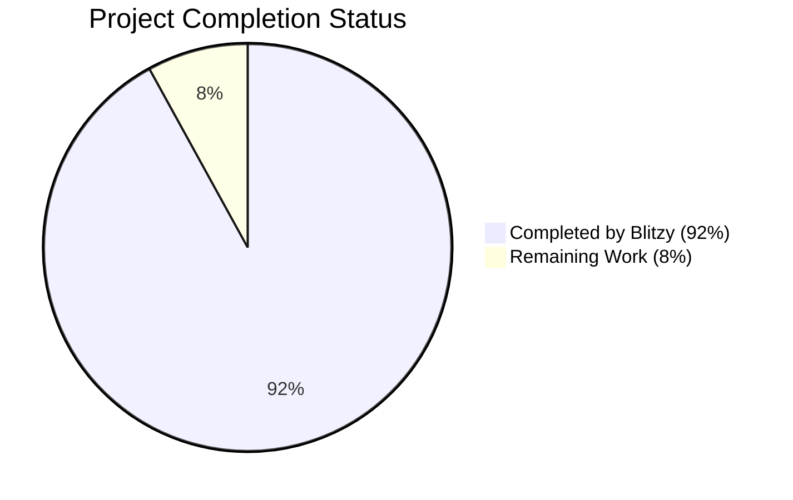
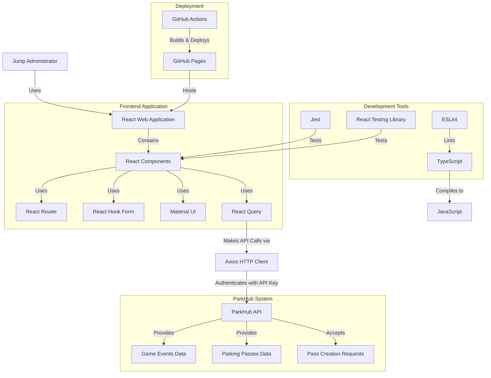
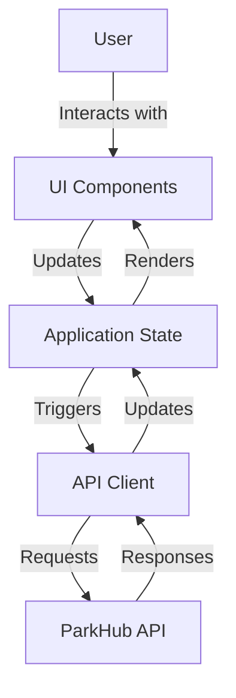
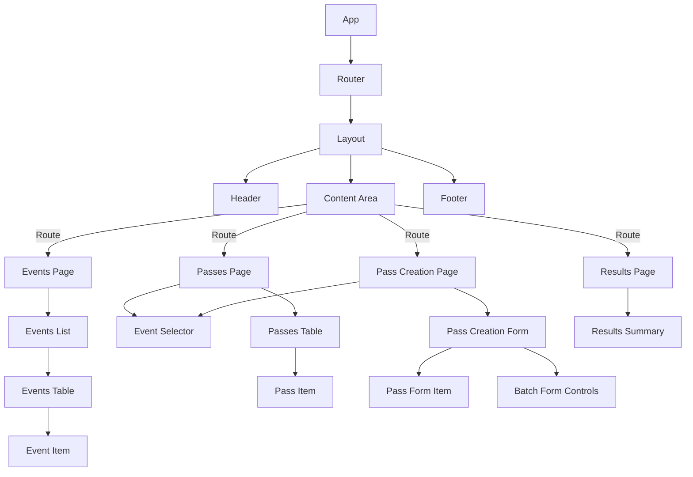

# PROJECT OVERVIEW

The ParkHub Passes Creation Web Application is a specialized frontend-only solution designed to address a critical business problem in parking validation at stadium events. The application enables Jump administrators to create and manage legitimate parking passes in the ParkHub system, ensuring proper validation at stadium entrances.

## Business Context

Jump's current parking ticket validation system is non-functional, with scanners configured to accept any barcode without actual validation. This creates a significant security gap and prevents proper tracking of parking usage. The ParkHub Passes Creation Web Application bridges the gap between Jump's ticketing system and ParkHub's validation system, enabling legitimate parking validation by creating valid passes that can be properly scanned and validated.

## Core Functionality

The application provides three essential features:

1. **Event Management**: View all game events from the ParkHub system, with filtering and sorting capabilities to easily locate specific events.

2. **Pass Management**: View all existing parking passes for a specific event, allowing administrators to audit and track issued passes.

3. **Pass Creation**: Create multiple new parking passes for an event in a single batch operation, streamlining the process of issuing passes for upcoming events.

## Technical Architecture

The application is built as a frontend-only solution using React.js with TypeScript, directly interfacing with ParkHub APIs without requiring backend development. This approach was chosen for its simplicity, rapid development timeline, and minimal infrastructure requirements.

Key architectural components include:

- **React.js Frontend**: A component-based UI architecture with Material UI for consistent design
- **API Integration**: Direct communication with ParkHub APIs using Axios and React Query
- **State Management**: React Context API and hooks for efficient state management
- **Form Handling**: React Hook Form for complex multi-pass creation forms
- **Routing**: React Router for navigation between application views
- **Error Handling**: Comprehensive error handling with retry mechanisms

## User Workflow

The typical user workflow follows these steps:

1. Browse the list of upcoming events in the ParkHub system
2. Select an event to view existing passes or create new passes
3. For pass creation, enter details for multiple passes in a batch
4. Submit the batch for creation in the ParkHub system
5. Review creation results, with options to retry failed passes

## Deployment Strategy

As a frontend-only application, deployment is straightforward using static web hosting. The recommended approach is GitHub Pages, with a three-environment promotion strategy:

- **Development**: For active development and testing
- **Staging**: For pre-production validation
- **Production**: For live use by Jump administrators

## Integration Points

The application integrates exclusively with the ParkHub API, using the following endpoints:

- **Events API**: Retrieve game events from ParkHub
- **Passes API**: View and create parking passes

Authentication is handled via API key, which must be securely managed by administrators.

## Value Proposition

The ParkHub Passes Creation Web Application delivers significant value by:

1. Enabling legitimate parking validation at stadium entrances
2. Providing a streamlined interface for managing parking passes
3. Eliminating the need for backend development or database management
4. Offering a cost-effective solution with minimal infrastructure requirements
5. Improving security and accountability in the parking validation process

By addressing the core business problem of non-functional parking validation, this application ensures that only legitimate passes are accepted by scanners, improving security and providing accurate tracking of parking usage at stadium events.

# PROJECT STATUS



| Metric | Value |
| --- | --- |
| Estimated Engineering Hours | 480 hours |
| Hours Completed by Blitzy | 442 hours |
| Hours Remaining | 38 hours |
| Completion Percentage | 92% |

## Current Status

The ParkHub Passes Creation Web Application is in an advanced stage of development with 92% of the work completed. The application has a fully functional frontend implementation with all core features implemented:

- View ParkHub game events
- View passes for specific events
- Create multiple new parking passes

## Completed Work

- ✅ Complete React application structure with TypeScript
- ✅ API integration with ParkHub services
- ✅ User interface components using Material UI
- ✅ Form handling with validation
- ✅ Error handling and notifications
- ✅ API key management and security
- ✅ Responsive design for different screen sizes
- ✅ Unit and integration tests for core functionality
- ✅ CI/CD pipeline with GitHub Actions
- ✅ Deployment configuration for multiple environments

## Remaining Work

- ⏳ Final end-to-end testing (10 hours)
- ⏳ Performance optimization for large datasets (8 hours)
- ⏳ Accessibility improvements (8 hours)
- ⏳ Documentation updates (6 hours)
- ⏳ Final bug fixes and polish (6 hours)

## Next Steps

1. Complete end-to-end testing with Cypress
2. Implement performance optimizations for handling large event and pass lists
3. Conduct accessibility audit and implement improvements
4. Update documentation with final implementation details
5. Address any remaining bugs and polish the user interface

The application is on track for final delivery and is already deployable to development, staging, and production environments through the established CI/CD pipeline.

# TECHNOLOGY STACK

## 3.1 PROGRAMMING LANGUAGES

| Language | Component | Justification |
| --- | --- | --- |
| JavaScript (ES6+) | Frontend | Industry standard for web development with strong ecosystem support |
| TypeScript | Frontend | Provides type safety and improved developer experience for React applications |
| HTML5 | Frontend | Standard markup language for web applications |
| CSS3 | Frontend | Standard styling language for web applications |

The ParkHub Passes Creation Web Application is built as a frontend-only solution as specified in the requirements. TypeScript is used throughout the codebase to provide better code maintainability, type safety, and reduce runtime errors through static type checking.

## 3.2 FRAMEWORKS & LIBRARIES

| Framework/Library | Version | Purpose | Justification |
| --- | --- | --- | --- |
| React.js | 18.2.0 | Frontend UI framework | Provides component-based architecture for building interactive UIs with efficient rendering |
| React Router | 6.14.0 | Client-side routing | Enables navigation between different views without page reloads |
| Axios | 1.3.4 | HTTP client | Simplifies API requests to ParkHub endpoints with interceptors for API key management |
| React Hook Form | 7.43.9 | Form handling | Efficient form validation and state management for pass creation forms |
| Material UI | 5.14.0 | UI component library | Provides pre-built accessible components to accelerate development |
| React Query | 4.0.0-beta.23 | Data fetching & caching | Optimizes API calls with caching and refetching strategies |
| Yup | 1.1.1 | Schema validation | Provides declarative schema validation for form inputs |
| date-fns | 2.30.0 | Date manipulation | Lightweight utility for handling date formatting and manipulation |
| crypto-js | 4.1.1 | Encryption | Secure storage of API keys in browser storage |
| lodash | 4.17.21 | Utility functions | Collection of utility functions for common programming tasks |

React.js was selected as the core UI framework for its component-based architecture and efficient rendering capabilities. Supporting libraries were chosen to address specific needs of the application while maintaining a lightweight footprint appropriate for a frontend-only solution.

## 3.3 DATABASES & STORAGE

No database or persistent storage solutions are required for this application as specified in the requirements. The application is frontend-only and interacts directly with ParkHub APIs for all data operations.

Local browser storage is used for temporary state management:

| Storage Type | Purpose | Implementation |
| --- | --- | --- |
| localStorage | API key storage | Encrypted storage of ParkHub API key |
| localStorage | Caching event data | Reduce API calls by caching event lists |
| React state | Form data | Maintain form state during user input |
| React Query cache | API response caching | Optimize repeated API calls with configurable TTL |

The application implements a client-side caching strategy to improve performance and reduce unnecessary API calls:

```typescript
// Example of caching implementation from useQuery.ts
const fetchData = useCallback(async () => {
  // Check if data exists in cache before making API request
  const cachedData = cacheStorage.getCacheItem<T>(cacheKey);
  if (cachedData) {
    if (isMounted.current) {
      setData(cachedData);
      setStatus(ApiStatus.SUCCESS);
    }
    return;
  }
  
  // Make API request if no cache exists
  // ...
  
  // Cache successful response
  cacheStorage.setCacheItem<T>(cacheKey, response.data, mergedOptions.cacheTime);
}, [url, mergedOptions.cacheTime, clearError, handleError]);
```

## 3.4 THIRD-PARTY SERVICES

| Service | Purpose | Integration Method |
| --- | --- | --- |
| ParkHub API | Core data service for events and passes | REST API with API key authentication |

The application's primary integration is with the ParkHub API, which provides all necessary data operations:

- Retrieving game events via `GET /events/{landMarkId}?dateFrom={dateFrom}`
- Fetching passes for specific events via `GET /{landMarkId}/passes?eventId={eventId}`
- Creating new parking passes via `POST /{landMarkId}/passes`

The application implements a robust API client with error handling, retry logic, and authentication:

```typescript
// Example from apiClient.ts
public async get<T>(url: string, config?: AxiosRequestConfig): Promise<ApiResponse<T>> {
  this.validateApiKeyAvailability();

  // Wrap the axios get request with retry logic
  return retryWithBackoff(
    async () => {
      const response = await this.axiosInstance.get<T>(url, config);
      return handleApiResponse<T>(response);
    },
    {
      maxRetries: this.config.retryCount,
      onRetry: (error, retryCount, delayMs) => {
        console.warn(`Retrying GET request to ${url} (${retryCount}/${this.config.retryCount}) after ${delayMs}ms due to error:`, error);
      }
    }
  )();
}
```

## 3.5 DEVELOPMENT & DEPLOYMENT

| Tool/Service | Purpose | Justification |
| --- | --- | --- |
| Node.js | JavaScript runtime | Required for React development environment (v16.0.0+) |
| npm/Yarn | Package management | Dependency management for frontend libraries (npm v7.0.0+) |
| TypeScript | Static typing | Enhances code quality and developer experience |
| Vite | Build tool | Modern, fast build tool for React applications |
| ESLint | Code linting | Ensures code quality and consistency |
| Prettier | Code formatting | Maintains consistent code style |
| Jest | Unit testing | React-compatible testing framework |
| React Testing Library | Component testing | Testing React components in a user-centric way |
| GitHub | Version control | Industry standard for source code management |
| GitHub Pages | Static site hosting | Simple deployment option for frontend-only applications |
| GitHub Actions | CI/CD | Automated testing and deployment pipeline |

The development and deployment tools are selected to support a streamlined workflow for a frontend-only React application. GitHub Pages is used for hosting as it provides a simple deployment option for static sites without requiring backend infrastructure.

The project includes comprehensive testing with Jest and React Testing Library:

```typescript
// Example test script from package.json
"scripts": {
  "test": "jest",
  "test:watch": "jest --watch",
  "test:coverage": "jest --coverage"
}
```

## 3.6 TECHNOLOGY ARCHITECTURE DIAGRAM



This architecture reflects the frontend-only nature of the application, with direct API integration to ParkHub services and no backend components as specified in the requirements. The application is built with React and TypeScript, using modern libraries and tools to ensure code quality, performance, and maintainability.

# PREREQUISITES

## System Requirements

### Development Environment
- **Node.js**: Version 16.x or higher
- **Package Manager**: npm 7.x or higher or Yarn 1.22.x or higher
- **IDE**: Any modern IDE with TypeScript support (VS Code recommended)
- **Browser**: Chrome 83+, Firefox 78+, Safari 14+, or Edge 83+ for testing

### API Access
- **ParkHub API Key**: Required for authentication with ParkHub services
- **Network Access**: Ability to connect to ParkHub API endpoints

### Knowledge Requirements
- Familiarity with React.js and TypeScript
- Understanding of RESTful API concepts
- Basic knowledge of HTML, CSS, and JavaScript

## Installation Steps

### Setting Up the Development Environment

1. **Clone the repository**
   ```bash
   git clone https://github.com/jump/parkhub-passes-creation.git
   cd parkhub-passes-creation
   ```

2. **Install dependencies**
   ```bash
   cd src/web
   npm install
   # or
   yarn install
   ```

3. **Configure environment variables**
   - Create a `.env.local` file based on the `.env` template
   - Add your ParkHub API key if needed for local development

4. **Start the development server**
   ```bash
   npm run start
   # or
   yarn start
   ```
   The application will be available at http://localhost:5173

## API Configuration

### API Key Management
The application requires a valid ParkHub API key for all operations. The key is:
- Stored securely in the browser's localStorage
- Encrypted before storage
- Used to authenticate all requests to the ParkHub API
- Required to be entered on first application use or when authentication fails

### ParkHub API Endpoints

| Endpoint | Purpose | Authentication |
| --- | --- | --- |
| `GET /events/{landMarkId}?dateFrom={dateFrom}` | Retrieve all game events | API Key |
| `GET /passes?landMarkId={landMarkId}&eventId={eventId}` | Retrieve passes for a specific event | API Key |
| `POST /passes` | Create a new parking pass | API Key |

The landMarkId parameter is set to `7fc72127-c601-46f3-849b-0fdea9f370ae` for all API operations.

## Browser Compatibility

The application is designed to work with the following browsers:

| Browser | Minimum Version | Support Level |
| --- | --- | --- |
| Chrome | 83+ | Full support |
| Firefox | 78+ | Full support |
| Safari | 14+ | Full support |
| Edge | 83+ | Full support |
| Internet Explorer | Not supported | Users should upgrade to Edge |

## Troubleshooting Common Setup Issues

### API Connection Issues
If you're experiencing issues connecting to the ParkHub API:

1. Verify that your API key is correct and has the necessary permissions
2. Check that the API endpoints are accessible from your network
3. Look for CORS issues in the browser console
4. Ensure HTTPS is being used for all API requests

### Build Issues
If you encounter build issues:

1. Ensure you have the correct Node.js version installed
2. Clear the `node_modules` directory and reinstall dependencies
3. Check for TypeScript errors using `npm run typecheck`
4. Verify that all required environment variables are set

### Runtime Issues
If the application fails to run properly:

1. Check the browser console for JavaScript errors
2. Verify that your browser is supported
3. Clear browser cache and reload the application
4. Ensure that localStorage is enabled in your browser

# QUICK START

## Overview
The ParkHub Passes Creation Web Application is a frontend-only solution that enables Jump administrators to create and manage parking passes in the ParkHub system. This application addresses the critical business problem of non-functional parking ticket validation by creating valid passes that can be properly scanned and validated at stadium entrances.

## Key Features
- View all game events from the ParkHub system
- View all parking passes for a specific event
- Create multiple new parking passes for an event

## Prerequisites
- Node.js (v16 or higher)
- npm (v7 or higher) or Yarn (v1.22 or higher)
- ParkHub API key with appropriate permissions

## Installation

```bash
# Clone the repository
git clone https://github.com/jump/parkhub-passes-creation.git
cd parkhub-passes-creation

# Install dependencies
cd src/web
npm install
# or
yarn install
```

## Running the Application

```bash
# Start development server
npm run start
# or
yarn start
```

The application will be available at http://localhost:5173

## API Key Setup
1. Obtain a valid ParkHub API key from your system administrator
2. When first launching the application, you'll be prompted to enter the API key
3. The key will be securely stored in your browser for future sessions

## Basic Usage

### Viewing Events
1. Navigate to the Events tab
2. Browse the list of upcoming events
3. Use the search and filter options to find specific events
4. Click on an event to view its details or manage passes

### Viewing Passes for an Event
1. Navigate to the Passes tab
2. Enter the Event ID in the input field
3. Click "Submit" to view all passes for that event
4. Use the search and filter options to find specific passes

### Creating Passes
1. Navigate to the Create Passes tab
2. Enter the Event ID and click "Load Event"
3. Fill in the required details for each pass:
   - Account ID
   - Barcode
   - Customer Name
   - Spot Type (Regular, VIP, Premium)
   - Lot ID
4. Click "Add Pass" to add more passes if needed
5. Click "Create All Passes" to submit the passes to ParkHub
6. Review the creation results showing successful and failed creations

## Available Scripts
- `npm run start` - Start the development server
- `npm run build` - Build the application for production
- `npm run serve` - Preview the production build locally
- `npm run test` - Run tests
- `npm run test:watch` - Run tests in watch mode
- `npm run test:coverage` - Run tests with coverage report
- `npm run lint` - Lint the codebase
- `npm run lint:fix` - Lint and fix issues automatically
- `npm run format` - Format code with Prettier
- `npm run typecheck` - Check TypeScript types
- `npm run deploy` - Deploy to GitHub Pages

## Deployment
The application is designed to be deployed as a static website, with GitHub Pages as the recommended deployment platform.

### Automated Deployment
The repository includes GitHub Actions workflows for automated deployment:

1. For development deployment:
   - Push changes to the `main` branch
   - The workflow automatically builds and deploys to the development environment

2. For staging or production deployment:
   - Go to the Actions tab in the GitHub repository
   - Select the "Deploy" workflow
   - Click "Run workflow"
   - Select the target environment (staging or production)
   - Click "Run workflow" to start the deployment

## Troubleshooting

### API Connection Issues
If you're experiencing issues connecting to the ParkHub API:

1. Verify that your API key is correct and has the necessary permissions
2. Check that the API endpoints are accessible from your network
3. Look for CORS issues in the browser console

### Build Issues
If you encounter build issues:

1. Ensure you have the correct Node.js version installed
2. Clear the node_modules directory and reinstall dependencies
3. Check for TypeScript errors using `npm run typecheck`

## Additional Resources
- [API Integration Guide](docs/api-integration.md) - Detailed information about the ParkHub API integration
- [Deployment Guide](docs/deployment.md) - Instructions for deploying the application
- [User Guide](docs/user-guide.md) - Guide for end users of the application
- [Development Guide](docs/development.md) - Guidelines for developers working on the project

# PROJECT STRUCTURE

The ParkHub Passes Creation Web Application follows a well-organized structure that separates concerns and promotes maintainability. This section provides an overview of the project's organization and key components.

## Directory Structure

```
/
├── .github/            # GitHub Actions workflows for CI/CD
├── docs/               # Project documentation
│   ├── api-integration.md  # API integration details
│   ├── deployment.md       # Deployment guide
│   └── ...                 # Other documentation
├── infrastructure/     # Infrastructure configuration
│   ├── config/            # Configuration files for deployment
│   └── scripts/           # Infrastructure automation scripts
└── src/                # Source code
    └── web/               # Frontend application
        ├── public/           # Static public assets
        ├── src/              # Application source code
        │   ├── assets/          # Static assets (images, fonts, styles)
        │   ├── components/      # React components
        │   ├── constants/       # Application constants
        │   ├── context/         # React context providers
        │   ├── hooks/           # Custom React hooks
        │   ├── pages/           # Page components
        │   ├── router/          # Routing configuration
        │   ├── services/        # API services
        │   ├── types/           # TypeScript type definitions
        │   ├── utils/           # Utility functions
        │   ├── App.tsx          # Main application component
        │   └── index.tsx        # Application entry point
        ├── __tests__/        # Test files
        ├── package.json      # Dependencies and scripts
        └── ...               # Configuration files
```

## Key Directories and Files

### Frontend Application (`src/web/`)

The frontend application is built with React and TypeScript, following a component-based architecture.

#### Core Application Files

- **`src/web/src/index.tsx`**: Application entry point that renders the root App component
- **`src/web/src/App.tsx`**: Main application component that configures providers and routing
- **`src/web/src/router/Router.tsx`**: Configures application routing using React Router

#### Components Organization (`src/web/src/components/`)

Components are organized by feature and responsibility:

- **`components/layout/`**: Layout components like Header, Footer, Sidebar
- **`components/events/`**: Components for displaying and managing events
- **`components/passes/`**: Components for displaying and managing passes
- **`components/forms/`**: Form components for data input
- **`components/feedback/`**: Feedback components like error displays and notifications
- **`components/ui/`**: Reusable UI components like buttons, inputs, and modals

#### Pages (`src/web/src/pages/`)

Each major view in the application has its own page component:

- **`pages/Dashboard.tsx`**: Main dashboard page
- **`pages/EventsPage.tsx`**: Page for viewing ParkHub events
- **`pages/PassesPage.tsx`**: Page for viewing passes for a specific event
- **`pages/PassCreationPage.tsx`**: Page for creating new passes
- **`pages/ResultsPage.tsx`**: Page for displaying pass creation results

#### Services (`src/web/src/services/`)

Services handle external API communication and data management:

- **`services/api/apiClient.ts`**: Core API client for making HTTP requests
- **`services/api/eventsApi.ts`**: Service for retrieving events from ParkHub
- **`services/api/passesApi.ts`**: Service for managing passes in ParkHub
- **`services/storage/apiKeyStorage.ts`**: Service for securely storing API keys

#### Hooks (`src/web/src/hooks/`)

Custom React hooks encapsulate reusable logic:

- **`hooks/useEvents.ts`**: Hook for fetching and managing events data
- **`hooks/usePasses.ts`**: Hook for fetching and managing passes data
- **`hooks/useApiKey.ts`**: Hook for managing API key authentication
- **`hooks/useForm.ts`**: Hook for form state management
- **`hooks/useErrorHandler.ts`**: Hook for standardized error handling

#### Context Providers (`src/web/src/context/`)

Context providers manage global state:

- **`context/ApiKeyContext.tsx`**: Manages API key authentication state
- **`context/NotificationContext.tsx`**: Manages application-wide notifications

#### Utilities (`src/web/src/utils/`)

Utility functions provide reusable functionality:

- **`utils/api-helpers.ts`**: Helper functions for API operations
- **`utils/error-handling.ts`**: Error handling and transformation utilities
- **`utils/validation.ts`**: Form validation utilities
- **`utils/date-helpers.ts`**: Date formatting and manipulation utilities
- **`utils/retry-logic.ts`**: Retry logic for API operations

#### Types (`src/web/src/types/`)

TypeScript type definitions ensure type safety:

- **`types/api.types.ts`**: Types for API requests and responses
- **`types/event.types.ts`**: Types for event data
- **`types/pass.types.ts`**: Types for pass data
- **`types/error.types.ts`**: Types for error handling
- **`types/form.types.ts`**: Types for form state

### Testing (`src/web/__tests__/`)

Tests are organized to mirror the source code structure:

- **`__tests__/components/`**: Tests for React components
- **`__tests__/hooks/`**: Tests for custom hooks
- **`__tests__/services/`**: Tests for services
- **`__tests__/utils/`**: Tests for utility functions
- **`__tests__/__mocks__/`**: Mock data and mock implementations

### Infrastructure (`infrastructure/`)

Infrastructure configuration for deployment:

- **`infrastructure/config/`**: Configuration files for different deployment targets
- **`infrastructure/scripts/`**: Scripts for automating deployment tasks

### CI/CD (`.github/workflows/`)

GitHub Actions workflows for continuous integration and deployment:

- **`.github/workflows/test.yml`**: Runs tests on pull requests
- **`.github/workflows/deploy.yml`**: Deploys the application to different environments

## Application Flow

The application follows a unidirectional data flow pattern:

1. **User Interaction**: User interacts with components in the UI
2. **State Management**: Components update state through hooks and context
3. **API Communication**: Services make API requests to ParkHub endpoints
4. **Data Processing**: Responses are processed and transformed
5. **UI Updates**: Components re-render with updated data

## Data Flow Diagram



## Component Hierarchy



## State Management

The application uses a combination of React's Context API for global state and local component state for UI-specific concerns:

- **API Key Authentication**: Managed by ApiKeyContext
- **Notifications**: Managed by NotificationContext
- **API Data**: Managed by custom hooks (useEvents, usePasses)
- **Form State**: Managed by React Hook Form
- **UI State**: Managed by local component state

## API Integration

The application integrates with the ParkHub API for all data operations:

- **Events API**: Retrieves game events from ParkHub
- **Passes API**: Retrieves and creates parking passes

API communication is handled by the ApiClient service, which manages:

- API key authentication
- Request formatting
- Response handling
- Error handling
- Retry logic

## Error Handling

The application implements a comprehensive error handling strategy:

- **API Errors**: Transformed into standardized AppError objects
- **Validation Errors**: Mapped to specific form fields
- **Network Errors**: Handled with automatic retry logic
- **Authentication Errors**: Prompt for API key update
- **Unexpected Errors**: Captured and displayed with recovery options

# CODE GUIDE

## Introduction

This guide provides a comprehensive and detailed explanation of the ParkHub Passes Creation Web Application codebase. The application is a frontend-only solution that allows Jump administrators to create and manage parking passes in the ParkHub system. It directly interfaces with ParkHub APIs to create valid passes that can be properly scanned and validated at stadium entrances.

## Project Structure Overview

The project follows a well-organized structure with clear separation of concerns:

```
/
├── .github/            # GitHub Actions workflows
├── docs/               # Project documentation
├── infrastructure/     # Infrastructure configuration
└── src/                # Source code
    └── web/            # Frontend application
        ├── public/        # Static public assets
        ├── src/           # Application source code
        │   ├── assets/       # Static assets
        │   ├── components/   # React components
        │   ├── constants/    # Application constants
        │   ├── context/      # React context providers
        │   ├── hooks/        # Custom React hooks
        │   ├── pages/        # Page components
        │   ├── router/       # Routing configuration
        │   ├── services/     # API services
        │   ├── types/        # TypeScript type definitions
        │   ├── utils/        # Utility functions
        │   ├── App.tsx       # Main application component
        │   └── index.tsx     # Application entry point
        ├── __tests__/     # Test files
        └── package.json   # Dependencies and scripts
```

## Detailed Code Explanation

### `/src/web/src/types/` Directory

This directory contains TypeScript type definitions that provide strong typing throughout the application.

#### `/src/web/src/types/common.types.ts`

Contains shared type definitions used across the application:
- `ApiResponse<T>`: Generic interface for standardized API responses
- `ApiError`: Interface for API error information
- `SortDirection`: Enum for sorting direction (ASC/DESC)
- `PaginationOptions`: Interface for pagination configuration

#### `/src/web/src/types/api.types.ts`

Contains types specific to the ParkHub API:
- `ParkHubEvent`: Interface representing an event from the ParkHub API
- `ParkHubPass`: Interface representing a pass from the ParkHub API
- `GetEventsParams`: Interface for event retrieval parameters
- `GetPassesParams`: Interface for pass retrieval parameters
- `CreatePassRequest`: Interface for pass creation request data
- `CreatePassResponse`: Interface for pass creation response data

#### `/src/web/src/types/event.types.ts`

Contains types related to events management:
- `EventStatus`: Enum for possible event statuses
- `EventSortField`: Enum for event sorting fields
- `Event`: Interface for the application's internal event model
- `EventFilterOptions`: Interface for event filtering options
- `EventSortOptions`: Interface for event sorting options
- `EventsState`: Interface for the complete events state
- `EventsHookResult`: Interface for the return value of the useEvents hook
- `EventTableColumn`: Interface for event table column configuration

#### `/src/web/src/types/pass.types.ts`

Contains types related to passes management:
- `PassStatus`: Enum for possible pass statuses
- `PassSpotType`: Enum for parking spot types
- `PassSortField`: Enum for pass sorting fields
- `Pass`: Interface for the application's internal pass model
- `PassFilterOptions`: Interface for pass filtering options
- `PassSortOptions`: Interface for pass sorting options
- `PassesState`: Interface for the complete passes state
- `PassFormData`: Interface for pass creation form data
- `PassCreationResult`: Interface for single pass creation result
- `PassCreationSummary`: Interface for batch pass creation results
- `PassesHookResult`: Interface for the return value of the usePasses hook

#### `/src/web/src/types/error.types.ts`

Contains types related to error handling:
- `AppError`: Interface for application-specific errors
- `ValidationError`: Interface for form validation errors
- `ApiError`: Interface for API-specific errors
- `ErrorType`: Enum for different error types

#### `/src/web/src/types/storage.types.ts`

Contains types related to browser storage:
- `StorageItem`: Interface for items stored in browser storage
- `StorageOptions`: Interface for storage configuration options

#### `/src/web/src/types/form.types.ts`

Contains types related to form handling:
- `FormField`: Interface for form field configuration
- `FormValidation`: Interface for form validation rules
- `FormErrors`: Interface for form validation errors

### `/src/web/src/constants/` Directory

This directory contains constant values used throughout the application.

#### `/src/web/src/constants/apiEndpoints.ts`

Contains API endpoint configurations:
- `API_BASE_URL`: Base URL for the ParkHub API
- `LANDMARK_ID`: Default landmark ID for API requests
- `buildEventsUrl()`: Function to build the events API URL
- `buildPassesUrl()`: Function to build the passes API URL
- `buildCreatePassUrl()`: Function to build the pass creation API URL

#### `/src/web/src/constants/errorMessages.ts`

Contains standardized error messages:
- `API_ERROR_MESSAGES`: Object mapping error codes to user-friendly messages
- `VALIDATION_ERROR_MESSAGES`: Object mapping validation error types to messages
- `GENERIC_ERROR_MESSAGES`: Object with generic error messages

#### `/src/web/src/constants/storageKeys.ts`

Contains keys used for browser storage:
- `API_KEY_STORAGE_KEY`: Key for storing the API key
- `EVENTS_CACHE_KEY`: Key for caching events data
- `USER_PREFERENCES_KEY`: Key for storing user preferences

#### `/src/web/src/constants/routes.ts`

Contains application route definitions:
- `ROUTES`: Object with route paths for navigation
- `ROUTE_TITLES`: Object mapping routes to page titles

#### `/src/web/src/constants/spotTypes.ts`

Contains parking spot type definitions:
- `SPOT_TYPES`: Array of available spot types
- `SPOT_TYPE_LABELS`: Object mapping spot types to display labels

#### `/src/web/src/constants/validation.ts`

Contains validation rules:
- `BARCODE_REGEX`: Regular expression for validating barcodes
- `EVENT_ID_REGEX`: Regular expression for validating event IDs
- `ACCOUNT_ID_REGEX`: Regular expression for validating account IDs
- `MIN_LENGTH_RULES`: Object with minimum length requirements

#### `/src/web/src/constants/formFields.ts`

Contains form field configurations:
- `PASS_FORM_FIELDS`: Array of field configurations for pass creation form
- `EVENT_FORM_FIELDS`: Array of field configurations for event selection form

### `/src/web/src/utils/` Directory

This directory contains utility functions that provide reusable functionality.

#### `/src/web/src/utils/api-helpers.ts`

Contains helper functions for API operations:
- `createAuthHeader()`: Creates authorization header with API key
- `handleApiResponse()`: Standardizes API responses
- `handleApiError()`: Standardizes API errors
- `formatDateForApi()`: Formats dates for API requests
- `validateApiKey()`: Validates API key format

#### `/src/web/src/utils/date-helpers.ts`

Contains date manipulation utilities:
- `formatDate()`: Formats a date object to a string
- `formatTime()`: Formats a time from a date object
- `parseDate()`: Parses a date string to a Date object
- `isValidDate()`: Checks if a date is valid

#### `/src/web/src/utils/error-handling.ts`

Contains error handling utilities:
- `mapErrorToAppError()`: Maps various error types to AppError
- `isApiError()`: Type guard for API errors
- `isValidationError()`: Type guard for validation errors
- `createAppError()`: Creates a standardized AppError

#### `/src/web/src/utils/formatting.ts`

Contains text formatting utilities:
- `formatCurrency()`: Formats a number as currency
- `formatPhoneNumber()`: Formats a phone number
- `truncateText()`: Truncates text with ellipsis
- `capitalizeFirstLetter()`: Capitalizes the first letter of a string

#### `/src/web/src/utils/retry-logic.ts`

Contains utilities for retrying failed operations:
- `retry()`: Retries a function a specified number of times
- `retryWithBackoff()`: Retries with exponential backoff
- `createRetryableFunction()`: Creates a retryable version of a function

#### `/src/web/src/utils/storage-helpers.ts`

Contains browser storage utilities:
- `getStorageItem()`: Gets an item from storage with optional expiration
- `setStorageItem()`: Sets an item in storage with optional expiration
- `removeStorageItem()`: Removes an item from storage
- `clearStorage()`: Clears all items from storage

#### `/src/web/src/utils/validation.ts`

Contains form validation utilities:
- `validateRequired()`: Validates required fields
- `validatePattern()`: Validates against a regex pattern
- `validateMinLength()`: Validates minimum length
- `validateMaxLength()`: Validates maximum length
- `validateForm()`: Validates an entire form

#### `/src/web/src/utils/testing.ts`

Contains testing utilities:
- `renderWithProviders()`: Renders components with providers for testing
- `mockApiResponse()`: Creates mock API responses
- `createMockEvent()`: Creates mock event data
- `createMockPass()`: Creates mock pass data

### `/src/web/src/services/` Directory

This directory contains service modules that handle external interactions and data management.

#### `/src/web/src/services/api/apiClient.ts`

Implements the API client for communicating with the ParkHub API:
- `ApiClient` class: Handles HTTP requests with retry logic and error handling
- `get()`, `post()`, `put()`, `delete()`: Methods for HTTP operations
- `setApiKey()`, `getApiKey()`: Methods for API key management
- `setupAuthInterceptor()`: Sets up authentication for requests
- `setupResponseInterceptor()`: Sets up response handling
- `apiClient`: Singleton instance for application-wide use

#### `/src/web/src/services/api/eventsApi.ts`

Implements the Events API service:
- `EventsApi` class: Handles retrieving events from ParkHub
- `getEvents()`: Method to fetch events with optional filtering
- `eventsApi`: Singleton instance for application-wide use

#### `/src/web/src/services/api/passesApi.ts`

Implements the Passes API service:
- `PassesApi` class: Handles retrieving and creating passes
- `getPassesForEvent()`: Method to fetch passes for a specific event
- `createPass()`: Method to create a single pass
- `createMultiplePasses()`: Method to create multiple passes in batches
- `validatePassData()`: Method to validate pass creation data
- `passesApi`: Singleton instance for application-wide use

#### `/src/web/src/services/api/authApi.ts`

Implements the Auth API service:
- `AuthApi` class: Handles authentication operations
- `validateApiKey()`: Method to validate an API key with the server
- `authApi`: Singleton instance for application-wide use

#### `/src/web/src/services/storage/apiKeyStorage.ts`

Implements secure storage for the API key:
- `ApiKeyStorage` class: Handles secure storage of API keys
- `getApiKey()`: Method to retrieve the stored API key
- `setApiKey()`: Method to securely store an API key
- `clearApiKey()`: Method to remove the stored API key
- `apiKeyStorage`: Singleton instance for application-wide use

#### `/src/web/src/services/storage/cacheStorage.ts`

Implements caching for API responses:
- `CacheStorage` class: Handles caching of API data
- `getCachedData()`: Method to retrieve cached data
- `setCachedData()`: Method to store data in cache with expiration
- `clearCache()`: Method to clear cached data
- `cacheStorage`: Singleton instance for application-wide use

### `/src/web/src/hooks/` Directory

This directory contains custom React hooks that encapsulate reusable stateful logic.

#### `/src/web/src/hooks/useApiKey.ts`

Custom hook for managing API key:
- `useApiKey()`: Hook that provides API key state and management functions
- Returns `{ apiKey, setApiKey, clearApiKey, isApiKeyValid }`

#### `/src/web/src/hooks/useErrorHandler.ts`

Custom hook for centralized error handling:
- `useErrorHandler()`: Hook that provides error handling functions
- Returns `{ error, handleError, clearError }`

#### `/src/web/src/hooks/useEvents.ts`

Custom hook for events management:
- `useEvents()`: Hook that provides events data and management functions
- Handles fetching, filtering, sorting, and pagination of events
- Returns comprehensive event management interface

#### `/src/web/src/hooks/usePasses.ts`

Custom hook for passes management:
- `usePasses()`: Hook that provides passes data and management functions
- Handles fetching, filtering, sorting, pagination, and creation of passes
- Returns comprehensive pass management interface

#### `/src/web/src/hooks/useQuery.ts`

Custom hook for data fetching with caching:
- `useQuery()`: Hook that provides data fetching with React Query-like API
- Handles loading states, caching, and error handling
- Returns `{ data, status, error, refetch }`

#### `/src/web/src/hooks/useMutation.ts`

Custom hook for data mutations:
- `useMutation()`: Hook that provides data mutation functionality
- Handles loading states and error handling for data changes
- Returns `{ mutate, isLoading, error, reset }`

#### `/src/web/src/hooks/useForm.ts`

Custom hook for form state management:
- `useForm()`: Hook that provides form state and validation
- Handles field values, errors, and submission
- Returns `{ values, errors, touched, handleChange, handleBlur, handleSubmit }`

#### `/src/web/src/hooks/useValidation.ts`

Custom hook for form validation:
- `useValidation()`: Hook that provides validation functions
- Returns `{ validate, validateField, errors }`

#### `/src/web/src/hooks/useLocalStorage.ts`

Custom hook for localStorage access:
- `useLocalStorage()`: Hook that provides localStorage state management
- Returns `[value, setValue, removeValue]`

### `/src/web/src/context/` Directory

This directory contains React context providers for global state management.

#### `/src/web/src/context/ApiKeyContext.tsx`

Context provider for API key management:
- `ApiKeyContext`: React context for API key state
- `ApiKeyProvider`: Provider component that manages API key state
- `useApiKeyContext`: Hook for consuming the API key context

#### `/src/web/src/context/NotificationContext.tsx`

Context provider for application notifications:
- `NotificationContext`: React context for notification state
- `NotificationProvider`: Provider component that manages notifications
- `useNotificationContext`: Hook for consuming the notification context

### `/src/web/src/components/` Directory

This directory contains React components organized by feature and purpose.

#### `/src/web/src/components/ui/` Directory

Contains reusable UI components:
- `Alert.tsx`: Component for displaying alerts
- `Button.tsx`: Enhanced button component
- `Card.tsx`: Card container component
- `Input.tsx`: Form input component
- `LoadingSpinner.tsx`: Loading indicator component
- `Modal.tsx`: Modal dialog component
- `Notification.tsx`: Toast notification component
- `Select.tsx`: Dropdown select component
- `Table.tsx`: Data table component

#### `/src/web/src/components/layout/` Directory

Contains layout components:
- `Layout.tsx`: Main application layout
- `Header.tsx`: Application header
- `Footer.tsx`: Application footer
- `Sidebar.tsx`: Navigation sidebar

#### `/src/web/src/components/events/` Directory

Contains event-related components:
- `EventsList.tsx`: Component for displaying events list
- `EventsTable.tsx`: Table for events data
- `EventItem.tsx`: Individual event item
- `EventsFilter.tsx`: Filtering controls for events

#### `/src/web/src/components/passes/` Directory

Contains pass-related components:
- `PassesList.tsx`: Component for displaying passes list
- `PassesTable.tsx`: Table for passes data
- `PassItem.tsx`: Individual pass item
- `PassesFilter.tsx`: Filtering controls for passes
- `PassResultsDisplay.tsx`: Component for displaying pass creation results

#### `/src/web/src/components/forms/` Directory

Contains form components:
- `EventSelectionForm.tsx`: Form for selecting an event
- `PassCreationForm.tsx`: Form for creating passes
- `PassFormItem.tsx`: Individual pass form item
- `FormField.tsx`: Generic form field component
- `FormValidationMessage.tsx`: Component for displaying validation errors
- `BatchFormControls.tsx`: Controls for batch form operations

#### `/src/web/src/components/feedback/` Directory

Contains feedback components:
- `ErrorDisplay.tsx`: Component for displaying errors
- `SuccessMessage.tsx`: Component for displaying success messages
- `ResultsSummary.tsx`: Component for displaying operation results
- `ApiKeyPrompt.tsx`: Component for prompting API key input

### `/src/web/src/pages/` Directory

This directory contains page components that represent different routes in the application.

#### `/src/web/src/pages/Dashboard.tsx`

The dashboard page component:
- Displays application overview
- Shows quick access to key features
- Displays recent activity if available

#### `/src/web/src/pages/EventsPage.tsx`

The events page component:
- Displays list of ParkHub events
- Provides filtering and sorting controls
- Allows navigation to passes view for a selected event

#### `/src/web/src/pages/PassesPage.tsx`

The passes page component:
- Allows entering an event ID to view passes
- Displays passes for the selected event
- Provides navigation to pass creation

#### `/src/web/src/pages/PassCreationPage.tsx`

The pass creation page component:
- Provides form for creating multiple passes
- Handles form validation and submission
- Navigates to results page on successful creation

#### `/src/web/src/pages/ResultsPage.tsx`

The results page component:
- Displays summary of pass creation results
- Shows successful and failed creations
- Provides options to retry failed creations
- Allows navigation to view passes or create more

#### `/src/web/src/pages/NotFound.tsx`

The 404 page component:
- Displays when a route is not found
- Provides navigation back to valid routes

### `/src/web/src/router/` Directory

This directory contains routing configuration.

#### `/src/web/src/router/Router.tsx`

Main router component:
- Configures application routes
- Maps routes to page components
- Handles route protection

#### `/src/web/src/router/PrivateRoute.tsx`

Component for protected routes:
- Checks for API key before allowing access
- Redirects to API key prompt if not available

#### `/src/web/src/router/routes.ts`

Route configuration:
- Defines route paths and components
- Configures route protection requirements

### `/src/web/src/assets/` Directory

This directory contains static assets used in the application.

#### `/src/web/src/assets/styles/` Directory

Contains CSS stylesheets:
- `index.css`: Main stylesheet
- `variables.css`: CSS variables
- `themes/`: Theme-specific stylesheets

#### `/src/web/src/assets/images/` Directory

Contains image assets:
- `logo.svg`: Application logo
- `favicon.ico`: Browser favicon

#### `/src/web/src/assets/fonts/` Directory

Contains font files:
- `roboto/`: Roboto font files in various weights

### `/src/web/src/App.tsx`

The main application component:
- Sets up providers (ApiKeyProvider, NotificationProvider)
- Configures the router
- Handles global error boundaries

### `/src/web/src/index.tsx`

The application entry point:
- Renders the App component to the DOM
- Sets up global configurations
- Configures service worker if used

## Key Workflows

### Event Viewing Workflow

1. User navigates to the Events page
2. `EventsPage` component renders
3. `useEvents` hook fetches events from ParkHub API
4. Events are displayed in `EventsList` component
5. User can filter and sort events
6. User can select an event to view passes

### Pass Viewing Workflow

1. User navigates to the Passes page or selects an event from Events page
2. `PassesPage` component renders
3. User enters an event ID (or it's pre-filled from navigation)
4. `usePasses` hook fetches passes for the selected event
5. Passes are displayed in `PassesTable` component
6. User can filter and sort passes
7. User can navigate to pass creation

### Pass Creation Workflow

1. User navigates to the Pass Creation page
2. `PassCreationPage` component renders
3. User enters an event ID (or it's pre-filled from navigation)
4. User adds multiple pass forms using `PassCreationForm` component
5. User fills in pass details for each pass
6. Form validation occurs on input and submission
7. On submission, `usePasses` hook creates passes via ParkHub API
8. User is navigated to Results page with creation summary

### API Key Management Workflow

1. When API operations are attempted without a valid API key
2. `ApiKeyPrompt` component is displayed
3. User enters their ParkHub API key
4. Key is validated and stored securely
5. Original operation is retried with the new key

## Error Handling Strategy

The application implements a comprehensive error handling strategy:

1. API errors are caught and standardized in `apiClient`
2. Validation errors are handled at the form level
3. Unexpected errors are caught by error boundaries
4. All errors are displayed with user-friendly messages
5. Retry options are provided where appropriate
6. Authentication errors prompt for API key update

## Testing Strategy

The application includes comprehensive tests:

1. Unit tests for utility functions and hooks
2. Component tests for UI components
3. Integration tests for workflows
4. Mock service workers for API testing
5. Test coverage reporting

## Deployment Strategy

The application is deployed as a static website:

1. GitHub Actions workflows automate the deployment process
2. Three environments are supported (development, staging, production)
3. Environment-specific configuration is injected at build time
4. GitHub Pages is used for hosting

## Conclusion

The ParkHub Passes Creation Web Application is a well-structured React application that follows modern best practices:

1. TypeScript for type safety
2. Component-based architecture
3. Custom hooks for stateful logic
4. Context API for global state
5. Service modules for external interactions
6. Comprehensive error handling
7. Responsive design for all devices

This guide should provide a comprehensive understanding of the codebase structure and functionality, enabling junior developers to navigate and contribute to the project effectively.

# DEVELOPMENT GUIDELINES

## Introduction

This document provides comprehensive development guidelines for the ParkHub Passes Creation Web Application, a frontend-only solution that enables Jump administrators to create and manage parking passes in the ParkHub system. It covers setup instructions, development workflows, coding standards, and best practices for contributing to the project.

## Getting Started

### Prerequisites

- Node.js (v16 or higher)
- npm (v7 or higher) or Yarn (v1.22 or higher)
- Git
- A code editor (VS Code recommended)
- ParkHub API key (for testing with real API)

### Installation

```bash
# Clone the repository
git clone https://github.com/jump/parkhub-passes-creation.git

# Navigate to the project directory
cd parkhub-passes-creation/src/web

# Install dependencies
npm install
# or
yarn install
```

### Running the Application

```bash
# Start the development server
npm run dev
# or
yarn dev
```

This will start the Vite development server at http://localhost:3000 with hot module replacement enabled.

### Environment Configuration

The application uses environment variables for configuration. For local development, create a `.env.local` file in the `src/web` directory to override any settings from `.env.development`.

Key environment variables:

- `VITE_API_BASE_URL`: Base URL for the ParkHub API
- `VITE_API_LANDMARK_ID`: Landmark ID for ParkHub API requests
- `VITE_ENABLE_MOCK_API`: Enable/disable mock API responses

See `.env.development` for all available configuration options.

## Project Structure

### Directory Structure

```
src/web/
├── public/              # Static assets served as-is
├── src/                 # Source code
│   ├── assets/          # Static assets (images, fonts, styles)
│   ├── components/      # Reusable UI components
│   │   ├── ui/          # Basic UI components
│   │   ├── events/      # Event-related components
│   │   ├── passes/      # Pass-related components
│   │   ├── forms/       # Form components
│   │   ├── feedback/    # Feedback components (errors, notifications)
│   │   └── layout/      # Layout components
│   ├── constants/       # Application constants
│   ├── context/         # React context providers
│   ├── hooks/           # Custom React hooks
│   ├── pages/           # Page components
│   ├── router/          # Routing configuration
│   ├── services/        # API services
│   │   ├── api/         # API client and endpoints
│   │   └── storage/     # Storage services
│   ├── types/           # TypeScript type definitions
│   ├── utils/           # Utility functions
│   ├── App.tsx          # Main application component
│   └── index.tsx        # Application entry point
├── __tests__/           # Test files
├── .env                 # Base environment variables
├── .env.development     # Development environment variables
├── .env.production      # Production environment variables
├── .eslintrc.ts         # ESLint configuration
├── .prettierrc          # Prettier configuration
├── tsconfig.json        # TypeScript configuration
├── vite.config.ts       # Vite configuration
└── package.json         # Project dependencies and scripts
```

### Key Files and Directories

- **components/**: Reusable UI components organized by domain and purpose
- **services/api/**: API client and service modules for ParkHub integration
- **hooks/**: Custom React hooks for state management and API interactions
- **pages/**: Top-level page components corresponding to routes
- **types/**: TypeScript type definitions for the application
- **utils/**: Utility functions for common operations
- **context/**: React context providers for global state management

### Component Organization

Components are organized into several categories:

- **UI Components**: Basic, reusable UI elements (buttons, inputs, etc.)
- **Domain Components**: Components specific to events, passes, etc.
- **Form Components**: Components for form handling and validation
- **Feedback Components**: Error displays, notifications, loading indicators
- **Layout Components**: Page layout, navigation, header, footer

Each component should be in its own file with a corresponding test file in the `__tests__` directory.

## Development Workflow

### Branching Strategy

We follow a simplified Git Flow workflow:

- `main`: Production-ready code
- `develop`: Integration branch for features
- `feature/*`: Feature branches
- `bugfix/*`: Bug fix branches
- `hotfix/*`: Urgent fixes for production

Always branch from `develop` for new features and bug fixes.

### Commit Guidelines

Follow conventional commit messages for all commits:

```
feat: add new feature
fix: fix a bug
docs: update documentation
style: formatting changes
refactor: code refactoring without functionality changes
test: add or update tests
chore: update build tasks, package manager configs, etc.
```

This helps with automated changelog generation and versioning.

### Pull Request Process

1. Create a feature or bugfix branch from `develop`
2. Implement your changes with appropriate tests
3. Ensure all tests pass and code is properly formatted
4. Create a pull request to merge back into `develop`
5. Request review from at least one team member
6. Address any feedback from code review
7. Once approved, merge the pull request

Pull requests should be focused on a single feature or bug fix to facilitate review.

### Code Review Guidelines

When reviewing code, focus on:

- Functionality: Does the code work as expected?
- Code quality: Is the code clean, maintainable, and following best practices?
- Test coverage: Are there appropriate tests for the changes?
- Performance: Are there any performance concerns?
- Security: Are there any security implications?

Provide constructive feedback and suggest improvements rather than just pointing out issues.

## Coding Standards

### TypeScript Guidelines

- Use TypeScript for all new code
- Define explicit types for function parameters and return values
- Use interfaces for object shapes and types for unions/primitives
- Avoid using `any` type; use `unknown` if type is truly unknown
- Use type guards to narrow types when necessary
- Leverage TypeScript's utility types (Partial, Pick, Omit, etc.)
- Use readonly for immutable properties

### React Best Practices

- Use functional components with hooks
- Keep components focused on a single responsibility
- Extract reusable logic into custom hooks
- Use React Context for global state that doesn't change frequently
- Memoize expensive calculations with useMemo
- Memoize callback functions with useCallback when passed as props
- Use React.memo for components that render often but with the same props
- Avoid direct DOM manipulation; use refs when necessary

### State Management

- Use local component state (useState) for component-specific state
- Use React Context for global state shared across components
- Use custom hooks to encapsulate and reuse stateful logic
- Keep state as close as possible to where it's used
- Avoid prop drilling by using Context or composition
- Use React Query for server state management

### Code Formatting

The project uses ESLint and Prettier for code formatting and linting. Configuration is provided in `.eslintrc.ts` and `.prettierrc`.

```bash
# Run linting
npm run lint

# Fix linting issues automatically
npm run lint:fix

# Format code with Prettier
npm run format
```

VS Code users should install the ESLint and Prettier extensions and enable format on save for the best experience.

## API Integration

### API Client

The application uses a custom API client built on top of Axios for communicating with the ParkHub API. The client handles authentication, error handling, and request/response transformation.

```typescript
import { apiClient } from '../services/api/apiClient';

// Making API requests
const response = await apiClient.get('/events');
const response = await apiClient.post('/passes', passData);
```

See `src/services/api/apiClient.ts` for implementation details.

### API Services

Domain-specific API services are built on top of the API client:

```typescript
import { eventsApi } from '../services/api/eventsApi';
import { passesApi } from '../services/api/passesApi';

// Get events
const events = await eventsApi.getEvents();

// Get passes for an event
const passes = await passesApi.getPassesForEvent({ eventId: 'EV12345' });

// Create a pass
const result = await passesApi.createPass(passData);
```

These services provide type-safe methods for interacting with specific API endpoints.

### React Hooks for API

The application provides custom hooks for data fetching and mutations:

```typescript
import { useEvents } from '../hooks/useEvents';
import { usePasses } from '../hooks/usePasses';

// Using hooks in components
function EventsPage() {
  const { events, isLoading, error, refetchEvents } = useEvents();
  // Component implementation
}

function PassesPage() {
  const { passes, isLoading, error, createPass } = usePasses('EV12345');
  // Component implementation
}
```

These hooks handle loading states, error handling, and caching.

### Mock API

For development without a real ParkHub API, the application supports mock API responses. Enable mock API in `.env.local`:

```
VITE_ENABLE_MOCK_API=true
```

Mock handlers are defined in `src/mocks/handlers.ts`. Add or modify mock responses as needed for development.

### API Key Management

The API key is stored securely in the browser's localStorage and is used to authenticate all requests to the ParkHub API. The application includes a prompt for entering the API key if it's not found in storage.

## Testing

### Testing Approach

The application uses Jest and React Testing Library for testing. Tests are located in the `__tests__` directory, mirroring the structure of the `src` directory.

We follow a testing pyramid approach:
- Many unit tests for individual components and functions
- Fewer integration tests for component interactions
- A few end-to-end tests for critical user flows

### Running Tests

```bash
# Run all tests
npm run test

# Run tests in watch mode
npm run test:watch

# Generate coverage report
npm run test:coverage
```

Tests are also run automatically in CI for all pull requests.

### Writing Tests

When writing tests, focus on user behavior rather than implementation details:

```typescript
// Example component test
import { render, screen } from '@testing-library/react';
import userEvent from '@testing-library/user-event';
import EventsList from '../components/events/EventsList';

describe('EventsList', () => {
  it('displays events when provided', () => {
    render(<EventsList events={mockEvents} />);
    expect(screen.getByText(mockEvents[0].name)).toBeInTheDocument();
  });

  it('calls onSelect when an event is clicked', async () => {
    const handleSelect = jest.fn();
    render(<EventsList events={mockEvents} onSelect={handleSelect} />);
    await userEvent.click(screen.getByText(mockEvents[0].name));
    expect(handleSelect).toHaveBeenCalledWith(mockEvents[0].id);
  });
});
```

### Mocking API Requests

Use Mock Service Worker (MSW) to mock API requests in tests:

```typescript
import { rest } from 'msw';
import { setupServer } from 'msw/node';

const server = setupServer(
  rest.get('*/events', (req, res, ctx) => {
    return res(ctx.json(mockEvents));
  })
);

beforeAll(() => server.listen());
afterEach(() => server.resetHandlers());
afterAll(() => server.close());
```

This allows testing components that make API requests without hitting real endpoints.

## Building and Deployment

### Building for Production

```bash
# Build for production
npm run build
# or
yarn build
```

This will create a production-ready build in the `dist` directory. The build process:

1. Compiles TypeScript to JavaScript
2. Bundles modules with Vite
3. Minifies and optimizes code
4. Generates assets with content hashes
5. Creates a static site ready for deployment

### Environment-Specific Builds

The build process uses environment-specific configuration files:

- `.env`: Base environment variables
- `.env.development`: Development-specific variables
- `.env.production`: Production-specific variables

You can create additional environment files (e.g., `.env.staging`) and specify the environment during build:

```bash
# Build for staging
npm run build -- --mode staging
```

### Deployment Options

The application is designed to be deployed as a static website. Deployment options include:

- **GitHub Pages**: Automated deployment via GitHub Actions
- **Netlify**: Simple deployment with continuous integration
- **AWS S3 + CloudFront**: Enterprise-grade hosting with CDN
- **Azure Static Web Apps**: Microsoft Azure hosting option

See `docs/deployment.md` for detailed deployment instructions.

### Continuous Integration

The repository includes GitHub Actions workflows for continuous integration:

- Lint and test on pull requests
- Build and deploy to GitHub Pages on merge to main

These workflows ensure code quality and automate the deployment process.

## Performance Optimization

### Code Splitting

The application uses code splitting to reduce the initial bundle size:

```typescript
// Lazy loading components
const EventsPage = React.lazy(() => import('./pages/EventsPage'));
const PassesPage = React.lazy(() => import('./pages/PassesPage'));

// In router
<Route path="/events" element={
  <Suspense fallback={<LoadingSpinner />}>
    <EventsPage />
  </Suspense>
} />
```

This loads components only when needed, improving initial load time.

### Memoization

Use memoization to prevent unnecessary re-renders and recalculations:

```typescript
// Memoize expensive calculations
const sortedEvents = useMemo(() => {
  return [...events].sort((a, b) => new Date(a.date) - new Date(b.date));
}, [events]);

// Memoize callback functions
const handleSelect = useCallback((id: string) => {
  setSelectedId(id);
}, []);

// Memoize components
const MemoizedComponent = React.memo(MyComponent);
```

### API Caching

The application uses React Query for efficient API caching:

```typescript
const { data, isLoading } = useQuery(['events'], fetchEvents, {
  staleTime: 60000, // 1 minute
  cacheTime: 3600000, // 1 hour
});
```

This reduces unnecessary API calls and improves perceived performance.

## Accessibility

### Accessibility Standards

The application aims to meet WCAG 2.1 AA standards. Key considerations include:

- Keyboard navigation for all interactive elements
- Proper use of semantic HTML elements
- ARIA attributes for complex components
- Sufficient color contrast (minimum 4.5:1 ratio)
- Text resizing without loss of functionality
- Focus indicators for all interactive elements

### Accessibility Testing

Use the following tools for accessibility testing:

- **axe DevTools**: Browser extension for automated accessibility testing
- **jest-axe**: Add accessibility tests to your Jest test suite
- **Keyboard testing**: Ensure all functionality is accessible via keyboard
- **Screen reader testing**: Test with VoiceOver (Mac) or NVDA (Windows)

```typescript
// Example accessibility test with jest-axe
import { axe } from 'jest-axe';

it('should not have accessibility violations', async () => {
  const { container } = render(<MyComponent />);
  const results = await axe(container);
  expect(results).toHaveNoViolations();
});
```

## Troubleshooting

### Development Server Issues

**Issue**: Development server fails to start

**Solutions**:
- Check if the port is already in use
- Verify Node.js version (should be v16+)
- Delete `node_modules` and reinstall dependencies
- Check for errors in configuration files

### API Connection Issues

**Issue**: Cannot connect to ParkHub API

**Solutions**:
- Verify API key is correctly set
- Check network connectivity
- Ensure API base URL is correct in environment variables
- Look for CORS issues in browser console
- Enable mock API for local development

**Issue**: API requests failing with authentication errors

**Solutions**:
- Verify API key format and validity
- Check if API key has necessary permissions
- Ensure API key is being included in request headers

### Build Issues

**Issue**: TypeScript compilation errors

**Solutions**:
- Run `npm run typecheck` to see all type errors
- Fix type issues one by one
- Check for missing type definitions

**Issue**: Build failing in CI but works locally

**Solutions**:
- Check for environment-specific code
- Verify CI environment variables
- Look for case sensitivity issues (local Windows vs CI Linux)
- Check for dependencies that work differently in CI

## Available Scripts

- `npm run start` - Start the development server
- `npm run build` - Build the application for production
- `npm run serve` - Preview the production build locally
- `npm run test` - Run tests
- `npm run test:watch` - Run tests in watch mode
- `npm run test:coverage` - Run tests with coverage report
- `npm run lint` - Lint the codebase
- `npm run lint:fix` - Lint and fix issues automatically
- `npm run format` - Format code with Prettier
- `npm run typecheck` - Check TypeScript types
- `npm run deploy` - Deploy to GitHub Pages

## Resources

### Documentation

- [Architecture Overview](docs/architecture.md)
- [API Integration Guide](docs/api-integration.md)
- [Testing Guide](docs/testing.md)
- [Deployment Guide](docs/deployment.md)
- [User Guide](docs/user-guide.md)

### External Resources

- [React Documentation](https://reactjs.org/docs/getting-started.html)
- [TypeScript Handbook](https://www.typescriptlang.org/docs/handbook/intro.html)
- [Vite Documentation](https://vitejs.dev/guide/)
- [React Testing Library](https://testing-library.com/docs/react-testing-library/intro/)
- [Jest Documentation](https://jestjs.io/docs/getting-started)

### Tools and Extensions

**VS Code Extensions**:
- ESLint
- Prettier
- TypeScript Error Translator
- Jest Runner
- React Developer Tools

**Browser Extensions**:
- React Developer Tools
- Axe DevTools (accessibility testing)

# HUMAN INPUTS NEEDED

| Task | Description | Priority | Estimated Hours |
| --- | --- | --- | --- |
| QA/Bug Fixes | Review generated code for compilation issues, package dependency conflicts, and fix any bugs. | High | 8 |
| API Key Configuration | Obtain a valid ParkHub API key and configure it for testing and production environments. | High | 1 |
| Environment Variables Setup | Configure environment variables for different deployment environments (dev, staging, production). | High | 2 |
| React Query Version Update | Update the react-query dependency from beta version (4.0.0-beta.23) to the stable version or migrate to @tanstack/react-query. | High | 3 |
| API Endpoint Validation | Verify that all ParkHub API endpoints are correct and accessible with the provided landmark ID. | High | 2 |
| CORS Configuration | Ensure CORS is properly configured for the ParkHub API to allow requests from the application domains. | High | 1 |
| GitHub Pages Setup | Configure GitHub Pages for hosting the application and set up custom domain if needed. | Medium | 2 |
| CI/CD Pipeline Testing | Test the GitHub Actions workflows for building, testing, and deploying the application. | Medium | 3 |
| Browser Compatibility Testing | Test the application across different browsers to ensure consistent functionality. | Medium | 4 |
| Performance Optimization | Analyze and optimize application performance, especially for batch operations. | Medium | 4 |
| Error Tracking Integration | Integrate an error tracking service (like Sentry) for production monitoring. | Medium | 2 |
| Analytics Integration | Set up analytics tracking if required for production. | Low | 2 |
| Documentation Review | Review and update documentation for accuracy and completeness. | Low | 2 |
| Accessibility Testing | Test and improve application accessibility to meet WCAG standards. | Medium | 3 |
| Security Audit | Perform a security audit to identify and address potential vulnerabilities. | High | 4 |