# Technical Specifications

## 1. INTRODUCTION

### EXECUTIVE SUMMARY

| Aspect | Description |
| --- | --- |
| Project Overview | ParkHub Passes Creation Web Application - A web-based tool for Jump administrators to create and manage parking passes in the ParkHub system |
| Core Business Problem | Current parking ticket validation is non-functional; scanners are configured to accept any barcode without actual validation |
| Key Stakeholders | Jump ticket operations employees |
| Value Proposition | Enable legitimate parking validation by creating valid passes in the ParkHub system that can be properly scanned and validated at stadium entrances |

### SYSTEM OVERVIEW

#### Project Context

| Context Element | Description |
| --- | --- |
| Business Context | The application bridges the gap between Jump's ticketing system and ParkHub's validation system |
| Current Limitations | Parking validation is currently simulated rather than actually validating legitimate passes |
| Enterprise Integration | Will integrate with existing ParkHub infrastructure without requiring backend development |

#### High-Level Description

The ParkHub Passes Creation Web Application is a lightweight, frontend-only solution that directly interfaces with ParkHub APIs. It allows Jump administrators to view game events, manage existing passes, and create new parking passes that will be recognized by ParkHub scanners at stadium entrances.

Key architectural decisions:

- Frontend-only implementation using React.js
- Direct API integration with ParkHub services
- No backend development required
- Secure API communication using API keys

#### Success Criteria

| Criteria | Measurement |
| --- | --- |
| Functional Validation | Parking passes created through the system are successfully validated by ParkHub scanners |
| User Adoption | Jump ticket operations employees regularly use the system for pass management |
| Error Reduction | Reduction in parking validation issues at stadium entrances |
| System Performance | API operations complete within acceptable timeframes |

### SCOPE

#### In-Scope

| Category | Elements |
| --- | --- |
| Core Features | - View ParkHub game events<br>- View passes for specific events<br>- Create multiple new parking passes |
| User Workflows | - Event browsing<br>- Pass management<br>- Batch pass creation |
| Integrations | ParkHub APIs for events and passes |
| Technical Requirements | - React.js frontend<br>- API key authentication<br>- Error handling for API operations |

#### Implementation Boundaries

The system will be limited to Jump ticket operations employees and will only interact with the ParkHub system. It will cover all game events available in the ParkHub system and manage parking passes for those events.

#### Out-of-Scope

- Backend development or database management
- User authentication system (relies on ParkHub authentication)
- Physical scanner configuration or management
- Ticket sales or financial transactions
- Integration with systems other than ParkHub
- Mobile application development
- Reporting or analytics features (beyond basic pass listing)
- Automated pass creation or scheduling

## 2. PRODUCT REQUIREMENTS

### 2.1 FEATURE CATALOG

#### 2.1.1 Event Management

| Feature Metadata | Details |
| --- | --- |
| ID | F-001 |
| Feature Name | ParkHub Events Viewing |
| Feature Category | Event Management |
| Priority Level | Critical |
| Status | Approved |

**Description**

- **Overview**: Allow users to view all game events from the ParkHub system
- **Business Value**: Provides visibility into scheduled events requiring parking passes
- **User Benefits**: Enables administrators to quickly identify events needing parking pass management
- **Technical Context**: Requires integration with ParkHub API to fetch event data

**Dependencies**

- **Prerequisite Features**: None
- **System Dependencies**: ParkHub API availability
- **External Dependencies**: Valid API key for ParkHub system
- **Integration Requirements**: REST API integration with ParkHub events endpoint

#### 2.1.2 Pass Management

| Feature Metadata | Details |
| --- | --- |
| ID | F-002 |
| Feature Name | Event Passes Viewing |
| Feature Category | Pass Management |
| Priority Level | Critical |
| Status | Approved |

**Description**

- **Overview**: Allow users to view all parking passes for a specific game event
- **Business Value**: Provides visibility into existing passes to prevent duplicates and manage inventory
- **User Benefits**: Enables administrators to audit and track issued passes
- **Technical Context**: Requires integration with ParkHub API to fetch pass data filtered by event ID

**Dependencies**

- **Prerequisite Features**: F-001 (ParkHub Events Viewing)
- **System Dependencies**: ParkHub API availability
- **External Dependencies**: Valid API key for ParkHub system
- **Integration Requirements**: REST API integration with ParkHub passes endpoint

#### 2.1.3 Pass Creation

| Feature Metadata | Details |
| --- | --- |
| ID | F-003 |
| Feature Name | Parking Pass Creation |
| Feature Category | Pass Management |
| Priority Level | Critical |
| Status | Approved |

**Description**

- **Overview**: Allow users to create multiple new parking passes for a specific event
- **Business Value**: Enables legitimate parking validation at stadium entrances
- **User Benefits**: Streamlines the process of creating multiple passes at once
- **Technical Context**: Requires integration with ParkHub API to create new passes

**Dependencies**

- **Prerequisite Features**: F-001 (ParkHub Events Viewing)
- **System Dependencies**: ParkHub API availability
- **External Dependencies**: Valid API key for ParkHub system
- **Integration Requirements**: REST API integration with ParkHub pass creation endpoint

### 2.2 FUNCTIONAL REQUIREMENTS TABLE

#### 2.2.1 Event Management Requirements

| Requirement Details | Description |
| --- | --- |
| ID | F-001-RQ-001 |
| Description | System must display a list of all game events from the ParkHub system |
| Acceptance Criteria | - All events from ParkHub API are displayed<br>- Events show relevant details (date, name, location)<br>- Events are sorted chronologically<br>- Error handling for API failures |
| Priority | Must-Have |
| Complexity | Low |

**Technical Specifications**

- **Input Parameters**: None (or optional date range filters)
- **Output/Response**: Formatted list of events with key details
- **Performance Criteria**: Page load and API response under 2 seconds
- **Data Requirements**: Event ID, event name, date, venue, status

**Validation Rules**

- **Business Rules**: Display only active/upcoming events
- **Data Validation**: Verify event data completeness
- **Security Requirements**: API key protection
- **Compliance Requirements**: None specific

#### 2.2.2 Pass Management Requirements

| Requirement Details | Description |
| --- | --- |
| ID | F-002-RQ-001 |
| Description | System must allow users to view passes for a specific event |
| Acceptance Criteria | - User can enter an event ID<br>- System displays all passes for that event<br>- Pass details are clearly presented<br>- Error handling for invalid event IDs or API failures |
| Priority | Must-Have |
| Complexity | Medium |

**Technical Specifications**

- **Input Parameters**: Event ID
- **Output/Response**: List of passes with details
- **Performance Criteria**: Results displayed within 3 seconds of submission
- **Data Requirements**: Pass ID, barcode, customer name, spot type, lot ID

**Validation Rules**

- **Business Rules**: Only show passes for the selected event
- **Data Validation**: Validate event ID format before submission
- **Security Requirements**: API key protection
- **Compliance Requirements**: None specific

#### 2.2.3 Pass Creation Requirements

| Requirement Details | Description |
| --- | --- |
| ID | F-003-RQ-001 |
| Description | System must allow users to create multiple parking passes for an event |
| Acceptance Criteria | - Form allows entry of multiple pass details<br>- All required fields are validated<br>- Successful creation shows confirmation with pass IDs<br>- Error handling for individual pass creation failures |
| Priority | Must-Have |
| Complexity | High |

**Technical Specifications**

- **Input Parameters**: Event ID, account ID, barcode, customer name, spot type, lot ID (for each pass)
- **Output/Response**: Confirmation with created pass IDs or error messages
- **Performance Criteria**: Batch creation completes within 5 seconds
- **Data Requirements**: Complete pass details for each new pass

**Validation Rules**

- **Business Rules**: Prevent duplicate barcodes
- **Data Validation**: All required fields must be populated and in correct format
- **Security Requirements**: API key protection
- **Compliance Requirements**: None specific

### 2.3 FEATURE RELATIONSHIPS

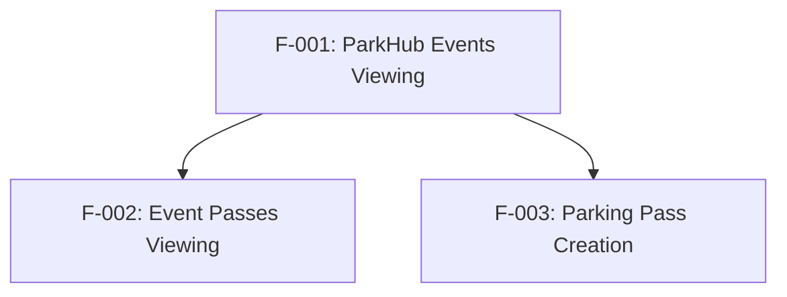
```mermaid
graph TD
    F001[F-001: ParkHub Events Viewing]
    F002[F-002: Event Passes Viewing]
    F003[F-003: Parking Pass Creation]
    
    F001 --> F002
    F001 --> F003
```

**Integration Points**

- All features integrate with ParkHub API
- Event viewing (F-001) provides context for both pass viewing (F-002) and creation (F-003)
- Pass viewing (F-002) and creation (F-003) share common data structures and API endpoints

**Shared Components**

- ParkHub API client service
- Error handling and notification system
- Event selection interface

### 2.4 IMPLEMENTATION CONSIDERATIONS

#### 2.4.1 Technical Constraints

| Feature | Technical Constraints |
| --- | --- |
| F-001 | - Limited by ParkHub API capabilities<br>- Frontend-only implementation |
| F-002 | - Dependent on ParkHub API response format<br>- Limited by frontend data handling capabilities |
| F-003 | - API rate limits for batch operations<br>- Frontend-only validation |

#### 2.4.2 Performance Requirements

| Requirement | Description |
| --- | --- |
| API Response Time | All API operations should complete within 5 seconds |
| UI Responsiveness | Interface should remain responsive during API operations |
| Batch Processing | System should handle creation of at least 50 passes in a single batch |

#### 2.4.3 Security Implications

| Security Aspect | Implementation Consideration |
| --- | --- |
| API Key Management | Secure storage of ParkHub API keys |
| Data Transmission | Secure HTTPS communication with ParkHub API |
| Input Validation | Client-side validation to prevent injection attacks |

#### 2.4.4 Maintenance Requirements

| Maintenance Aspect | Consideration |
| --- | --- |
| API Changes | Design for easy updates if ParkHub API changes |
| Error Logging | Implement comprehensive error logging for troubleshooting |
| Documentation | Maintain up-to-date documentation of API integration |

## 3. TECHNOLOGY STACK

### 3.1 PROGRAMMING LANGUAGES

| Language | Component | Justification |
| --- | --- | --- |
| JavaScript (ES6+) | Frontend | Industry standard for web development with strong ecosystem support |
| TypeScript | Frontend | Provides type safety and improved developer experience for React applications |
| HTML5 | Frontend | Standard markup language for web applications |
| CSS3 | Frontend | Standard styling language for web applications |

The application will be frontend-only as specified in the requirements, with no backend development needed. TypeScript is recommended over plain JavaScript to provide better code maintainability and reduce runtime errors through static type checking.

### 3.2 FRAMEWORKS & LIBRARIES

| Framework/Library | Version | Purpose | Justification |
| --- | --- | --- | --- |
| React.js | 18.x | Frontend UI framework | Specified in requirements; provides component-based architecture for building interactive UIs |
| React Router | 6.x | Client-side routing | Enables navigation between different views without page reloads |
| Axios | 1.x | HTTP client | Simplifies API requests to ParkHub endpoints with interceptors for API key management |
| React Hook Form | 7.x | Form handling | Efficient form validation and state management for pass creation forms |
| Material UI | 5.x | UI component library | Provides pre-built accessible components to accelerate development |
| React Query | 4.x | Data fetching & caching | Optimizes API calls with caching and refetching strategies |

React.js was explicitly required in the specifications. Supporting libraries were selected to address specific needs of the application while maintaining a lightweight footprint appropriate for a frontend-only solution.

### 3.3 DATABASES & STORAGE

No database or persistent storage solutions are required for this application as specified in the requirements. The application will be frontend-only and interact directly with ParkHub APIs for all data operations.

Local browser storage (localStorage or sessionStorage) may be used for temporary state management such as:

- Caching event lists to reduce API calls
- Storing form data during user input
- Maintaining user preferences

### 3.4 THIRD-PARTY SERVICES

| Service | Purpose | Integration Method |
| --- | --- | --- |
| ParkHub API | Core data service for events and passes | REST API with API key authentication |

The application's primary integration is with the ParkHub API, which will provide all necessary data operations:

- Retrieving game events
- Fetching passes for specific events
- Creating new parking passes

No additional third-party services are required based on the specified requirements.

### 3.5 DEVELOPMENT & DEPLOYMENT

| Tool/Service | Purpose | Justification |
| --- | --- | --- |
| Node.js | JavaScript runtime | Required for React development environment |
| npm/Yarn | Package management | Dependency management for frontend libraries |
| Create React App | Project scaffolding | Standardized React application setup with best practices |
| ESLint | Code linting | Ensures code quality and consistency |
| Jest | Unit testing | React-compatible testing framework |
| React Testing Library | Component testing | Testing React components in a user-centric way |
| GitHub | Version control | Industry standard for source code management |
| GitHub Pages | Static site hosting | Simple deployment option for frontend-only applications |
| GitHub Actions | CI/CD | Automated testing and deployment pipeline |

The development and deployment tools are selected to support a streamlined workflow for a frontend-only React application. GitHub Pages is recommended for hosting as it provides a simple deployment option for static sites without requiring backend infrastructure.

### 3.6 TECHNOLOGY ARCHITECTURE DIAGRAM

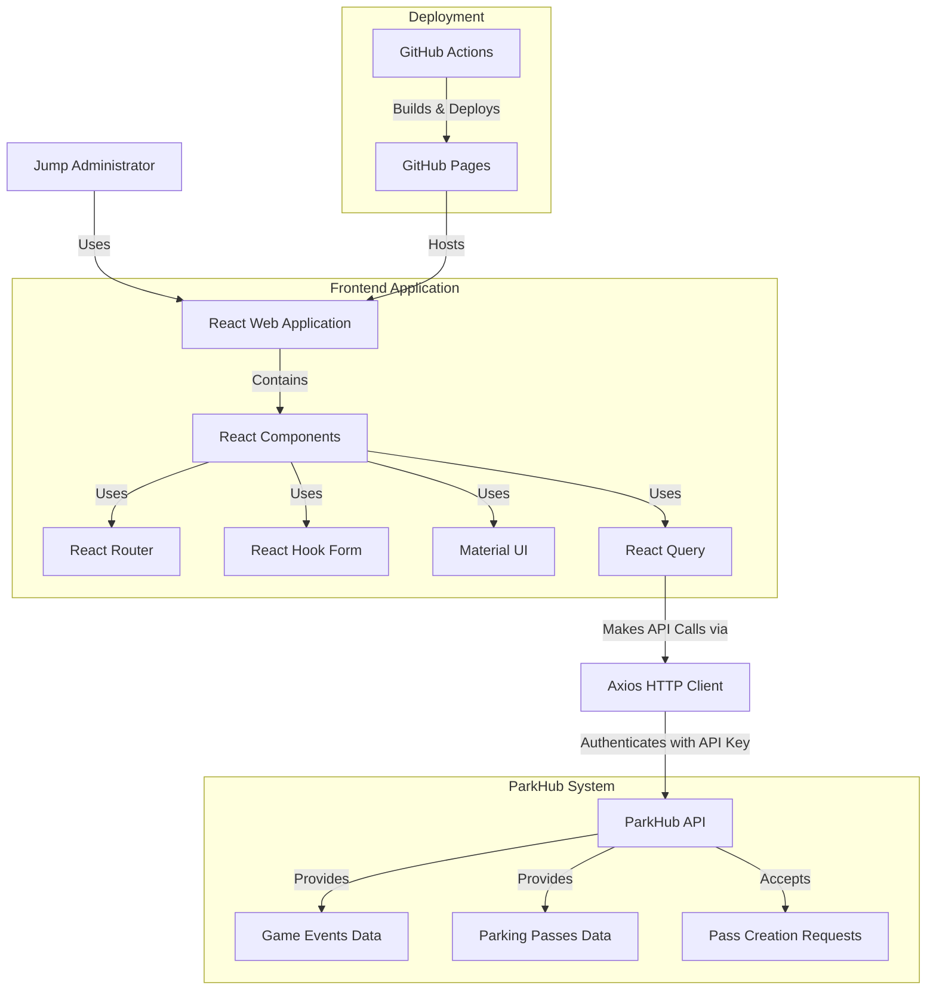
```mermaid
graph TD
    User[Jump Administrator] -->|Uses| WebApp[React Web Application]
    
    subgraph "Frontend Application"
        WebApp -->|Contains| Components[React Components]
        Components -->|Uses| ReactRouter[React Router]
        Components -->|Uses| ReactHookForm[React Hook Form]
        Components -->|Uses| MaterialUI[Material UI]
        Components -->|Uses| ReactQuery[React Query]
    end
    
    ReactQuery -->|Makes API Calls via| Axios[Axios HTTP Client]
    Axios -->|Authenticates with API Key| ParkHubAPI[ParkHub API]
    
    subgraph "ParkHub System"
        ParkHubAPI -->|Provides| Events[Game Events Data]
        ParkHubAPI -->|Provides| Passes[Parking Passes Data]
        ParkHubAPI -->|Accepts| PassCreation[Pass Creation Requests]
    end
    
    subgraph "Deployment"
        GitHubActions[GitHub Actions] -->|Builds & Deploys| GitHubPages[GitHub Pages]
        GitHubPages -->|Hosts| WebApp
    end
```

This architecture reflects the frontend-only nature of the application, with direct API integration to ParkHub services and no backend components as specified in the requirements.

## 4. PROCESS FLOWCHART

### 4.1 SYSTEM WORKFLOWS

#### 4.1.1 Core Business Processes

##### View ParkHub Events Workflow

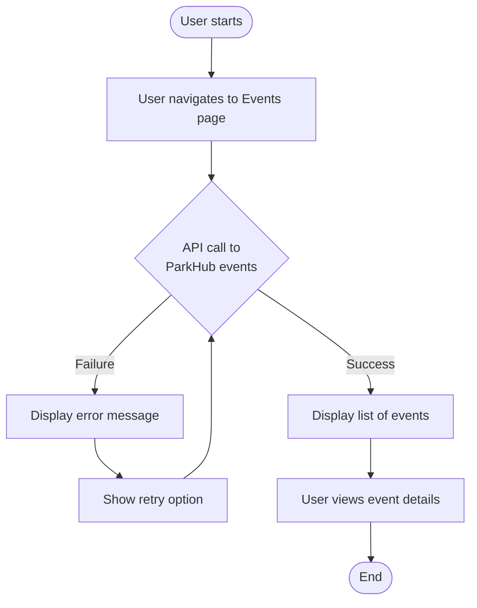
```mermaid
flowchart TD
    Start([User starts]) --> A[User navigates to Events page]
    A --> B{API call to\nParkHub events}
    B -->|Success| C[Display list of events]
    B -->|Failure| D[Display error message]
    D --> E[Show retry option]
    E --> B
    C --> F[User views event details]
    F --> End([End])
```

##### View Event Passes Workflow

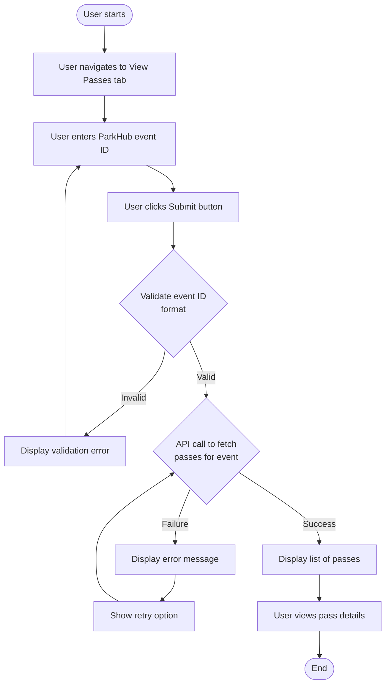
```mermaid
flowchart TD
    Start([User starts]) --> A[User navigates to View Passes tab]
    A --> B[User enters ParkHub event ID]
    B --> C[User clicks Submit button]
    C --> D{Validate event ID\nformat}
    D -->|Invalid| E[Display validation error]
    E --> B
    D -->|Valid| F{API call to fetch\npasses for event}
    F -->|Success| G[Display list of passes]
    F -->|Failure| H[Display error message]
    H --> I[Show retry option]
    I --> F
    G --> J[User views pass details]
    J --> End([End])
```

##### Create Parking Passes Workflow

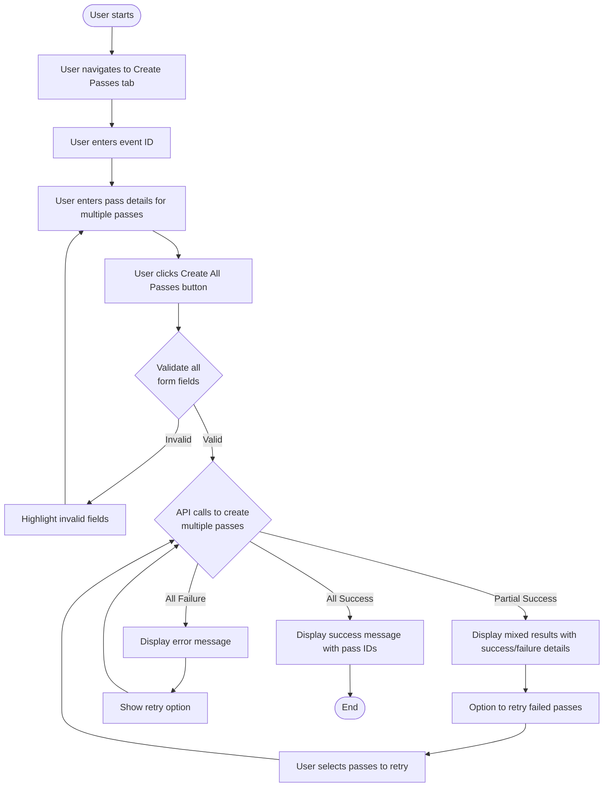
```mermaid
flowchart TD
    Start([User starts]) --> A[User navigates to Create Passes tab]
    A --> B[User enters event ID]
    B --> C[User enters pass details for multiple passes]
    C --> D[User clicks Create All Passes button]
    D --> E{Validate all\nform fields}
    E -->|Invalid| F[Highlight invalid fields]
    F --> C
    E -->|Valid| G{API calls to create\nmultiple passes}
    G -->|All Success| H[Display success message with pass IDs]
    G -->|Partial Success| I[Display mixed results with success/failure details]
    G -->|All Failure| J[Display error message]
    I --> K[Option to retry failed passes]
    J --> L[Show retry option]
    K --> M[User selects passes to retry]
    M --> G
    L --> G
    H --> End([End])
```

#### 4.1.2 Integration Workflows

##### ParkHub API Integration Flow

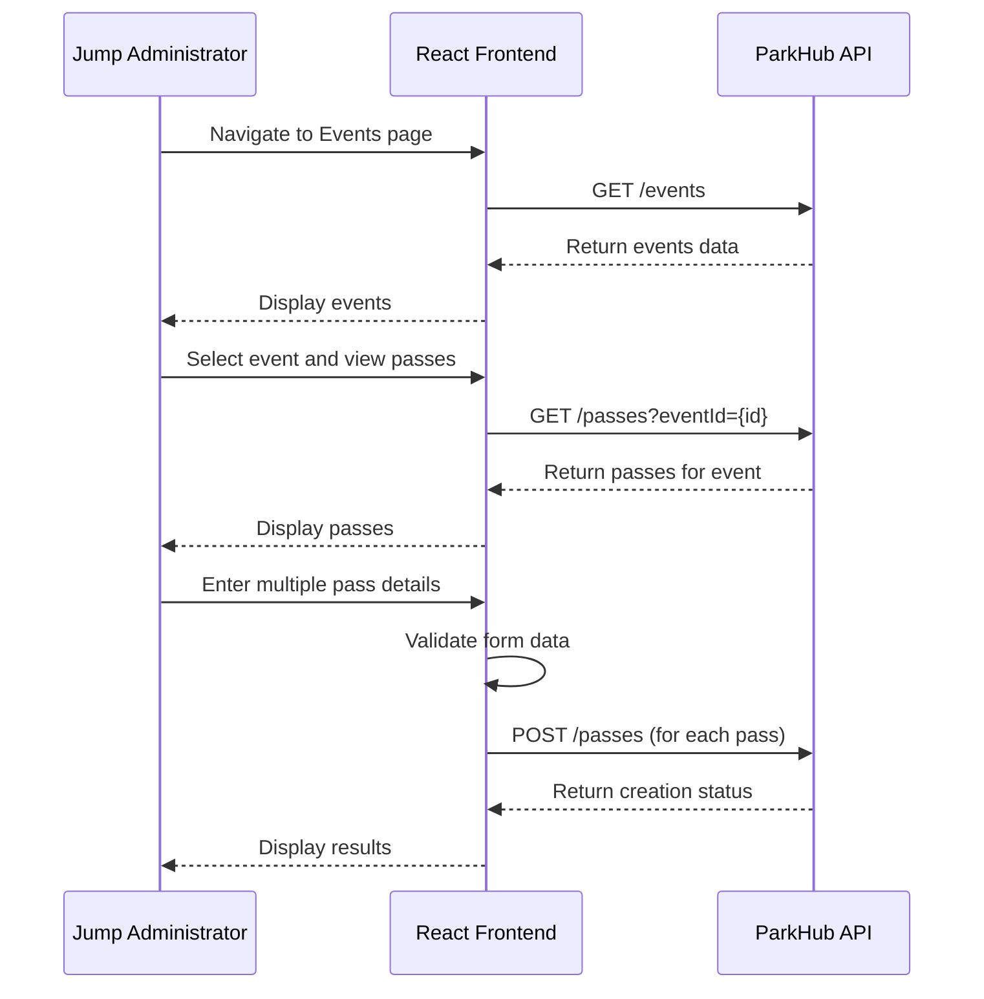
```mermaid
sequenceDiagram
    participant User as Jump Administrator
    participant UI as React Frontend
    participant API as ParkHub API
    
    User->>UI: Navigate to Events page
    UI->>API: GET /events
    API-->>UI: Return events data
    UI-->>User: Display events
    
    User->>UI: Select event and view passes
    UI->>API: GET /passes?eventId={id}
    API-->>UI: Return passes for event
    UI-->>User: Display passes
    
    User->>UI: Enter multiple pass details
    UI->>UI: Validate form data
    UI->>API: POST /passes (for each pass)
    API-->>UI: Return creation status
    UI-->>User: Display results
```

##### Batch Pass Creation Sequence

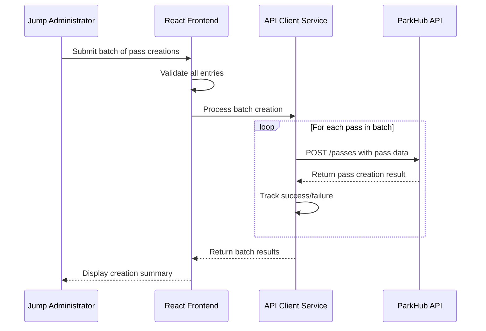
```mermaid
sequenceDiagram
    participant User as Jump Administrator
    participant UI as React Frontend
    participant APIClient as API Client Service
    participant API as ParkHub API
    
    User->>UI: Submit batch of pass creations
    UI->>UI: Validate all entries
    UI->>APIClient: Process batch creation
    
    loop For each pass in batch
        APIClient->>API: POST /passes with pass data
        API-->>APIClient: Return pass creation result
        APIClient->>APIClient: Track success/failure
    end
    
    APIClient-->>UI: Return batch results
    UI-->>User: Display creation summary
```

### 4.2 FLOWCHART REQUIREMENTS

#### 4.2.1 Event Management Workflow Details

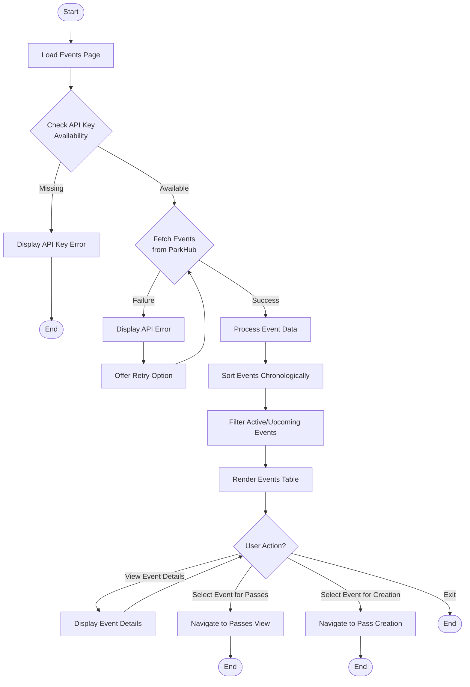
```mermaid
flowchart TD
    Start([Start]) --> A[Load Events Page]
    A --> B{Check API Key\nAvailability}
    B -->|Missing| C[Display API Key Error]
    C --> End1([End])
    
    B -->|Available| D{Fetch Events\nfrom ParkHub}
    D -->|Success| E[Process Event Data]
    D -->|Failure| F[Display API Error]
    F --> G[Offer Retry Option]
    G --> D
    
    E --> H[Sort Events Chronologically]
    H --> I[Filter Active/Upcoming Events]
    I --> J[Render Events Table]
    J --> K{User Action?}
    
    K -->|View Event Details| L[Display Event Details]
    K -->|Select Event for Passes| M[Navigate to Passes View]
    K -->|Select Event for Creation| N[Navigate to Pass Creation]
    K -->|Exit| End2([End])
    
    L --> K
    M --> End3([End])
    N --> End4([End])
```

#### 4.2.2 Pass Viewing Workflow Details

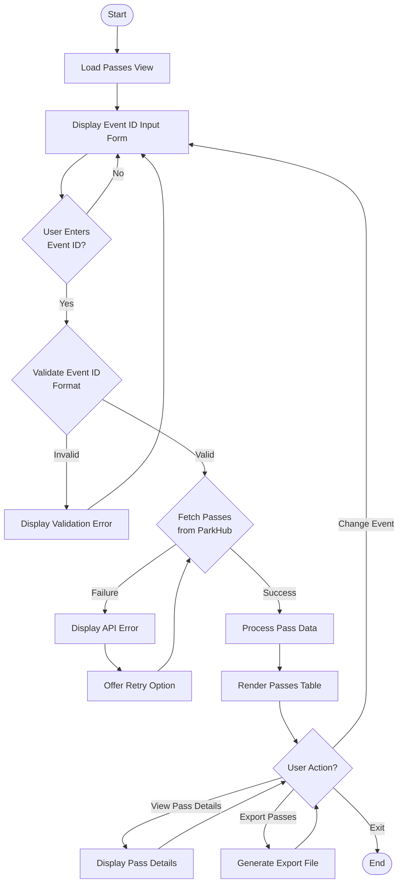
```mermaid
flowchart TD
    Start([Start]) --> A[Load Passes View]
    A --> B[Display Event ID Input Form]
    B --> C{User Enters\nEvent ID?}
    
    C -->|Yes| D{Validate Event ID\nFormat}
    C -->|No| B
    
    D -->|Invalid| E[Display Validation Error]
    E --> B
    
    D -->|Valid| F{Fetch Passes\nfrom ParkHub}
    F -->|Success| G[Process Pass Data]
    F -->|Failure| H[Display API Error]
    H --> I[Offer Retry Option]
    I --> F
    
    G --> J[Render Passes Table]
    J --> K{User Action?}
    
    K -->|View Pass Details| L[Display Pass Details]
    K -->|Export Passes| M[Generate Export File]
    K -->|Change Event| B
    K -->|Exit| End([End])
    
    L --> K
    M --> K
```

#### 4.2.3 Pass Creation Workflow Details

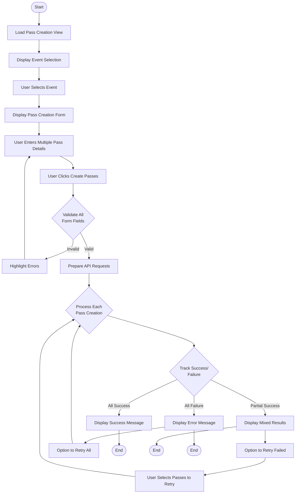
```mermaid
flowchart TD
    Start([Start]) --> A[Load Pass Creation View]
    A --> B[Display Event Selection]
    B --> C[User Selects Event]
    C --> D[Display Pass Creation Form]
    
    D --> E[User Enters Multiple Pass Details]
    E --> F[User Clicks Create Passes]
    
    F --> G{Validate All\nForm Fields}
    G -->|Invalid| H[Highlight Errors]
    H --> E
    
    G -->|Valid| I[Prepare API Requests]
    I --> J{Process Each\nPass Creation}
    
    J --> K{Track Success/\nFailure}
    K -->|All Success| L[Display Success Message]
    K -->|Partial Success| M[Display Mixed Results]
    K -->|All Failure| N[Display Error Message]
    
    M --> O[Option to Retry Failed]
    N --> P[Option to Retry All]
    
    O --> Q[User Selects Passes to Retry]
    Q --> J
    P --> J
    
    L --> End1([End])
    M --> End2([End])
    N --> End3([End])
```

### 4.3 TECHNICAL IMPLEMENTATION

#### 4.3.1 State Management Flow

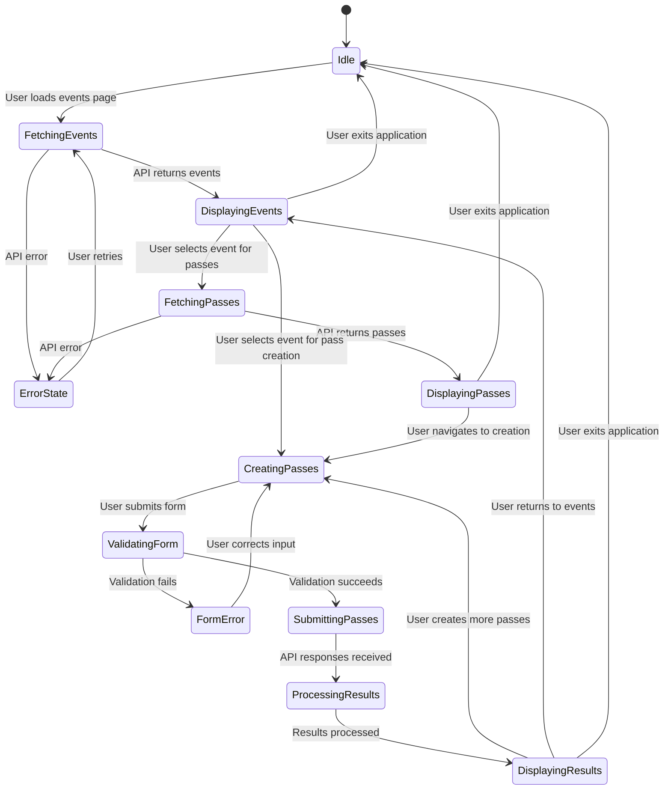
```mermaid
stateDiagram-v2
    [*] --> Idle
    
    Idle --> FetchingEvents: User loads events page
    FetchingEvents --> DisplayingEvents: API returns events
    FetchingEvents --> ErrorState: API error
    ErrorState --> FetchingEvents: User retries
    
    DisplayingEvents --> FetchingPasses: User selects event for passes
    FetchingPasses --> DisplayingPasses: API returns passes
    FetchingPasses --> ErrorState: API error
    
    DisplayingEvents --> CreatingPasses: User selects event for pass creation
    DisplayingPasses --> CreatingPasses: User navigates to creation
    
    CreatingPasses --> ValidatingForm: User submits form
    ValidatingForm --> FormError: Validation fails
    FormError --> CreatingPasses: User corrects input
    
    ValidatingForm --> SubmittingPasses: Validation succeeds
    SubmittingPasses --> ProcessingResults: API responses received
    ProcessingResults --> DisplayingResults: Results processed
    
    DisplayingResults --> CreatingPasses: User creates more passes
    DisplayingResults --> DisplayingEvents: User returns to events
    
    DisplayingEvents --> Idle: User exits application
    DisplayingPasses --> Idle: User exits application
    DisplayingResults --> Idle: User exits application
```

#### 4.3.2 Error Handling Flow

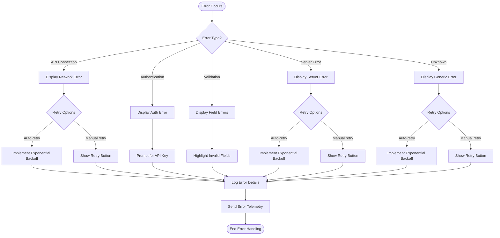
```mermaid
flowchart TD
    Start([Error Occurs]) --> A{Error Type?}
    
    A -->|API Connection| B[Display Network Error]
    A -->|Authentication| C[Display Auth Error]
    A -->|Validation| D[Display Field Errors]
    A -->|Server Error| E[Display Server Error]
    A -->|Unknown| F[Display Generic Error]
    
    B --> G{Retry Options}
    C --> H[Prompt for API Key]
    D --> I[Highlight Invalid Fields]
    E --> J{Retry Options}
    F --> K{Retry Options}
    
    G -->|Auto-retry| L[Implement Exponential Backoff]
    G -->|Manual retry| M[Show Retry Button]
    
    J -->|Auto-retry| N[Implement Exponential Backoff]
    J -->|Manual retry| O[Show Retry Button]
    
    K -->|Auto-retry| P[Implement Exponential Backoff]
    K -->|Manual retry| Q[Show Retry Button]
    
    L --> R[Log Error Details]
    M --> R
    H --> R
    I --> R
    N --> R
    O --> R
    P --> R
    Q --> R
    
    R --> S[Send Error Telemetry]
    S --> End([End Error Handling])
```

### 4.4 SYSTEM BOUNDARIES AND INTERACTIONS

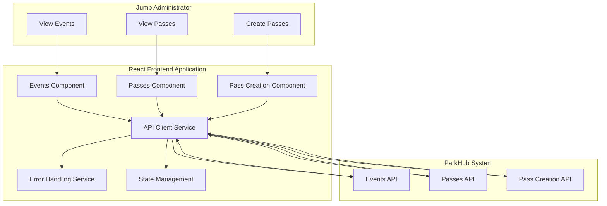
```mermaid
flowchart TD
    subgraph User["Jump Administrator"]
        A[View Events]
        B[View Passes]
        C[Create Passes]
    end
    
    subgraph Frontend["React Frontend Application"]
        D[Events Component]
        E[Passes Component]
        F[Pass Creation Component]
        G[API Client Service]
        H[Error Handling Service]
        I[State Management]
    end
    
    subgraph ParkHub["ParkHub System"]
        J[Events API]
        K[Passes API]
        L[Pass Creation API]
    end
    
    A --> D
    B --> E
    C --> F
    
    D --> G
    E --> G
    F --> G
    
    G --> H
    G --> I
    
    G --> J
    G --> K
    G --> L
    
    J --> G
    K --> G
    L --> G
```

### 4.5 VALIDATION RULES FLOWCHART

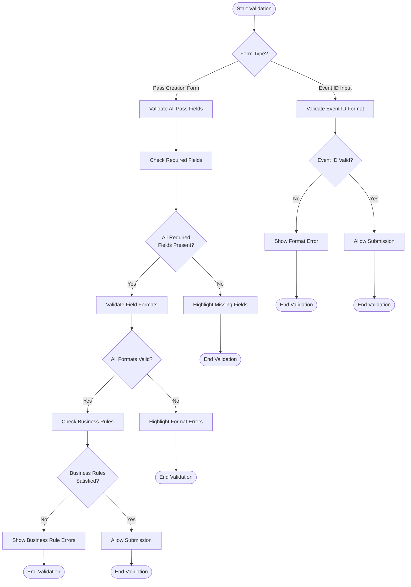
```mermaid
flowchart TD
    Start([Start Validation]) --> A{Form Type?}
    
    A -->|Event ID Input| B[Validate Event ID Format]
    A -->|Pass Creation Form| C[Validate All Pass Fields]
    
    B --> D{Event ID Valid?}
    D -->|Yes| E[Allow Submission]
    D -->|No| F[Show Format Error]
    
    C --> G[Check Required Fields]
    G --> H{All Required\nFields Present?}
    H -->|No| I[Highlight Missing Fields]
    H -->|Yes| J[Validate Field Formats]
    
    J --> K{All Formats Valid?}
    K -->|No| L[Highlight Format Errors]
    K -->|Yes| M[Check Business Rules]
    
    M --> N{Business Rules\nSatisfied?}
    N -->|No| O[Show Business Rule Errors]
    N -->|Yes| P[Allow Submission]
    
    F --> End1([End Validation])
    I --> End2([End Validation])
    L --> End3([End Validation])
    O --> End4([End Validation])
    P --> End5([End Validation])
    E --> End6([End Validation])
```

### 4.6 INTEGRATION SEQUENCE WITH TIMING CONSTRAINTS

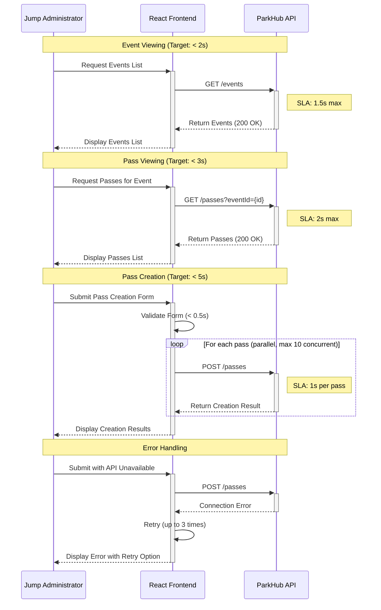
```mermaid
sequenceDiagram
    participant User as Jump Administrator
    participant UI as React Frontend
    participant API as ParkHub API
    
    Note over User,API: Event Viewing (Target: < 2s)
    User->>+UI: Request Events List
    UI->>+API: GET /events
    Note right of API: SLA: 1.5s max
    API-->>-UI: Return Events (200 OK)
    UI-->>-User: Display Events List
    
    Note over User,API: Pass Viewing (Target: < 3s)
    User->>+UI: Request Passes for Event
    UI->>+API: GET /passes?eventId={id}
    Note right of API: SLA: 2s max
    API-->>-UI: Return Passes (200 OK)
    UI-->>-User: Display Passes List
    
    Note over User,API: Pass Creation (Target: < 5s)
    User->>+UI: Submit Pass Creation Form
    UI->>UI: Validate Form (< 0.5s)
    
    loop For each pass (parallel, max 10 concurrent)
        UI->>+API: POST /passes
        Note right of API: SLA: 1s per pass
        API-->>-UI: Return Creation Result
    end
    
    UI-->>-User: Display Creation Results
    
    Note over User,API: Error Handling
    User->>+UI: Submit with API Unavailable
    UI->>+API: POST /passes
    API-->>-UI: Connection Error
    UI->>UI: Retry (up to 3 times)
    UI-->>-User: Display Error with Retry Option
```

## 5. SYSTEM ARCHITECTURE

### 5.1 HIGH-LEVEL ARCHITECTURE

#### 5.1.1 System Overview

The ParkHub Passes Creation Web Application follows a client-side architecture pattern with direct API integration. This approach was selected based on the requirement for a frontend-only implementation without backend development.

- **Architectural Style**: Single-Page Application (SPA) with RESTful API integration

- **Key Architectural Principles**:

  - Frontend-only implementation using React.js
  - Direct integration with third-party APIs (ParkHub)
  - Stateless communication using REST principles
  - Component-based UI architecture
  - Separation of concerns between UI, state management, and API communication

- **System Boundaries**:

  - The application is bounded by the web browser environment
  - External boundary is the ParkHub API interface
  - No persistent data storage within the application boundary
  - No server-side processing within the application boundary

#### 5.1.2 Core Components Table

| Component Name | Primary Responsibility | Key Dependencies | Critical Considerations |
| --- | --- | --- | --- |
| UI Components | Render interface and handle user interactions | React.js, Material UI | Accessibility, responsive design, error state handling |
| State Management | Maintain application state and UI synchronization | React Context/Hooks | Performance, state isolation, predictable updates |
| API Client | Handle communication with ParkHub API | Axios, React Query | Error handling, retry logic, authentication |
| Form Management | Handle form state, validation, and submission | React Hook Form | Validation rules, error messaging, field dependencies |

#### 5.1.3 Data Flow Description

The application follows a unidirectional data flow pattern:

1. **User Interaction Flow**: User actions trigger state changes or API requests through UI components.

2. **API Communication Flow**: The API client handles requests to ParkHub endpoints:

   - Fetches event data from ParkHub events endpoint
   - Retrieves passes for specific events from ParkHub passes endpoint
   - Submits new pass creation requests to ParkHub creation endpoint

3. **State Management Flow**: Application state is updated based on API responses or user actions:

   - Events data is stored in state after successful API retrieval
   - Passes data is stored in state when a specific event is selected
   - Form state is managed during pass creation process
   - Error states are captured and displayed to users

4. **Data Transformation Points**:

   - API response data is normalized before storage in application state
   - Form input data is validated and transformed before API submission
   - API error responses are transformed into user-friendly messages

5. **Temporary Storage**:

   - Browser localStorage may be used for caching event data to reduce API calls
   - Form state is maintained in memory during user input sessions

#### 5.1.4 External Integration Points

| System Name | Integration Type | Data Exchange Pattern | Protocol/Format | SLA Requirements |
| --- | --- | --- | --- | --- |
| ParkHub Events API | REST API | Request-Response | HTTPS/JSON | Response time \< 2s |
| ParkHub Passes API | REST API | Request-Response | HTTPS/JSON | Response time \< 3s |
| ParkHub Pass Creation API | REST API | Request-Response | HTTPS/JSON | Response time \< 1s per pass |

### 5.2 COMPONENT DETAILS

#### 5.2.1 UI Component Layer

**Purpose and Responsibilities**:

- Render user interface elements
- Handle user interactions
- Display data from application state
- Present error messages and loading states
- Manage navigation between application views

**Technologies and Frameworks**:

- React.js for component architecture
- Material UI for consistent design language
- React Router for navigation management
- CSS modules for component-specific styling

**Key Interfaces**:

- Event listing interface
- Pass viewing interface
- Pass creation form interface
- Error notification interface
- Loading state indicators

**Scaling Considerations**:

- Component composition for UI reusability
- Lazy loading of components for performance optimization
- Virtualized lists for handling large datasets

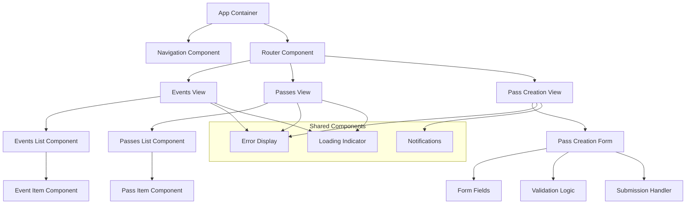
```mermaid
graph TD
    App[App Container] --> Nav[Navigation Component]
    App --> Router[Router Component]
    Router --> Events[Events View]
    Router --> Passes[Passes View]
    Router --> Creation[Pass Creation View]
    
    Events --> EventsList[Events List Component]
    EventsList --> EventItem[Event Item Component]
    
    Passes --> PassesList[Passes List Component]
    PassesList --> PassItem[Pass Item Component]
    
    Creation --> PassForm[Pass Creation Form]
    PassForm --> FormFields[Form Fields]
    PassForm --> ValidationLogic[Validation Logic]
    PassForm --> SubmissionHandler[Submission Handler]
    
    subgraph "Shared Components"
        ErrorDisplay[Error Display]
        LoadingIndicator[Loading Indicator]
        Notifications[Notifications]
    end
    
    Events --> ErrorDisplay
    Events --> LoadingIndicator
    Passes --> ErrorDisplay
    Passes --> LoadingIndicator
    Creation --> ErrorDisplay
    Creation --> Notifications
```

#### 5.2.2 State Management Layer

**Purpose and Responsibilities**:

- Maintain application state
- Provide state access to components
- Handle state updates based on user actions and API responses
- Manage loading and error states

**Technologies and Frameworks**:

- React Context API for global state
- React Hooks for component-level state
- React Query for server state management

**Key Interfaces**:

- Events state provider
- Passes state provider
- Form state management
- Error state handling

**Data Persistence Requirements**:

- No persistent data storage beyond browser session
- Optional caching of event data in localStorage

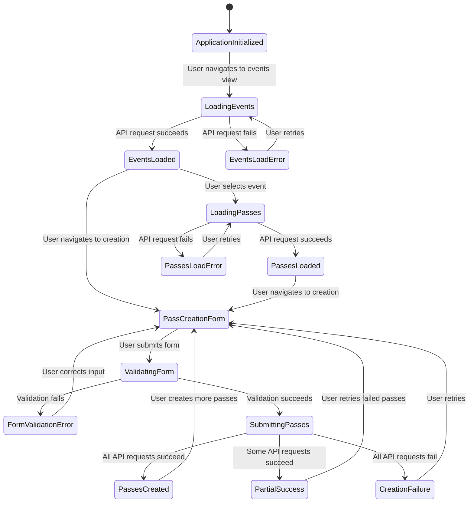
```mermaid
stateDiagram-v2
    [*] --> ApplicationInitialized
    
    ApplicationInitialized --> LoadingEvents: User navigates to events view
    LoadingEvents --> EventsLoaded: API request succeeds
    LoadingEvents --> EventsLoadError: API request fails
    EventsLoadError --> LoadingEvents: User retries
    
    EventsLoaded --> LoadingPasses: User selects event
    LoadingPasses --> PassesLoaded: API request succeeds
    LoadingPasses --> PassesLoadError: API request fails
    PassesLoadError --> LoadingPasses: User retries
    
    EventsLoaded --> PassCreationForm: User navigates to creation
    PassesLoaded --> PassCreationForm: User navigates to creation
    
    PassCreationForm --> ValidatingForm: User submits form
    ValidatingForm --> FormValidationError: Validation fails
    FormValidationError --> PassCreationForm: User corrects input
    
    ValidatingForm --> SubmittingPasses: Validation succeeds
    SubmittingPasses --> PassesCreated: All API requests succeed
    SubmittingPasses --> PartialSuccess: Some API requests succeed
    SubmittingPasses --> CreationFailure: All API requests fail
    
    PassesCreated --> PassCreationForm: User creates more passes
    PartialSuccess --> PassCreationForm: User retries failed passes
    CreationFailure --> PassCreationForm: User retries
```

#### 5.2.3 API Client Layer

**Purpose and Responsibilities**:

- Handle communication with ParkHub API endpoints
- Manage API authentication
- Transform request and response data
- Handle API errors and retries

**Technologies and Frameworks**:

- Axios for HTTP requests
- React Query for data fetching, caching, and synchronization

**Key Interfaces**:

- getEvents(): Fetch all events from ParkHub
- getPassesForEvent(eventId): Fetch passes for a specific event
- createPass(passData): Create a new parking pass
- createMultiplePasses(passesData): Create multiple parking passes

**Scaling Considerations**:

- Request batching for multiple pass creation
- Concurrency limits for API requests
- Exponential backoff for retries

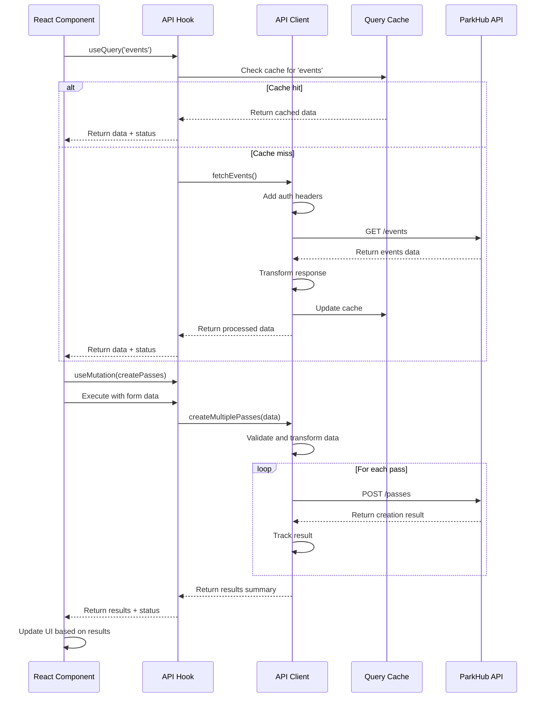
```mermaid
sequenceDiagram
    participant Component as React Component
    participant APIHook as API Hook
    participant Client as API Client
    participant Cache as Query Cache
    participant API as ParkHub API
    
    Component->>APIHook: useQuery('events')
    APIHook->>Cache: Check cache for 'events'
    
    alt Cache hit
        Cache-->>APIHook: Return cached data
        APIHook-->>Component: Return data + status
    else Cache miss
        APIHook->>Client: fetchEvents()
        Client->>Client: Add auth headers
        Client->>API: GET /events
        API-->>Client: Return events data
        Client->>Client: Transform response
        Client->>Cache: Update cache
        Client-->>APIHook: Return processed data
        APIHook-->>Component: Return data + status
    end
    
    Component->>APIHook: useMutation(createPasses)
    Component->>APIHook: Execute with form data
    APIHook->>Client: createMultiplePasses(data)
    Client->>Client: Validate and transform data
    
    loop For each pass
        Client->>API: POST /passes
        API-->>Client: Return creation result
        Client->>Client: Track result
    end
    
    Client-->>APIHook: Return results summary
    APIHook-->>Component: Return results + status
    Component->>Component: Update UI based on results
```

#### 5.2.4 Form Management Layer

**Purpose and Responsibilities**:

- Manage form state and validation
- Handle form submission
- Provide error feedback for form fields
- Support batch input for multiple passes

**Technologies and Frameworks**:

- React Hook Form for form state management
- Yup or Joi for validation schema definition

**Key Interfaces**:

- EventSelectionForm: Select event for pass operations
- PassCreationForm: Create multiple new passes
- ValidationSchema: Define validation rules for form fields

**Scaling Considerations**:

- Dynamic form fields for variable number of passes
- Field-level validation for immediate feedback
- Batch validation for efficiency

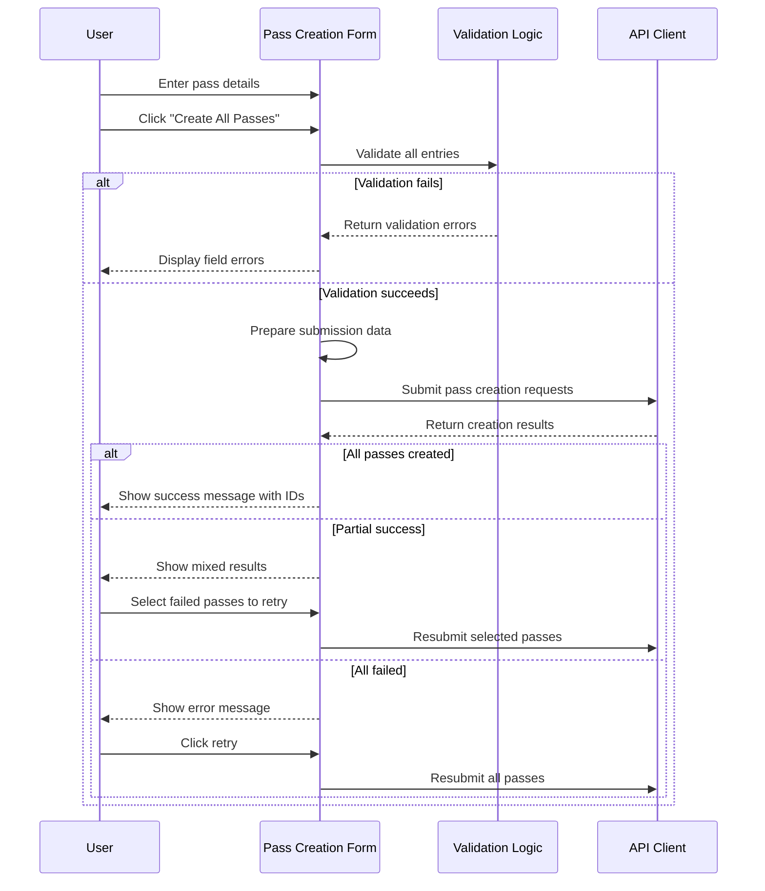
```mermaid
sequenceDiagram
    participant User
    participant Form as Pass Creation Form
    participant Validation as Validation Logic
    participant API as API Client
    
    User->>Form: Enter pass details
    User->>Form: Click "Create All Passes"
    Form->>Validation: Validate all entries
    
    alt Validation fails
        Validation-->>Form: Return validation errors
        Form-->>User: Display field errors
    else Validation succeeds
        Form->>Form: Prepare submission data
        Form->>API: Submit pass creation requests
        
        API-->>Form: Return creation results
        
        alt All passes created
            Form-->>User: Show success message with IDs
        else Partial success
            Form-->>User: Show mixed results
            User->>Form: Select failed passes to retry
            Form->>API: Resubmit selected passes
        else All failed
            Form-->>User: Show error message
            User->>Form: Click retry
            Form->>API: Resubmit all passes
        end
    end
```

### 5.3 TECHNICAL DECISIONS

#### 5.3.1 Architecture Style Decisions

| Decision | Options Considered | Selected Approach | Rationale |
| --- | --- | --- | --- |
| Application Architecture | SPA vs MPA vs PWA | Single-Page Application (SPA) | Best fit for admin interface with multiple views and direct API integration |
| State Management | Redux vs Context API vs React Query | Context API + React Query | Simpler than Redux for this scale; React Query handles server state efficiently |
| API Communication | REST vs GraphQL | REST | ParkHub provides REST APIs; no need for GraphQL complexity |
| UI Component Strategy | Custom vs Library | Material UI | Accelerates development with pre-built accessible components |

#### 5.3.2 Communication Pattern Choices

The application uses a RESTful communication pattern with the ParkHub API, following these principles:

- **Request-Response Pattern**: Synchronous communication for all API operations
- **API Key Authentication**: All requests include API key in headers
- **JSON Data Format**: All requests and responses use JSON format
- **Error Handling**: HTTP status codes determine success/failure with detailed error messages in response body
- **Idempotency**: Pass creation operations are designed to be idempotent to prevent duplicates

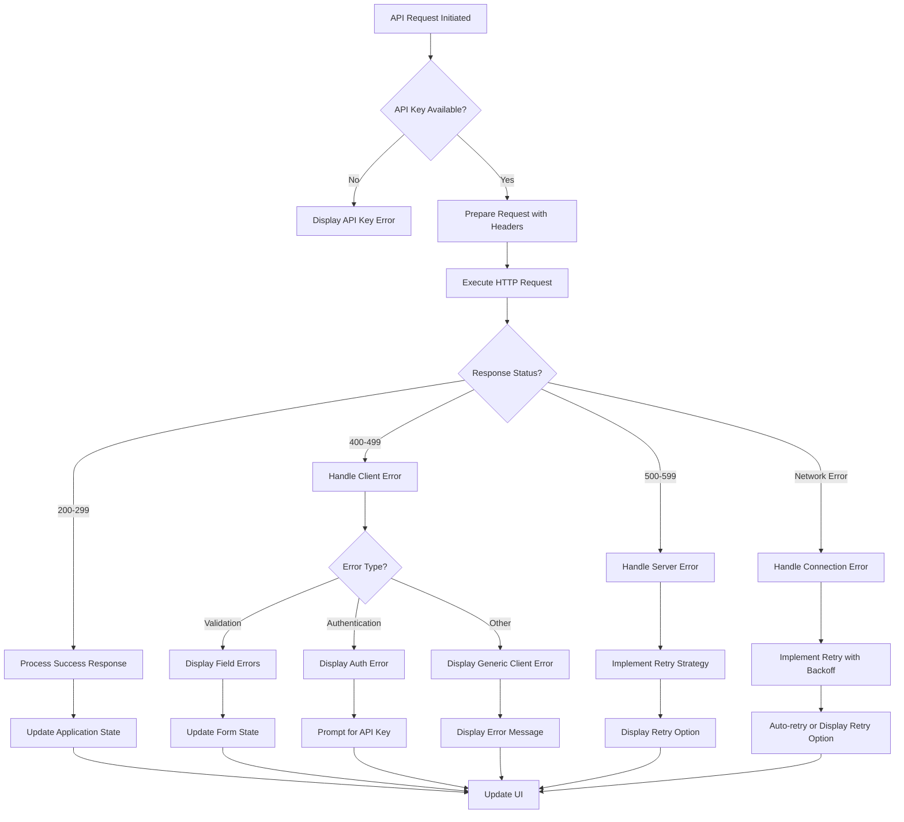
```mermaid
graph TD
    A[API Request Initiated] --> B{API Key Available?}
    B -->|No| C[Display API Key Error]
    B -->|Yes| D[Prepare Request with Headers]
    D --> E[Execute HTTP Request]
    E --> F{Response Status?}
    F -->|200-299| G[Process Success Response]
    F -->|400-499| H[Handle Client Error]
    F -->|500-599| I[Handle Server Error]
    F -->|Network Error| J[Handle Connection Error]
    
    H --> K{Error Type?}
    K -->|Validation| L[Display Field Errors]
    K -->|Authentication| M[Display Auth Error]
    K -->|Other| N[Display Generic Client Error]
    
    I --> O[Implement Retry Strategy]
    J --> P[Implement Retry with Backoff]
    
    G --> Q[Update Application State]
    L --> R[Update Form State]
    M --> S[Prompt for API Key]
    N --> T[Display Error Message]
    O --> U[Display Retry Option]
    P --> V[Auto-retry or Display Retry Option]
    
    Q --> W[Update UI]
    R --> W
    S --> W
    T --> W
    U --> W
    V --> W
```

#### 5.3.3 Caching Strategy Justification

| Cache Type | Implementation | Purpose | Justification |
| --- | --- | --- | --- |
| Event Data Cache | React Query + localStorage | Reduce API calls for event data | Events change infrequently; caching improves performance |
| Form Data Cache | React Hook Form state | Preserve user input during navigation | Prevents data loss if user navigates between views |
| API Response Cache | React Query | Optimize repeated API calls | Reduces network traffic and improves responsiveness |

The application implements a lightweight caching strategy focused on improving user experience without complex infrastructure:

- **Time-Based Invalidation**: Event data cache expires after a configurable period (default: 1 hour)
- **Manual Invalidation**: Users can force-refresh data when needed
- **Persistence Options**: Critical data may be persisted in localStorage to survive page refreshes

### 5.4 CROSS-CUTTING CONCERNS

#### 5.4.1 Error Handling Patterns

The application implements a comprehensive error handling strategy:

- **API Error Handling**:

  - Network errors trigger automatic retry with exponential backoff
  - Authentication errors prompt for API key update
  - Validation errors map to specific form fields
  - Server errors display appropriate messages with retry options

- **Form Validation Errors**:

  - Field-level validation with immediate feedback
  - Form-level validation for cross-field dependencies
  - Clear error messages with resolution guidance

- **Application Errors**:

  - Global error boundary catches unexpected errors
  - Non-blocking error notifications for non-critical issues
  - Detailed error logging for troubleshooting

```mermaid
flowchart TD
    Start([Error Detected]) --> A{Error Category}
    
    A -->|API Error| B{Error Type}
    A -->|Validation Error| C[Map to Form Fields]
    A -->|Application Error| D[Capture in Error Boundary]
    
    B -->|Network| E[Implement Retry Logic]
    B -->|Authentication| F[Display Auth Error]
    B -->|Server| G[Display Server Error]
    B -->|Client| H[Display Client Error]
    
    E --> I{Retry Count < Max?}
    I -->|Yes| J[Retry with Backoff]
    I -->|No| K[Display Connection Error]
    
    C --> L[Highlight Invalid Fields]
    L --> M[Display Field Error Messages]
    
    D --> N[Log Error Details]
    N --> O[Display Fallback UI]
    
    F --> P[Prompt for API Key Update]
    G --> Q[Offer Manual Retry]
    H --> R[Show Resolution Steps]
    
    J --> S[Update Loading State]
    K --> T[Show Offline Message]
    M --> U[Enable Form Correction]
    O --> V[Provide Reset Option]
    P --> W[Allow Credential Update]
    Q --> X[Provide Retry Button]
    R --> Y[Link to Documentation]
    
    S --> End([End Error Handling])
    T --> End
    U --> End
    V --> End
    W --> End
    X --> End
    Y --> End
```

#### 5.4.2 Monitoring and Observability

For a frontend-only application, monitoring focuses on client-side metrics and error tracking:

- **Error Tracking**:

  - Console logging for development
  - Optional integration with error monitoring services (e.g., Sentry)
  - Capture of API errors, validation failures, and unexpected exceptions

- **Performance Monitoring**:

  - API response time tracking
  - UI rendering performance metrics
  - Form submission success/failure rates

- **Usage Analytics**:

  - Optional integration with web analytics
  - Feature usage tracking
  - Error frequency monitoring

#### 5.4.3 Security Considerations

| Security Concern | Implementation Approach | Rationale |
| --- | --- | --- |
| API Key Protection | Store in secure browser storage | Prevents exposure in client-side code |
| Data Validation | Client-side validation before API calls | Reduces invalid data submission |
| HTTPS Communication | Enforce secure API communication | Prevents data interception |
| Input Sanitization | Validate and sanitize all user inputs | Prevents injection attacks |

The application implements security best practices appropriate for a frontend-only admin tool:

- **API Key Management**:

  - API keys stored in secure browser storage (not in code)
  - Keys never exposed in client-side source
  - Optional session-based key storage

- **Data Protection**:

  - No sensitive data stored in browser beyond the current session
  - Form data cleared after successful submission
  - No exposure of internal ParkHub system details

I'll provide the System Components Design section for your Technical Specifications document.

## 6. SYSTEM COMPONENTS DESIGN

### 6.1 FRONTEND COMPONENTS

#### 6.1.1 Component Hierarchy

The frontend application follows a component-based architecture with a clear hierarchy to maintain separation of concerns and promote reusability.

```mermaid
graph TD
    App[App Container] --> Header[Header Component]
    App --> MainContent[Main Content Container]
    App --> Footer[Footer Component]
    
    MainContent --> Router[Router Component]
    
    Router --> EventsView[Events View]
    Router --> PassesView[Passes View]
    Router --> CreationView[Pass Creation View]
    
    EventsView --> EventsTable[Events Table]
    EventsTable --> EventRow[Event Row]
    EventsView --> EventsFilter[Events Filter]
    EventsView --> LoadingState[Loading State]
    EventsView --> ErrorState[Error State]
    
    PassesView --> EventSelector[Event Selector]
    PassesView --> PassesTable[Passes Table]
    PassesTable --> PassRow[Pass Row]
    PassesView --> PassesFilter[Passes Filter]
    PassesView --> LoadingState
    PassesView --> ErrorState
    
    CreationView --> EventSelector
    CreationView --> PassFormContainer[Pass Form Container]
    PassFormContainer --> PassForm[Pass Form]
    PassForm --> FormFields[Form Fields]
    PassFormContainer --> AddPassButton[Add Pass Button]
    PassFormContainer --> SubmitButton[Submit Button]
    CreationView --> ResultsDisplay[Results Display]
    CreationView --> LoadingState
    CreationView --> ErrorState
    
    subgraph "Shared Components"
        LoadingState
        ErrorState
        Notification[Notification Component]
        Modal[Modal Component]
        Table[Table Component]
    end
```

#### 6.1.2 Component Specifications

##### Core View Components

| Component | Purpose | Props | State | Key Functions |
| --- | --- | --- | --- | --- |
| EventsView | Display list of ParkHub events | None | events, loading, error | fetchEvents(), handleEventSelect() |
| PassesView | Display passes for selected event | eventId (optional) | passes, selectedEvent, loading, error | fetchPasses(), handlePassSelect() |
| CreationView | Create new parking passes | eventId (optional) | forms, results, loading, error | handleAddPass(), handleRemovePass(), handleSubmit() |

##### Data Display Components

| Component | Purpose | Props | State | Key Functions |
| --- | --- | --- | --- | --- |
| EventsTable | Render events in tabular format | events, onEventSelect | sortColumn, sortDirection | handleSort(), renderEventRow() |
| PassesTable | Render passes in tabular format | passes, onPassSelect | sortColumn, sortDirection | handleSort(), renderPassRow() |
| ResultsDisplay | Show pass creation results | results | None | renderSuccessItems(), renderFailureItems() |

##### Form Components

| Component | Purpose | Props | State | Key Functions |
| --- | --- | --- | --- | --- |
| EventSelector | Select event for operations | events, selectedEvent, onSelect | None | handleChange() |
| PassForm | Capture pass details | index, formData, onChange, onRemove | None | handleFieldChange(), validateField() |
| FormFields | Render individual form fields | field, value, onChange, error | None | handleChange(), handleBlur() |

##### Shared Components

| Component | Purpose | Props | State | Key Functions |
| --- | --- | --- | --- | --- |
| LoadingState | Display loading indicator | message (optional) | None | None |
| ErrorState | Display error message | error, onRetry (optional) | None | handleRetry() |
| Notification | Show success/error notifications | type, message, duration | visible | show(), hide() |
| Modal | Display modal dialogs | isOpen, title, children, onClose | None | handleClose() |
| Table | Reusable table component | columns, data, onRowClick | None | renderHeader(), renderRows() |

#### 6.1.3 UI State Management

The application uses React's Context API for global state management, with local component state for UI-specific concerns.

```mermaid
graph TD
    subgraph "Global State"
        AppContext[App Context]
        EventsContext[Events Context]
        PassesContext[Passes Context]
        NotificationContext[Notification Context]
    end
    
    subgraph "Local State"
        EventsViewState[Events View State]
        PassesViewState[Passes View State]
        CreationViewState[Creation View State]
        FormState[Form State]
    end
    
    AppContext --> EventsContext
    AppContext --> PassesContext
    AppContext --> NotificationContext
    
    EventsContext --> EventsViewState
    PassesContext --> PassesViewState
    PassesContext --> CreationViewState
    NotificationContext --> EventsViewState
    NotificationContext --> PassesViewState
    NotificationContext --> CreationViewState
    
    CreationViewState --> FormState
```

**State Management Approach**:

| State Category | Management Approach | Justification |
| --- | --- | --- |
| API Data | React Query + Context | Efficient caching and synchronization of server data |
| UI State | Local Component State | Keeps UI-specific state encapsulated within components |
| Form State | React Hook Form | Specialized library for efficient form state management |
| Notifications | Context API | Global access to notification system from any component |

### 6.2 API INTEGRATION COMPONENTS

#### 6.2.1 API Client Structure

The API client layer handles all communication with the ParkHub API, providing a clean interface for components to interact with external services.

```mermaid
graph TD
    subgraph "API Client Layer"
        APIClient[API Client]
        EventsAPI[Events API]
        PassesAPI[Passes API]
        AuthInterceptor[Auth Interceptor]
        ErrorHandler[Error Handler]
        RequestQueue[Request Queue]
    end
    
    subgraph "React Components"
        Components[React Components]
    end
    
    subgraph "External Services"
        ParkHubAPI[ParkHub API]
    end
    
    Components --> APIClient
    APIClient --> EventsAPI
    APIClient --> PassesAPI
    
    EventsAPI --> AuthInterceptor
    PassesAPI --> AuthInterceptor
    
    AuthInterceptor --> RequestQueue
    RequestQueue --> ParkHubAPI
    
    ParkHubAPI --> ErrorHandler
    ErrorHandler --> Components
```

#### 6.2.2 API Service Specifications

| Service | Endpoints | Parameters | Return Value | Error Handling |
| --- | --- | --- | --- | --- |
| EventsService | getEvents() | None | Promise\<Event\[\]\> | Handles network errors, authentication errors, and server errors |
| PassesService | getPassesForEvent(eventId) | eventId: string | Promise\<Pass\[\]\> | Handles network errors, authentication errors, and server errors |
| PassesService | createPass(passData) | passData: PassData | Promise\<PassResult\> | Handles validation errors, network errors, authentication errors, and server errors |
| PassesService | createMultiplePasses(passesData) | passesData: PassData\[\] | Promise\<PassResult\[\]\> | Handles batch processing with individual pass results |

#### 6.2.3 API Data Models

**Event Model**:

```
Event {
  id: string
  name: string
  date: string
  venue: string
  status: string
  additionalDetails?: object
}
```

**Pass Model**:

```
Pass {
  id: string
  eventId: string
  accountId: string
  barcode: string
  customerName: string
  spotType: string
  lotId: string
  createdAt: string
  status: string
  additionalDetails?: object
}
```

**Pass Creation Request**:

```
PassCreationRequest {
  eventId: string
  accountId: string
  barcode: string
  customerName: string
  spotType: string
  lotId: string
}
```

**Pass Creation Response**:

```
PassCreationResponse {
  success: boolean
  passId?: string
  error?: {
    code: string
    message: string
    field?: string
  }
}
```

#### 6.2.4 API Authentication

The application uses API key authentication for all ParkHub API requests:

- **Storage**: API key is stored in browser localStorage or sessionStorage
- **Transmission**: API key is included in the Authorization header of all requests
- **Security**: HTTPS is enforced for all API communication
- **Management**: UI provides a way to update the API key if needed

```mermaid
sequenceDiagram
    participant Component as React Component
    participant APIClient as API Client
    participant Auth as Auth Interceptor
    participant Storage as Local Storage
    participant API as ParkHub API
    
    Component->>APIClient: Make API request
    APIClient->>Auth: Process request
    Auth->>Storage: Get API key
    
    alt API key exists
        Storage-->>Auth: Return API key
        Auth->>Auth: Add Authorization header
        Auth->>API: Send authenticated request
        API-->>Auth: Return response
        Auth-->>APIClient: Return response
        APIClient-->>Component: Return data
    else API key missing
        Storage-->>Auth: Return null
        Auth-->>APIClient: Throw authentication error
        APIClient-->>Component: Show API key input prompt
        Component->>Storage: Save new API key
        Component->>APIClient: Retry request
    end
```

### 6.3 FORM HANDLING COMPONENTS

#### 6.3.1 Form Architecture

The form handling system is designed to manage complex multi-pass creation forms with validation and error handling.

```mermaid
graph TD
    subgraph "Form Container"
        FormContainer[Form Container]
        FormProvider[Form Provider]
        FormArray[Dynamic Form Array]
        ValidationSchema[Validation Schema]
        SubmitHandler[Submit Handler]
    end
    
    subgraph "Form Items"
        PassForm1[Pass Form 1]
        PassForm2[Pass Form 2]
        PassFormN[Pass Form N]
    end
    
    subgraph "Form Fields"
        EventIdField[Event ID Field]
        AccountIdField[Account ID Field]
        BarcodeField[Barcode Field]
        CustomerNameField[Customer Name Field]
        SpotTypeField[Spot Type Field]
        LotIdField[Lot ID Field]
    end
    
    FormContainer --> FormProvider
    FormProvider --> FormArray
    FormProvider --> ValidationSchema
    FormProvider --> SubmitHandler
    
    FormArray --> PassForm1
    FormArray --> PassForm2
    FormArray --> PassFormN
    
    PassForm1 --> EventIdField
    PassForm1 --> AccountIdField
    PassForm1 --> BarcodeField
    PassForm1 --> CustomerNameField
    PassForm1 --> SpotTypeField
    PassForm1 --> LotIdField
    
    PassForm2 --> EventIdField
    PassForm2 --> AccountIdField
    PassForm2 --> BarcodeField
    PassForm2 --> CustomerNameField
    PassForm2 --> SpotTypeField
    PassForm2 --> LotIdField
    
    PassFormN --> EventIdField
    PassFormN --> AccountIdField
    PassFormN --> BarcodeField
    PassFormN --> CustomerNameField
    PassFormN --> SpotTypeField
    PassFormN --> LotIdField
```

#### 6.3.2 Form Validation Rules

| Field | Validation Rules | Error Messages |
| --- | --- | --- |
| eventId | Required, String format | "Event ID is required", "Invalid Event ID format" |
| accountId | Required, String format | "Account ID is required", "Invalid Account ID format" |
| barcode | Required, String format, Unique | "Barcode is required", "Invalid barcode format", "Barcode must be unique" |
| customerName | Required, String format | "Customer name is required", "Invalid customer name format" |
| spotType | Required, Valid option | "Spot type is required", "Invalid spot type" |
| lotId | Required, String format | "Lot ID is required", "Invalid lot ID format" |

#### 6.3.3 Form State Management

The application uses React Hook Form for efficient form state management:

- **Form Arrays**: Dynamic arrays for multiple pass creation
- **Validation**: Schema-based validation with Yup
- **Error Handling**: Field-level and form-level error messages
- **Performance**: Uncontrolled components with validation on blur/submit
- **Submission**: Batch submission with individual pass tracking

```mermaid
sequenceDiagram
    participant User
    participant Form as Form Component
    participant HookForm as React Hook Form
    participant Validation as Validation Schema
    participant API as API Client
    
    User->>Form: Add pass form
    Form->>HookForm: Append form field
    HookForm-->>Form: Update form array
    
    User->>Form: Fill form fields
    Form->>HookForm: Update field values
    HookForm->>Validation: Validate on blur
    Validation-->>HookForm: Return validation result
    HookForm-->>Form: Update field errors
    
    User->>Form: Submit form
    Form->>HookForm: Trigger form validation
    HookForm->>Validation: Validate all fields
    
    alt Validation fails
        Validation-->>HookForm: Return validation errors
        HookForm-->>Form: Display field errors
        Form-->>User: Highlight invalid fields
    else Validation succeeds
        HookForm-->>Form: Provide form values
        Form->>API: Submit pass creation requests
        API-->>Form: Return creation results
        Form-->>User: Display creation results
    end
```

### 6.4 ERROR HANDLING COMPONENTS

#### 6.4.1 Error Handling Architecture

The application implements a comprehensive error handling system to manage various error scenarios:

```mermaid
graph TD
    subgraph "Error Sources"
        APIErrors[API Errors]
        ValidationErrors[Validation Errors]
        RuntimeErrors[Runtime Errors]
    end
    
    subgraph "Error Handlers"
        ErrorBoundary[Error Boundary]
        APIErrorHandler[API Error Handler]
        FormErrorHandler[Form Error Handler]
    end
    
    subgraph "Error Displays"
        ErrorNotification[Error Notification]
        FieldErrors[Field Error Messages]
        ErrorPage[Error Page]
    end
    
    APIErrors --> APIErrorHandler
    ValidationErrors --> FormErrorHandler
    RuntimeErrors --> ErrorBoundary
    
    APIErrorHandler --> ErrorNotification
    FormErrorHandler --> FieldErrors
    ErrorBoundary --> ErrorPage
    
    subgraph "Recovery Actions"
        RetryButton[Retry Button]
        ResetForm[Reset Form]
        RefreshPage[Refresh Page]
    end
    
    ErrorNotification --> RetryButton
    FieldErrors --> ResetForm
    ErrorPage --> RefreshPage
```

#### 6.4.2 Error Types and Handling Strategies

| Error Type | Detection Method | Handling Strategy | User Experience |
| --- | --- | --- | --- |
| Network Error | Axios interceptor | Automatic retry with exponential backoff | Loading indicator with retry message |
| Authentication Error | API response status | Prompt for API key update | Modal dialog for API key input |
| Validation Error | Form submission | Field-level error messages | Highlighted fields with error text |
| Server Error | API response status | Display error with retry option | Error notification with retry button |
| Runtime Error | Error boundary | Fallback UI with refresh option | Error page with refresh button |

#### 6.4.3 Error Recovery Patterns

The application implements several error recovery patterns to maintain a good user experience:

- **Automatic Retry**: Network errors trigger automatic retry with exponential backoff
- **Manual Retry**: User-initiated retry for server errors or failed operations
- **Partial Success Handling**: For batch operations, track individual successes/failures
- **State Preservation**: Preserve form state during errors to prevent data loss
- **Graceful Degradation**: Fall back to limited functionality when possible

```mermaid
sequenceDiagram
    participant User
    participant UI as UI Component
    participant ErrorHandler as Error Handler
    participant API as API Client
    
    UI->>API: Make API request
    API-->>ErrorHandler: Network error occurs
    ErrorHandler->>ErrorHandler: Implement retry strategy
    
    loop Retry with backoff (max 3 attempts)
        ErrorHandler->>API: Retry request
        
        alt Success
            API-->>UI: Return successful response
            UI-->>User: Display success state
            
        else Continued failure
            API-->>ErrorHandler: Return error
            ErrorHandler->>ErrorHandler: Increment retry count
        end
    end
    
    alt Max retries reached
        ErrorHandler-->>UI: Provide error details
        UI-->>User: Display error with manual retry option
        User->>UI: Click retry
        UI->>API: Manual retry request
    end
```

### 6.5 RESPONSIVE DESIGN COMPONENTS

#### 6.5.1 Responsive Layout Strategy

The application uses a responsive design approach to ensure usability across different screen sizes:

- **Fluid Grid System**: Percentage-based layouts that adapt to screen width
- **Breakpoints**: Defined breakpoints for major device categories
- **Mobile-First Approach**: Base styles for mobile with progressive enhancement
- **Flexible Components**: UI components that adapt to available space

```mermaid
graph TD
    subgraph "Responsive Layout System"
        Container[Container Component]
        Grid[Grid System]
        Breakpoints[Breakpoint Definitions]
        MediaQueries[Media Queries]
    end
    
    subgraph "Responsive Components"
        ResponsiveTable[Responsive Table]
        ResponsiveForm[Responsive Form]
        ResponsiveNavigation[Responsive Navigation]
    end
    
    Container --> Grid
    Grid --> Breakpoints
    Breakpoints --> MediaQueries
    
    MediaQueries --> ResponsiveTable
    MediaQueries --> ResponsiveForm
    MediaQueries --> ResponsiveNavigation
    
    subgraph "Adaptation Strategies"
        ColumnStacking[Column Stacking]
        ContentPrioritization[Content Prioritization]
        TouchTargets[Touch-Friendly Targets]
    end
    
    ResponsiveTable --> ColumnStacking
    ResponsiveForm --> TouchTargets
    ResponsiveNavigation --> ContentPrioritization
```

#### 6.5.2 Responsive Component Adaptations

| Component | Small Screen Adaptation | Medium Screen Adaptation | Large Screen Adaptation |
| --- | --- | --- | --- |
| EventsTable | Stacked card view with essential fields | Simplified table with fewer columns | Full table with all columns |
| PassesTable | Stacked card view with essential fields | Simplified table with fewer columns | Full table with all columns |
| PassForm | Single form per screen with pagination | Multiple forms in scrollable container | Multiple forms in grid layout |
| Navigation | Hamburger menu with dropdown | Tabbed navigation | Full horizontal navigation |

#### 6.5.3 Responsive Design Breakpoints

| Breakpoint Name | Screen Width | Target Devices | Layout Adaptations |
| --- | --- | --- | --- |
| xs | \< 576px | Mobile phones | Single column, stacked elements |
| sm | ≥ 576px | Large phones, small tablets | Limited two-column layouts |
| md | ≥ 768px | Tablets, small laptops | Multi-column layouts |
| lg | ≥ 992px | Laptops, desktops | Full layout with sidebars |
| xl | ≥ 1200px | Large desktops | Optimized for widescreen |

### 6.6 PERFORMANCE OPTIMIZATION COMPONENTS

#### 6.6.1 Performance Strategies

The application implements several strategies to ensure optimal performance:

- **Code Splitting**: Lazy loading of components to reduce initial bundle size
- **Memoization**: Prevent unnecessary re-renders with React.memo and useMemo
- **Virtualization**: Efficient rendering of large lists with windowing
- **API Caching**: Caching API responses to reduce network requests
- **Debouncing**: Limit frequency of expensive operations like API calls

```mermaid
graph TD
    subgraph "Performance Optimization Techniques"
        CodeSplitting[Code Splitting]
        Memoization[Memoization]
        Virtualization[Virtualization]
        APICaching[API Caching]
        Debouncing[Debouncing]
    end
    
    subgraph "Implementation Components"
        LazyComponents[Lazy Loaded Components]
        MemoizedComponents[Memoized Components]
        VirtualizedLists[Virtualized Lists]
        QueryCache[React Query Cache]
        DebouncedHandlers[Debounced Event Handlers]
    end
    
    CodeSplitting --> LazyComponents
    Memoization --> MemoizedComponents
    Virtualization --> VirtualizedLists
    APICaching --> QueryCache
    Debouncing --> DebouncedHandlers
    
    subgraph "Performance Metrics"
        InitialLoadTime[Initial Load Time]
        InteractionResponsiveness[Interaction Responsiveness]
        MemoryUsage[Memory Usage]
        NetworkEfficiency[Network Efficiency]
    end
    
    LazyComponents --> InitialLoadTime
    MemoizedComponents --> InteractionResponsiveness
    VirtualizedLists --> MemoryUsage
    QueryCache --> NetworkEfficiency
    DebouncedHandlers --> InteractionResponsiveness
```

#### 6.6.2 Performance Critical Components

| Component | Performance Challenge | Optimization Strategy | Expected Improvement |
| --- | --- | --- | --- |
| EventsTable | Rendering large event lists | Virtualized list with react-window | Reduced memory usage and render time |
| PassesTable | Rendering large pass lists | Virtualized list with react-window | Reduced memory usage and render time |
| PassForm | Multiple form instances | Memoized form components | Reduced re-renders during typing |
| API Client | Repeated API calls | React Query caching | Reduced network requests |
| Form Validation | Expensive validation on large forms | Debounced validation | Improved typing responsiveness |

#### 6.6.3 Lazy Loading Strategy

```mermaid
graph TD
    App[App Container] --> Router[Router]
    
    Router --> LazyEventView{Lazy Events View}
    Router --> LazyPassesView{Lazy Passes View}
    Router --> LazyCreationView{Lazy Creation View}
    
    LazyEventView -->|On Route Match| LoadEventView[Load Events View]
    LazyPassesView -->|On Route Match| LoadPassesView[Load Passes View]
    LazyCreationView -->|On Route Match| LoadCreationView[Load Creation View]
    
    LoadEventView --> EventsViewChunk[Events View Chunk]
    LoadPassesView --> PassesViewChunk[Passes View Chunk]
    LoadCreationView --> CreationViewChunk[Creation View Chunk]
    
    subgraph "Initial Bundle"
        App
        Router
        LazyEventView
        LazyPassesView
        LazyCreationView
        SharedComponents[Shared Components]
    end
    
    subgraph "Lazy Loaded Chunks"
        EventsViewChunk
        PassesViewChunk
        CreationViewChunk
    end
```

### 6.7 COMPONENT INTERACTION PATTERNS

#### 6.7.1 Component Communication

The application uses several patterns for component communication:

- **Props Passing**: Direct parent-to-child communication
- **Context API**: Global state sharing across component tree
- **Custom Hooks**: Encapsulated state and behavior
- **Event Callbacks**: Child-to-parent communication

```mermaid
graph TD
    subgraph "Communication Patterns"
        Props[Props Passing]
        Context[Context API]
        CustomHooks[Custom Hooks]
        Callbacks[Event Callbacks]
    end
    
    subgraph "Component Hierarchy"
        Parent[Parent Component]
        Child1[Child Component 1]
        Child2[Child Component 2]
        Grandchild[Grandchild Component]
    end
    
    Parent -->|Props| Child1
    Parent -->|Props| Child2
    Child1 -->|Props| Grandchild
    
    Child1 -->|Callback| Parent
    Grandchild -->|Callback| Child1
    
    Context -->|Provider| Parent
    Context -->|Consumer| Child1
    Context -->|Consumer| Child2
    Context -->|Consumer| Grandchild
    
    CustomHooks -->|Used by| Parent
    CustomHooks -->|Used by| Child1
    CustomHooks -->|Used by| Child2
```

#### 6.7.2 Component Lifecycle Management

The application manages component lifecycle using React Hooks:

- **useState**: Local component state
- **useEffect**: Side effects and cleanup
- **useCallback**: Memoized callbacks
- **useMemo**: Memoized values
- **useRef**: Persistent references

```mermaid
sequenceDiagram
    participant Component as React Component
    participant Hooks as React Hooks
    participant API as API Client
    participant Cleanup as Cleanup Functions
    
    Component->>Hooks: useState (initialize state)
    Component->>Hooks: useRef (create refs)
    
    Component->>Hooks: useEffect (empty deps array)
    Hooks->>API: Initial data fetching
    API-->>Component: Update state with data
    
    Component->>Hooks: useEffect (with deps)
    Note over Component,Hooks: Re-runs when dependencies change
    
    Component->>Hooks: useCallback (memoize handlers)
    Component->>Hooks: useMemo (memoize computed values)
    
    Note over Component,Cleanup: Component unmounting
    Hooks->>Cleanup: Run cleanup functions
    Cleanup->>API: Cancel pending requests
    Cleanup->>Component: Clean up subscriptions
```

#### 6.7.3 Component Reusability Patterns

The application implements several patterns to promote component reusability:

- **Compound Components**: Related components that work together
- **Render Props**: Components that take a function as a prop
- **Higher-Order Components**: Functions that enhance components
- **Custom Hooks**: Reusable stateful logic

```mermaid
graph TD
    subgraph "Reusability Patterns"
        CompoundComponents[Compound Components]
        RenderProps[Render Props]
        HOC[Higher-Order Components]
        CustomHooks[Custom Hooks]
    end
    
    subgraph "Example Implementations"
        Table[Table Component]
        TableHeader[Table Header]
        TableBody[Table Body]
        TableRow[Table Row]
        
        WithLoading[withLoading HOC]
        WithErrorHandling[withErrorHandling HOC]
        
        UseAPI[useAPI Hook]
        UseForm[useForm Hook]
    end
    
    CompoundComponents --> Table
    Table --> TableHeader
    Table --> TableBody
    TableBody --> TableRow
    
    RenderProps --> DataFetcher[Data Fetcher Component]
    
    HOC --> WithLoading
    HOC --> WithErrorHandling
    
    CustomHooks --> UseAPI
    CustomHooks --> UseForm
    
    WithLoading --> EnhancedComponent1[Enhanced Component]
    WithErrorHandling --> EnhancedComponent2[Enhanced Component]
    
    UseAPI --> FunctionalComponent1[Functional Component]
    UseForm --> FunctionalComponent2[Functional Component]
```

### 6.1 CORE SERVICES ARCHITECTURE

Core Services Architecture is not applicable for this system. The ParkHub Passes Creation Web Application is designed as a frontend-only solution that directly interfaces with external ParkHub APIs without requiring its own backend services or microservices architecture.

#### Justification for Non-Applicability

| Aspect | Explanation |
| --- | --- |
| System Design | The application is a single-tier, frontend-only React application |
| Integration Model | Direct API integration with ParkHub services using API keys |
| Deployment Model | Static web application hosted on a simple web server |
| Data Processing | All data processing occurs client-side within the browser |

The application architecture intentionally avoids backend services, microservices, or distributed components for several reasons:

1. **Simplicity**: The requirements specify a lightweight solution that can be implemented without backend development
2. **Direct Integration**: The application communicates directly with ParkHub APIs, eliminating the need for middleware services
3. **Maintenance**: A frontend-only approach reduces operational complexity and maintenance overhead
4. **Cost Efficiency**: Eliminates infrastructure costs associated with running backend services

```mermaid
graph TD
    subgraph "Client Browser"
        ReactApp[React Application]
        APIClient[API Client Layer]
        StateManagement[State Management]
        UIComponents[UI Components]
    end
    
    subgraph "External Services"
        ParkHubAPI[ParkHub API]
    end
    
    ReactApp --> StateManagement
    ReactApp --> UIComponents
    ReactApp --> APIClient
    APIClient -->|Direct API Calls| ParkHubAPI
    ParkHubAPI -->|JSON Responses| APIClient
    APIClient --> StateManagement
    StateManagement --> UIComponents
```

#### Alternative Considerations

While a microservices architecture is not applicable, the application still implements several best practices typically found in service-oriented designs:

| Practice | Implementation in Frontend-Only Architecture |
| --- | --- |
| Component Isolation | UI components are isolated with clear boundaries and responsibilities |
| Error Handling | Client-side error handling with retry mechanisms for API failures |
| Caching | Browser-based caching of API responses to improve performance |
| Graceful Degradation | UI components degrade gracefully when services are unavailable |

#### Scaling and Resilience Approach

Even without a backend architecture, the application addresses scaling and resilience through frontend techniques:

| Concern | Frontend-Only Approach |
| --- | --- |
| Scaling | Static site hosting with CDN distribution for global access |
| Performance | Code splitting, lazy loading, and optimized bundle size |
| Resilience | Robust error handling, retry logic, and offline capabilities |
| Monitoring | Client-side error tracking and performance monitoring |

This frontend-only architecture aligns with the project requirements while providing a maintainable, cost-effective solution that can be deployed and updated with minimal operational overhead.

## 6.2 DATABASE DESIGN

Database Design is not applicable to this system. The ParkHub Passes Creation Web Application is designed as a frontend-only solution that directly interfaces with external ParkHub APIs without requiring its own database or persistent storage.

### Justification for Non-Applicability

| Aspect | Explanation |
| --- | --- |
| System Architecture | The application is a frontend-only implementation using React.js as specified in the requirements |
| Data Storage | All data is stored and managed by the external ParkHub system |
| Data Access | The application accesses data exclusively through ParkHub APIs |
| Persistence | No local persistence beyond temporary browser storage (localStorage/sessionStorage) |

### Alternative Data Management Approaches

While the system does not implement a traditional database, it does employ several client-side data management techniques:

#### Temporary Data Storage

| Storage Type | Purpose | Lifecycle |
| --- | --- | --- |
| React State | Manage UI state and form data | Component lifecycle |
| React Context | Share state across components | Application session |
| localStorage | Cache API responses | Browser session or longer |
| sessionStorage | Store temporary user preferences | Browser session |

#### Client-Side Data Flow

```mermaid
graph TD
    subgraph "External Systems"
        ParkHubAPI[ParkHub API]
    end
    
    subgraph "Client Application"
        APIClient[API Client]
        StateManagement[State Management]
        UIComponents[UI Components]
        BrowserStorage[Browser Storage]
    end
    
    ParkHubAPI -->|Events Data| APIClient
    ParkHubAPI -->|Passes Data| APIClient
    APIClient -->|API Responses| StateManagement
    APIClient -->|Cache Responses| BrowserStorage
    BrowserStorage -->|Cached Data| APIClient
    StateManagement -->|UI State| UIComponents
    UIComponents -->|User Input| StateManagement
    StateManagement -->|API Requests| APIClient
    APIClient -->|Create Passes| ParkHubAPI
```

### Client-Side Caching Strategy

Although not a database design, the application implements a strategic caching approach:

| Data Type | Caching Strategy | Invalidation Policy |
| --- | --- | --- |
| Events List | Cache in localStorage with TTL | Expires after 1 hour or manual refresh |
| Event Details | Cache in React Query cache | Stale-while-revalidate pattern |
| Passes List | Cache in React Query cache | Invalidate on new pass creation |
| Form Data | Store in component state | Persist until submission or reset |

### Data Security Considerations

Even without a database, the application addresses data security:

| Security Aspect | Implementation Approach |
| --- | --- |
| API Key Storage | Secure browser storage with encryption |
| Sensitive Data | No persistent storage of sensitive information |
| Data Transmission | HTTPS for all API communication |
| Data Exposure | Minimal data retention in browser |

### Conclusion

The ParkHub Passes Creation Web Application intentionally avoids database implementation to maintain simplicity and adhere to the frontend-only requirement. All persistent data storage and management is delegated to the external ParkHub system, which the application accesses through its API. This approach reduces complexity, eliminates the need for database administration, and focuses the application on its core purpose of creating and managing parking passes through the ParkHub API.

## 6.3 INTEGRATION ARCHITECTURE

The ParkHub Passes Creation Web Application relies heavily on integration with the ParkHub API to fulfill its core functionality. This section details the integration architecture that enables the application to interact with ParkHub services.

### 6.3.1 API DESIGN

#### Protocol Specifications

| Aspect | Specification |
| --- | --- |
| Protocol | HTTPS |
| Format | JSON (application/json) |
| Request Method | RESTful (GET, POST) |
| Character Encoding | UTF-8 |

The application communicates with ParkHub exclusively through HTTPS to ensure secure transmission of data. All requests and responses use JSON format with proper content-type headers.

#### Authentication Methods

| Method | Implementation | Usage |
| --- | --- | --- |
| API Key | Authorization header | All ParkHub API requests |
| Token Format | Bearer token | `Authorization: Bearer {api_key}` |
| Key Storage | Encrypted browser storage | Secure client-side storage |

The application uses API key authentication for all ParkHub API requests. The key is stored securely in the browser and included in the Authorization header of each request.

```mermaid
sequenceDiagram
    participant App as React Application
    participant Auth as Auth Service
    participant Storage as Secure Storage
    participant API as ParkHub API
    
    App->>Auth: Request API operation
    Auth->>Storage: Retrieve API key
    Storage-->>Auth: Return encrypted key
    Auth->>Auth: Decrypt key
    Auth->>API: Request with Authorization header
    API-->>API: Validate API key
    API-->>App: Return response
    
    alt Invalid or Missing API Key
        API-->>App: Return 401 Unauthorized
        App->>App: Prompt for API key
        App->>Storage: Store new API key
        App->>Auth: Retry operation
    end
```

#### Authorization Framework

| Aspect | Implementation |
| --- | --- |
| Access Control | API key-based access |
| Permission Level | Administrative access to ParkHub |
| Scope Limitation | Read events, read/write passes |

The ParkHub API handles authorization based on the provided API key. The application assumes the API key has appropriate permissions for all required operations.

#### Rate Limiting Strategy

| Strategy | Implementation |
| --- | --- |
| Client-side Throttling | Limit concurrent requests to 10 |
| Retry Mechanism | Exponential backoff with max 3 retries |
| Batch Processing | Group pass creation requests when possible |

The application implements client-side throttling to prevent overwhelming the ParkHub API, especially during batch pass creation operations.

```mermaid
graph TD
    A[API Request Initiated] --> B{Rate Limit Check}
    B -->|Under Limit| C[Process Request]
    B -->|Over Limit| D[Queue Request]
    
    C --> E{Response Status}
    E -->|Success| F[Handle Success]
    E -->|429 Too Many Requests| G[Apply Backoff]
    E -->|Error| H[Handle Error]
    
    D --> I[Wait for Queue Processing]
    I --> C
    
    G --> J[Calculate Backoff Time]
    J --> K[Wait]
    K --> L{Retry Count < Max?}
    L -->|Yes| M[Increment Retry Count]
    M --> C
    L -->|No| N[Fail Request]
```

#### Versioning Approach

| Aspect | Implementation |
| --- | --- |
| API Version Handling | Accept current ParkHub API version |
| Compatibility Strategy | Feature detection and graceful degradation |
| Version Tracking | Monitor for ParkHub API changes |

The application is designed to work with the current version of the ParkHub API. It includes mechanisms to detect API changes and adapt accordingly.

#### Documentation Standards

| Documentation Type | Implementation |
| --- | --- |
| API Reference | Comprehensive documentation of ParkHub endpoints |
| Integration Guide | Step-by-step guide for API key setup |
| Error Catalog | Documentation of all possible error responses |

The application includes thorough documentation of the ParkHub API integration to facilitate maintenance and troubleshooting.

### 6.3.2 MESSAGE PROCESSING

#### Event Processing Patterns

| Pattern | Implementation | Usage |
| --- | --- | --- |
| Request-Response | Synchronous API calls | All ParkHub API interactions |
| Polling | Periodic refresh | Optional auto-refresh of event data |

The application primarily uses a request-response pattern for all API interactions, with optional polling for data that may change frequently.

#### Message Queue Architecture

Message queuing is implemented client-side only for managing batch operations:

```mermaid
graph TD
    A[Pass Creation Request] --> B[Client-side Queue]
    B --> C{Queue Processing}
    
    C -->|Process Next| D[API Request]
    D --> E{Response}
    E -->|Success| F[Track Success]
    E -->|Failure| G[Track Failure]
    
    F --> H{Queue Empty?}
    G --> H
    
    H -->|No| C
    H -->|Yes| I[Display Results]
```

#### Stream Processing Design

Stream processing is not applicable for this frontend-only application as it does not require real-time data streaming capabilities.

#### Batch Processing Flows

| Batch Operation | Implementation | Concurrency |
| --- | --- | --- |
| Pass Creation | Client-side batching | 10 concurrent requests max |
| Results Collection | Aggregate responses | Track individual pass results |
| Error Handling | Per-item error tracking | Allow partial success |

The application implements client-side batch processing for creating multiple passes:

```mermaid
sequenceDiagram
    participant User as User
    participant UI as React UI
    participant Batch as Batch Processor
    participant API as ParkHub API
    
    User->>UI: Submit multiple pass creation
    UI->>Batch: Process batch (50 passes)
    
    Batch->>Batch: Split into chunks of 10
    
    loop For each chunk
        par Concurrent requests
            Batch->>API: Create Pass 1
            Batch->>API: Create Pass 2
            Batch->>API: Create Pass 10
        end
        
        API-->>Batch: Pass 1 Result
        API-->>Batch: Pass 2 Result
        API-->>Batch: Pass 10 Result
        
        Batch->>Batch: Aggregate results
    end
    
    Batch->>UI: Return complete results
    UI->>User: Display creation summary
```

#### Error Handling Strategy

| Error Type | Handling Strategy |
| --- | --- |
| Network Errors | Automatic retry with backoff |
| API Errors | Parse error response and display |
| Validation Errors | Map to form fields |
| Batch Errors | Track per-item success/failure |

The application implements a comprehensive error handling strategy for API integration:

```mermaid
graph TD
    A[API Error Occurs] --> B{Error Type}
    
    B -->|Network| C[Implement Retry]
    B -->|Authentication| D[Prompt for API Key]
    B -->|Validation| E[Display Field Errors]
    B -->|Server| F[Display Error Message]
    
    C --> G{Retry Count < Max?}
    G -->|Yes| H[Retry with Backoff]
    G -->|No| I[Display Connection Error]
    
    D --> J[Update API Key]
    E --> K[Highlight Invalid Fields]
    F --> L[Show Error with Details]
    
    H --> M[Track Retry Attempts]
    I --> N[Offer Manual Retry]
    J --> O[Retry Operation]
    K --> P[Allow Form Correction]
    L --> Q[Provide Troubleshooting Steps]
```

### 6.3.3 EXTERNAL SYSTEMS

#### Third-party Integration Patterns

| System | Integration Pattern | Purpose |
| --- | --- | --- |
| ParkHub Events API | Direct REST API | Retrieve game events |
| ParkHub Passes API | Direct REST API | View and create passes |

The application integrates directly with ParkHub APIs without intermediary services:

```mermaid
graph TD
    subgraph "React Application"
        A[UI Components]
        B[API Client]
        C[State Management]
    end
    
    subgraph "ParkHub System"
        D[Events API]
        E[Passes API]
        F[Pass Creation API]
    end
    
    A -->|User Actions| C
    C -->|State Updates| A
    C -->|API Requests| B
    B -->|HTTP Requests| D
    B -->|HTTP Requests| E
    B -->|HTTP Requests| F
    D -->|JSON Responses| B
    E -->|JSON Responses| B
    F -->|JSON Responses| B
    B -->|API Responses| C
```

#### Legacy System Interfaces

No legacy system interfaces are required for this application. The ParkHub API is the only external system the application interacts with.

#### API Gateway Configuration

The application does not implement an API gateway as it is a frontend-only solution that communicates directly with the ParkHub API.

#### External Service Contracts

| Service | Endpoint | Purpose | Contract |
| --- | --- | --- | --- |
| ParkHub Events | GET /events | Retrieve all events | Returns array of event objects |
| ParkHub Passes | GET /passes?eventId={id} | Get passes for event | Returns array of pass objects |
| ParkHub Creation | POST /passes | Create new pass | Accepts pass data, returns created pass ID |

The application relies on these ParkHub API contracts:

```mermaid
classDiagram
    class Event {
        +string id
        +string name
        +string date
        +string venue
        +string status
    }
    
    class Pass {
        +string id
        +string eventId
        +string accountId
        +string barcode
        +string customerName
        +string spotType
        +string lotId
        +string status
    }
    
    class PassCreationRequest {
        +string eventId
        +string accountId
        +string barcode
        +string customerName
        +string spotType
        +string lotId
    }
    
    class PassCreationResponse {
        +boolean success
        +string passId
        +Error error
    }
    
    class Error {
        +string code
        +string message
        +string field
    }
    
    Event "1" -- "many" Pass : has
    PassCreationRequest --> Pass : creates
    Pass --> PassCreationResponse : returns
    PassCreationResponse --> Error : may contain
```

### 6.3.4 INTEGRATION FLOWS

#### Event Retrieval Flow

```mermaid
sequenceDiagram
    participant User as User
    participant UI as React UI
    participant API as API Client
    participant ParkHub as ParkHub API
    
    User->>UI: Navigate to Events page
    UI->>API: Request events list
    
    API->>API: Add API key to headers
    API->>ParkHub: GET /events
    
    alt Successful Response
        ParkHub-->>API: 200 OK with events data
        API->>API: Transform response data
        API->>UI: Return formatted events
        UI->>UI: Update state with events
        UI->>User: Display events list
    else Authentication Error
        ParkHub-->>API: 401 Unauthorized
        API->>UI: Return auth error
        UI->>User: Prompt for API key
    else Server Error
        ParkHub-->>API: 5xx Server Error
        API->>API: Implement retry logic
        API->>UI: Return error after max retries
        UI->>User: Display error message
    end
```

#### Pass Retrieval Flow

```mermaid
sequenceDiagram
    participant User as User
    participant UI as React UI
    participant API as API Client
    participant ParkHub as ParkHub API
    
    User->>UI: Enter event ID and submit
    UI->>UI: Validate event ID format
    
    alt Valid Event ID
        UI->>API: Request passes for event
        API->>API: Add API key to headers
        API->>ParkHub: GET /passes?eventId={id}
        
        alt Successful Response
            ParkHub-->>API: 200 OK with passes data
            API->>API: Transform response data
            API->>UI: Return formatted passes
            UI->>UI: Update state with passes
            UI->>User: Display passes list
        else Error Response
            ParkHub-->>API: Error response
            API->>UI: Return error details
            UI->>User: Display error message
        end
    else Invalid Event ID
        UI->>User: Display validation error
    end
```

#### Pass Creation Flow

```mermaid
sequenceDiagram
    participant User as User
    participant UI as React UI
    participant Validator as Form Validator
    participant Batch as Batch Processor
    participant API as API Client
    participant ParkHub as ParkHub API
    
    User->>UI: Enter multiple pass details
    User->>UI: Submit creation form
    
    UI->>Validator: Validate all form entries
    
    alt Validation Successful
        Validator-->>UI: All entries valid
        UI->>Batch: Process batch creation
        
        loop For each pass
            Batch->>API: Create single pass
            API->>API: Add API key to headers
            API->>ParkHub: POST /passes
            
            alt Creation Successful
                ParkHub-->>API: 201 Created with pass ID
                API->>Batch: Return success result
            else Creation Failed
                ParkHub-->>API: Error response
                API->>Batch: Return error result
            end
        end
        
        Batch->>UI: Return complete results
        UI->>User: Display creation summary
    else Validation Failed
        Validator-->>UI: Validation errors
        UI->>User: Display field errors
    end
```

### 6.3.5 EXTERNAL DEPENDENCIES

| Dependency | Type | Purpose | Criticality |
| --- | --- | --- | --- |
| ParkHub API | External Service | Core data operations | Critical |
| API Key | Authentication | Access to ParkHub API | Critical |
| HTTPS | Protocol | Secure communication | Critical |
| Browser Storage | Client Feature | API key storage | Important |

The application has minimal external dependencies, with the ParkHub API being the only critical external system. This simplifies the integration architecture while focusing on the core functionality of creating and managing parking passes.

## 6.4 SECURITY ARCHITECTURE

### 6.4.1 OVERVIEW

The ParkHub Passes Creation Web Application implements a focused security architecture appropriate for a frontend-only administrative tool. While the application has a limited security scope compared to multi-tier systems, it incorporates essential security controls to protect API access and ensure proper data handling.

| Security Aspect | Implementation Approach | Rationale |
| --- | --- | --- |
| Authentication | API Key-based authentication | Aligns with ParkHub API requirements |
| Authorization | Implicit via API key permissions | Relies on ParkHub's permission model |
| Data Protection | HTTPS, secure storage, input validation | Protects API keys and prevents injection attacks |
| Threat Mitigation | XSS protection, CSRF prevention | Addresses common web application vulnerabilities |

### 6.4.2 AUTHENTICATION FRAMEWORK

The application uses API key authentication to access ParkHub services. This approach was selected based on the ParkHub API requirements and the frontend-only nature of the application.

#### Identity Management

| Component | Implementation | Description |
| --- | --- | --- |
| User Identity | Not applicable | No user accounts within the application |
| Service Identity | API Key | Identifies the application to ParkHub services |
| Key Storage | Secure browser storage | Encrypted storage in browser localStorage |

The application does not implement its own user identity management system. Instead, it relies on physical access control to the application and API key authentication for service access.

#### API Key Management

```mermaid
flowchart TD
    A[Application Start] --> B{API Key Available?}
    B -->|Yes| C[Decrypt API Key]
    B -->|No| D[Prompt for API Key]
    
    D --> E[Validate API Key Format]
    E -->|Valid| F[Encrypt and Store API Key]
    E -->|Invalid| G[Display Error]
    G --> D
    
    F --> C
    C --> H[Use for API Requests]
    
    I[API Request] --> J[Add Authorization Header]
    J --> K[Send Request to ParkHub]
    
    K -->|401 Unauthorized| L[Clear Stored Key]
    L --> D
    K -->|200 Success| M[Process Response]
```

#### Session Management

Traditional session management is not applicable for this application as it does not maintain user sessions. However, the application implements the following controls for API key usage:

| Control | Implementation | Purpose |
| --- | --- | --- |
| Key Expiration | Optional time-based expiration | Require re-entry of API key after period of inactivity |
| Key Rotation | Manual key update interface | Allow administrators to update API key when needed |
| Key Validation | Format validation before storage | Prevent storage of invalid API keys |

#### Security Tokens

| Token Type | Usage | Storage | Protection |
| --- | --- | --- | --- |
| API Key | ParkHub API authentication | Encrypted in localStorage | AES encryption with derived key |

The application uses the Web Crypto API for client-side encryption of the API key before storage:

```mermaid
sequenceDiagram
    participant User as Administrator
    participant App as Application
    participant Crypto as Web Crypto API
    participant Storage as Local Storage
    participant API as ParkHub API
    
    User->>App: Enter API Key
    App->>App: Validate key format
    App->>Crypto: Generate encryption key
    Crypto-->>App: Return encryption key
    App->>Crypto: Encrypt API key
    Crypto-->>App: Return encrypted key
    App->>Storage: Store encrypted key
    
    App->>Storage: Retrieve encrypted key
    Storage-->>App: Return encrypted key
    App->>Crypto: Decrypt API key
    Crypto-->>App: Return decrypted key
    App->>API: Make authenticated request
```

### 6.4.3 AUTHORIZATION SYSTEM

The application does not implement its own authorization system. Instead, it relies on the ParkHub API's authorization controls based on the provided API key.

#### Access Control Model

| Aspect | Implementation | Description |
| --- | --- | --- |
| Access Control | Implicit via API key | The API key determines access rights |
| Permission Model | ParkHub-defined | Permissions are defined and enforced by ParkHub |
| Resource Access | API-controlled | ParkHub API controls access to resources |

#### Authorization Flow

```mermaid
flowchart TD
    A[User Action] --> B[Frontend Component]
    B --> C[API Client]
    C --> D[Add API Key to Request]
    D --> E[Send to ParkHub API]
    
    E --> F{ParkHub Authorization}
    F -->|Authorized| G[Return Requested Data]
    F -->|Unauthorized| H[Return 401/403 Error]
    
    G --> I[Display Data to User]
    H --> J[Display Error Message]
    J --> K[Prompt for New API Key]
```

#### Audit Logging

The application implements basic client-side audit logging for security-relevant events:

| Event Type | Logged Information | Purpose |
| --- | --- | --- |
| API Key Changes | Timestamp, success/failure | Track API key updates |
| Authorization Failures | Timestamp, endpoint, error code | Track access issues |
| Pass Creation | Timestamp, event ID, count | Track pass creation activity |

These logs are maintained in browser memory during the session and can optionally be exported for review.

### 6.4.4 DATA PROTECTION

#### Encryption Standards

| Data Type | Encryption Method | Key Management |
| --- | --- | --- |
| API Key | AES-256-GCM | Browser-derived key |
| Transit Data | TLS 1.2+ (HTTPS) | Standard TLS |

The application enforces HTTPS for all API communication and implements client-side encryption for sensitive stored data.

#### Secure Communication

```mermaid
flowchart TD
    A[Browser] -->|HTTPS| B[ParkHub API]
    
    subgraph "Client Security Controls"
        C[HTTPS Enforcement]
        D[Certificate Validation]
        E[Content Security Policy]
    end
    
    A --- C
    A --- D
    A --- E
```

The application implements the following secure communication controls:

| Control | Implementation | Purpose |
| --- | --- | --- |
| HTTPS Enforcement | Redirect HTTP to HTTPS | Prevent unencrypted communication |
| Certificate Validation | Browser standard validation | Prevent man-in-the-middle attacks |
| Content Security Policy | Strict CSP headers | Prevent injection attacks |

#### Data Handling Rules

| Data Category | Handling Rule | Implementation |
| --- | --- | --- |
| API Keys | Never expose in client code | Store encrypted, never log |
| Event Data | Treat as non-sensitive | Standard handling |
| Pass Data | Treat as business confidential | Clear from forms after submission |
| Form Input | Validate before submission | Input validation rules |

### 6.4.5 THREAT MITIGATION

#### Common Web Vulnerabilities

The application implements controls to mitigate common web application vulnerabilities:

| Vulnerability | Mitigation Strategy | Implementation |
| --- | --- | --- |
| Cross-Site Scripting (XSS) | Content sanitization | React's built-in XSS protection, CSP |
| Cross-Site Request Forgery | Not applicable | Single-origin application |
| Injection Attacks | Input validation | Validate all user inputs before API submission |
| Sensitive Data Exposure | Minimize data collection | Only collect required data for operations |

#### Security Control Matrix

| Threat | Preventive Controls | Detective Controls | Responsive Controls |
| --- | --- | --- | --- |
| API Key Compromise | Encryption, secure storage | Auth failure monitoring | Key rotation interface |
| Data Interception | HTTPS enforcement | Certificate validation | Connection termination |
| Injection Attacks | Input validation, sanitization | Error monitoring | Error display with guidance |
| Unauthorized Access | Physical access controls | Audit logging | Session termination |

### 6.4.6 SECURITY ZONES

The application operates within a simple security zone model appropriate for a frontend-only application:

```mermaid
graph TD
    subgraph "User Zone"
        A[Administrator]
    end
    
    subgraph "Client Zone"
        B[Browser Environment]
        C[React Application]
        D[Local Storage]
    end
    
    subgraph "External Zone"
        E[ParkHub API]
    end
    
    A -->|Physical Access| B
    B -->|Executes| C
    C -->|Stores Encrypted Data| D
    D -->|Provides Encrypted Data| C
    C -->|HTTPS Requests| E
    E -->|HTTPS Responses| C
```

| Zone | Security Controls | Data Classification |
| --- | --- | --- |
| User Zone | Physical access controls | N/A |
| Client Zone | Browser security, CSP, encryption | Confidential |
| External Zone | TLS, API authentication | Controlled by ParkHub |

### 6.4.7 COMPLIANCE CONSIDERATIONS

While the application has limited compliance requirements due to its administrative nature and lack of sensitive data processing, it adheres to the following standards:

| Standard | Applicable Controls | Implementation |
| --- | --- | --- |
| OWASP Top 10 | A2 (Broken Authentication) | Secure API key handling |
| OWASP Top 10 | A3 (Sensitive Data Exposure) | Encryption of stored credentials |
| OWASP Top 10 | A7 (XSS) | Content Security Policy, React XSS protection |
| General Security | Principle of Least Privilege | Minimal data collection and storage |

### 6.4.8 SECURITY TESTING APPROACH

| Test Type | Scope | Frequency | Tools |
| --- | --- | --- | --- |
| Static Analysis | Frontend code | During development | ESLint security plugins |
| Dependency Scanning | NPM packages | During builds | npm audit, Snyk |
| Manual Security Review | Authentication flow | Pre-release | Code review checklist |
| Browser Security Testing | CSP, storage security | Pre-release | Browser developer tools |

The security testing approach focuses on frontend-specific concerns appropriate for this application's architecture.

## 6.5 MONITORING AND OBSERVABILITY

### 6.5.1 MONITORING APPROACH

For the ParkHub Passes Creation Web Application, a lightweight monitoring approach is appropriate given its frontend-only architecture. While traditional backend monitoring infrastructure is not applicable, client-side monitoring is implemented to ensure application reliability and performance.

#### Client-Side Monitoring Strategy

| Monitoring Aspect | Implementation | Purpose |
| --- | --- | --- |
| Error Tracking | Browser console + optional error tracking service | Capture and analyze runtime errors |
| Performance Monitoring | Web Vitals metrics | Track core user experience metrics |
| API Health Monitoring | Response time and error rate tracking | Monitor ParkHub API availability |
| Usage Analytics | Optional web analytics integration | Track feature usage and user flows |

```mermaid
graph TD
    subgraph "Client Application"
        A[React Application]
        B[Error Tracking]
        C[Performance Monitoring]
        D[API Health Tracking]
        E[Usage Analytics]
    end
    
    subgraph "Monitoring Services"
        F[Error Tracking Service]
        G[Analytics Service]
    end
    
    subgraph "ParkHub System"
        H[ParkHub API]
    end
    
    A -->|Errors| B
    A -->|Performance Metrics| C
    A -->|API Metrics| D
    A -->|Usage Data| E
    
    B -->|Error Reports| F
    E -->|Analytics Data| G
    
    D -->|Health Checks| H
    H -->|Responses| D
```

#### Metrics Collection Framework

The application implements a lightweight metrics collection framework focused on frontend concerns:

| Metric Category | Key Metrics | Collection Method |
| --- | --- | --- |
| Performance | Load time, Time to Interactive, FID | Web Vitals API |
| API Health | Response time, Error rate, Success rate | API client interceptors |
| Error Tracking | Error count, Error types, Stack traces | Global error handler |
| User Experience | Form completion rate, Navigation paths | Custom event tracking |

### 6.5.2 OBSERVABILITY PATTERNS

#### Health Checks

The application implements client-side health checks to monitor critical dependencies:

```mermaid
sequenceDiagram
    participant User as User
    participant App as React Application
    participant Health as Health Monitor
    participant API as ParkHub API
    
    App->>Health: Initialize health monitoring
    
    loop Every 5 minutes or on navigation
        Health->>API: Lightweight health check
        
        alt API Available
            API-->>Health: 200 OK Response
            Health->>Health: Record successful check
            Health->>App: Update API status indicator
        else API Unavailable
            API-->>Health: Error or timeout
            Health->>Health: Record failed check
            Health->>App: Display API unavailability warning
            Health->>Health: Increase check frequency
        end
    end
    
    User->>App: Perform action requiring API
    App->>Health: Check current API status
    
    alt API Healthy
        Health-->>App: API available
        App->>API: Proceed with API request
    else API Unhealthy
        Health-->>App: API unavailable
        App->>User: Display offline mode message
    end
```

#### Performance Metrics

The application tracks key performance metrics to ensure a responsive user experience:

| Metric | Description | Target | Collection Method |
| --- | --- | --- | --- |
| FCP | First Contentful Paint | \< 1.8s | Web Vitals |
| LCP | Largest Contentful Paint | \< 2.5s | Web Vitals |
| FID | First Input Delay | \< 100ms | Web Vitals |
| CLS | Cumulative Layout Shift | \< 0.1 | Web Vitals |
| API Response Time | Time for ParkHub API to respond | \< 2s | Custom tracking |

#### Business Metrics

The application tracks business-relevant metrics to measure application effectiveness:

| Metric | Description | Purpose | Collection Method |
| --- | --- | --- | --- |
| Pass Creation Rate | Number of passes created per session | Measure application usage | Custom event tracking |
| Pass Creation Success | Percentage of successful pass creations | Measure API reliability | API response tracking |
| Events Viewed | Number of events viewed per session | Track feature usage | Navigation tracking |
| Form Completion Time | Time to complete pass creation forms | Identify UX issues | Form interaction tracking |

#### User Experience Monitoring

```mermaid
flowchart TD
    A[User Interaction] --> B{Interaction Type}
    
    B -->|Page Navigation| C[Track Page View]
    B -->|Form Interaction| D[Track Form Events]
    B -->|API Operation| E[Track API Metrics]
    B -->|Error Encounter| F[Track Error]
    
    C --> G[Navigation Metrics]
    D --> H[Form Completion Metrics]
    E --> I[API Success Metrics]
    F --> J[Error Frequency Metrics]
    
    G --> K[UX Dashboard]
    H --> K
    I --> K
    J --> K
```

### 6.5.3 DASHBOARD DESIGN

The application supports integration with monitoring dashboards to visualize key metrics:

#### Performance Dashboard Layout

```mermaid
graph TD
    subgraph "Performance Dashboard"
        A[Web Vitals Overview]
        B[API Response Times]
        C[Error Rates]
        D[Resource Usage]
    end
    
    subgraph "Web Vitals Metrics"
        A1[FCP Trend]
        A2[LCP Trend]
        A3[FID Trend]
        A4[CLS Trend]
    end
    
    subgraph "API Metrics"
        B1[Events API Response Time]
        B2[Passes API Response Time]
        B3[Creation API Response Time]
        B4[API Error Rate]
    end
    
    subgraph "Error Tracking"
        C1[Error Count by Type]
        C2[Error Trend]
        C3[Top Errors]
        C4[User Impact]
    end
    
    subgraph "Resource Metrics"
        D1[Memory Usage]
        D2[CPU Usage]
        D3[Network Requests]
        D4[Bundle Size]
    end
    
    A --> A1
    A --> A2
    A --> A3
    A --> A4
    
    B --> B1
    B --> B2
    B --> B3
    B --> B4
    
    C --> C1
    C --> C2
    C --> C3
    C --> C4
    
    D --> D1
    D --> D2
    D --> D3
    D --> D4
```

#### Business Dashboard Layout

```mermaid
graph TD
    subgraph "Business Metrics Dashboard"
        A[Pass Creation Overview]
        B[Feature Usage]
        C[User Experience]
        D[API Reliability]
    end
    
    subgraph "Pass Creation Metrics"
        A1[Passes Created per Day]
        A2[Success Rate]
        A3[Creation Time Trend]
        A4[Passes by Event]
    end
    
    subgraph "Feature Usage Metrics"
        B1[Events Viewed]
        B2[Passes Viewed]
        B3[Form Submissions]
        B4[Feature Adoption]
    end
    
    subgraph "User Experience Metrics"
        C1[Form Completion Time]
        C2[Navigation Paths]
        C3[Error Encounters]
        C4[User Satisfaction]
    end
    
    subgraph "API Reliability Metrics"
        D1[API Availability]
        D2[Error Rates by Endpoint]
        D3[Response Time Trend]
        D4[Batch Operation Success]
    end
    
    A --> A1
    A --> A2
    A --> A3
    A --> A4
    
    B --> B1
    B --> B2
    B --> B3
    B --> B4
    
    C --> C1
    C --> C2
    C --> C3
    C --> C4
    
    D --> D1
    D --> D2
    D --> D3
    D --> D4
```

### 6.5.4 ALERT MANAGEMENT

While the frontend-only application has limited alerting capabilities, it implements client-side alert mechanisms for critical issues:

#### Alert Thresholds

| Metric | Warning Threshold | Critical Threshold | Alert Method |
| --- | --- | --- | --- |
| API Error Rate | \> 5% in 5 minutes | \> 20% in 5 minutes | Console + Optional Service |
| API Response Time | \> 3 seconds avg | \> 5 seconds avg | Console + Optional Service |
| JS Exceptions | \> 3 unique errors | \> 10 total errors | Console + Optional Service |
| Memory Usage | \> 80% of available | \> 90% of available | Console Warning |

#### Alert Flow

```mermaid
flowchart TD
    A[Metric Exceeds Threshold] --> B{Alert Type}
    
    B -->|API Issue| C[Log to Console]
    B -->|Performance Issue| D[Log to Console]
    B -->|Error Spike| E[Log to Console]
    
    C --> F{External Monitoring?}
    D --> F
    E --> F
    
    F -->|Yes| G[Send to Monitoring Service]
    F -->|No| H[Display in Browser Console]
    
    G --> I[Generate Alert Notification]
    H --> J[Available in DevTools]
    
    I --> K[Alert Dashboard]
    I --> L[Email Notification]
    I --> M[Slack/Teams Notification]
```

### 6.5.5 INCIDENT RESPONSE

For a frontend-only application, incident response is simplified but still follows a structured approach:

#### Issue Detection and Response

| Issue Type | Detection Method | Response Action | Resolution Path |
| --- | --- | --- | --- |
| API Unavailability | Health checks | Display offline mode | Retry with exponential backoff |
| High Error Rate | Error tracking | Log details, notify users | Provide alternative workflows |
| Performance Degradation | Performance metrics | Reduce functionality | Optimize critical paths |
| Data Inconsistency | Validation checks | Alert user, offer refresh | Reload data from source |

#### Troubleshooting Guide

The application includes built-in troubleshooting capabilities:

```mermaid
flowchart TD
    A[Issue Detected] --> B{Issue Category}
    
    B -->|API Connection| C[Check Network]
    B -->|Authentication| D[Verify API Key]
    B -->|Data Error| E[Validate Data]
    B -->|Performance| F[Check Resources]
    
    C --> G{Network Available?}
    G -->|Yes| H[Check API Status]
    G -->|No| I[Display Offline Message]
    
    D --> J{API Key Valid?}
    J -->|Yes| K[Check Permissions]
    J -->|No| L[Prompt for New Key]
    
    E --> M{Data Format Issue?}
    M -->|Yes| N[Display Format Guide]
    M -->|No| O[Offer Data Refresh]
    
    F --> P{Memory Issue?}
    P -->|Yes| Q[Suggest Page Refresh]
    P -->|No| R[Reduce Active Features]
```

### 6.5.6 LOG MANAGEMENT

The application implements client-side logging to capture important events and errors:

#### Logging Levels

| Level | Purpose | Examples |
| --- | --- | --- |
| Error | Critical issues | API failures, JS exceptions, authentication failures |
| Warning | Potential problems | Slow API responses, validation issues, retry attempts |
| Info | Normal operations | Page navigation, form submissions, successful API calls |
| Debug | Detailed information | Component rendering, state updates, API request details |

#### Log Enrichment

All logs are enriched with contextual information:

- Timestamp
- User action context
- Application version
- Browser information
- Current route/view
- Related entity IDs (event ID, etc.)

#### Log Storage Strategy

| Storage Location | Retention | Purpose |
| --- | --- | --- |
| Browser Console | Session only | Immediate debugging |
| Local Storage | Limited history | Recent activity review |
| Optional Service | Extended retention | Long-term analysis |

### 6.5.7 SLA MONITORING

While the application doesn't have formal SLAs as a frontend-only solution, it tracks key metrics to ensure a quality user experience:

#### Key Performance Indicators

| KPI | Target | Measurement Method |
| --- | --- | --- |
| API Availability | 99.5% | Successful health checks / total checks |
| Form Submission Success | 98% | Successful submissions / total submissions |
| Page Load Time | \< 2 seconds | Navigation timing API |
| API Response Time | \< 3 seconds | Request timing measurements |

#### User Experience Metrics

```mermaid
graph TD
    subgraph "User Experience SLAs"
        A[Page Load Time]
        B[Form Response Time]
        C[API Operation Time]
        D[Error Frequency]
    end
    
    subgraph "Measurement Methods"
        A1[Navigation Timing API]
        B1[Form Interaction Tracking]
        C1[API Client Timing]
        D1[Error Tracking]
    end
    
    subgraph "Targets"
        A2["< 2 seconds"]
        B2["< 1 second"]
        C2["< 3 seconds"]
        D2["< 2% of operations"]
    end
    
    A --> A1 --> A2
    B --> B1 --> B2
    C --> C1 --> C2
    D --> D1 --> D2
```

### 6.5.8 IMPLEMENTATION CONSIDERATIONS

For a frontend-only application, monitoring implementation requires careful consideration:

#### Privacy and Data Collection

| Consideration | Approach |
| --- | --- |
| User Privacy | Collect only technical metrics, no PII |
| Data Minimization | Aggregate metrics where possible |
| Consent | Transparent notification of monitoring |
| Data Retention | Limited retention of client-side logs |

#### Performance Impact

Monitoring itself must not significantly impact application performance:

| Technique | Implementation |
| --- | --- |
| Sampling | Collect detailed metrics for subset of operations |
| Batching | Group monitoring data before transmission |
| Async Processing | Non-blocking monitoring operations |
| Throttling | Limit frequency of intensive monitoring |

#### Integration Options

The monitoring system supports optional integration with external services:

| Service Type | Integration Purpose | Implementation |
| --- | --- | --- |
| Error Tracking | Capture and analyze JS errors | Sentry, LogRocket |
| Analytics | Track usage patterns | Google Analytics, Matomo |
| Performance | Monitor web vitals | Google Analytics, custom |
| Session Recording | Troubleshoot UX issues | LogRocket, Hotjar |

These integrations are optional and can be enabled based on specific monitoring needs.

## 6.6 TESTING STRATEGY

### 6.6.1 TESTING APPROACH

#### Unit Testing

The ParkHub Passes Creation Web Application will implement a comprehensive unit testing strategy to ensure the reliability and correctness of individual components.

| Aspect | Implementation |
| --- | --- |
| Testing Framework | Jest with React Testing Library |
| Test Organization | Tests co-located with components in `__tests__` directories |
| Component Coverage | All UI components, hooks, and utility functions |

**Mocking Strategy:**

```mermaid
flowchart TD
    A[Component Under Test] --> B{Dependency Type}
    B -->|API Client| C[Mock API Responses]
    B -->|Context Provider| D[Mock Context Values]
    B -->|Browser APIs| E[Mock Browser Functions]
    
    C --> F[MSW for API Mocking]
    D --> G[React Context Wrapper]
    E --> H[Jest Mock Functions]
    
    F --> I[Define Request Handlers]
    I --> J[Configure Success/Error Responses]
    
    G --> K[Provide Mock State]
    H --> L[Simulate Browser Behavior]
```

**Code Coverage Requirements:**

| Component Type | Coverage Target | Critical Areas |
| --- | --- | --- |
| UI Components | 80% | Event handling, conditional rendering |
| Custom Hooks | 90% | State management, API interactions |
| Utility Functions | 95% | Data transformation, validation logic |
| API Client | 90% | Request formatting, error handling |

**Test Naming Conventions:**

Tests will follow a descriptive naming convention:

- `renders_correctly_when_[condition]`
- `handles_[event]_when_[condition]`
- `returns_[result]_when_[condition]`

**Test Data Management:**

| Data Type | Management Approach |
| --- | --- |
| Mock Events | Static JSON fixtures in `__mocks__/events.json` |
| Mock Passes | Static JSON fixtures in `__mocks__/passes.json` |
| Form Inputs | Generated with testing utilities |
| API Responses | Defined in MSW handlers |

#### Integration Testing

Integration testing will focus on the interaction between components and the ParkHub API.

| Test Type | Approach | Tools |
| --- | --- | --- |
| Component Integration | Test component trees with context | React Testing Library |
| API Integration | Mock API with realistic responses | Mock Service Worker (MSW) |
| Form Submission | Test complete form workflows | User event simulation |

**API Testing Strategy:**

```mermaid
flowchart TD
    A[API Integration Test] --> B[Setup MSW Server]
    B --> C[Define API Handlers]
    C --> D[Configure Test Component]
    D --> E[Render with Testing Library]
    E --> F[Simulate User Interactions]
    F --> G[Verify API Calls]
    G --> H[Verify UI Updates]
    
    subgraph "API Test Scenarios"
        I[Happy Path]
        J[Error Handling]
        K[Loading States]
        L[Retry Logic]
    end
    
    G --> I
    G --> J
    G --> K
    G --> L
```

**External Service Mocking:**

| Service | Mocking Approach | Scenarios |
| --- | --- | --- |
| ParkHub Events API | MSW response handlers | Success, error, empty results |
| ParkHub Passes API | MSW response handlers | Success, error, validation errors |
| ParkHub Creation API | MSW response handlers | Success, partial success, failure |

**Test Environment Management:**

Integration tests will run in a controlled environment with:

- Isolated browser environment (JSDOM)
- Mocked API endpoints
- Simulated browser storage
- Controlled timers and animations

#### End-to-End Testing

End-to-end testing will validate complete user workflows using Cypress.

| Test Scenario | Description | Critical Validations |
| --- | --- | --- |
| View Events | Navigate to events page and verify display | Event list rendering, sorting, filtering |
| View Passes | Enter event ID and view passes | Pass list rendering, error handling |
| Create Passes | Complete pass creation workflow | Form validation, submission, results display |

**UI Automation Approach:**

```mermaid
flowchart TD
    A[E2E Test] --> B[Visit Application URL]
    B --> C[Intercept API Calls]
    C --> D[Stub API Responses]
    D --> E[Perform User Actions]
    E --> F[Verify UI State]
    F --> G[Verify API Requests]
    
    subgraph "Test Workflows"
        H[Event Viewing]
        I[Pass Viewing]
        J[Pass Creation]
        K[Error Handling]
    end
    
    E --> H
    E --> I
    E --> J
    E --> K
```

**Test Data Setup/Teardown:**

| Phase | Actions |
| --- | --- |
| Setup | Stub API responses, set localStorage state if needed |
| Execution | Perform user actions, capture screenshots at key points |
| Verification | Assert UI state, verify API calls, check for errors |
| Teardown | Clear localStorage, reset API stubs |

**Cross-browser Testing Strategy:**

| Browser | Testing Approach | Priority |
| --- | --- | --- |
| Chrome | Full test suite | High |
| Firefox | Full test suite | High |
| Safari | Critical path tests | Medium |
| Edge | Critical path tests | Medium |

### 6.6.2 TEST AUTOMATION

The testing strategy includes comprehensive automation to ensure consistent quality.

**CI/CD Integration:**

```mermaid
flowchart TD
    A[Code Push] --> B[GitHub Actions Workflow]
    B --> C{Test Type}
    
    C -->|Unit Tests| D[Run Jest Tests]
    C -->|Integration Tests| E[Run Integration Tests]
    C -->|E2E Tests| F[Run Cypress Tests]
    
    D --> G{Tests Pass?}
    E --> G
    F --> G
    
    G -->|Yes| H[Generate Coverage Report]
    G -->|No| I[Fail Build]
    
    H --> J[Deploy to Preview]
    J --> K[Run Smoke Tests]
    K --> L{Smoke Tests Pass?}
    
    L -->|Yes| M[Ready for Production]
    L -->|No| N[Revert Deployment]
```

**Automated Test Triggers:**

| Trigger | Tests Run | Environment |
| --- | --- | --- |
| Pull Request | Unit, Integration | CI environment |
| Merge to Main | Unit, Integration, E2E | CI environment |
| Scheduled | Full suite | CI environment |
| Pre-release | Full suite with extended E2E | Staging |

**Test Reporting Requirements:**

| Report Type | Content | Distribution |
| --- | --- | --- |
| Test Summary | Pass/fail counts, coverage | CI dashboard |
| Coverage Report | Detailed coverage by component | CI artifacts |
| Test Logs | Detailed test execution logs | CI artifacts |
| Screenshot Captures | UI state at failure points | CI artifacts |

**Failed Test Handling:**

| Failure Type | Action | Notification |
| --- | --- | --- |
| Unit Test | Block PR, require fix | PR comment |
| Integration Test | Block PR, require fix | PR comment |
| E2E Test | Block deployment, investigate | Team notification |
| Flaky Test | Mark as flaky, continue build | Warning notification |

### 6.6.3 QUALITY METRICS

The following quality metrics will be tracked to ensure the application meets quality standards:

| Metric | Target | Measurement Method |
| --- | --- | --- |
| Unit Test Coverage | ≥85% overall | Jest coverage reporter |
| Integration Test Coverage | ≥75% of workflows | Custom workflow tracker |
| E2E Test Success Rate | 100% on critical paths | Cypress dashboard |
| Code Quality | 0 critical issues | ESLint, SonarQube |

**Quality Gates:**

```mermaid
flowchart TD
    A[Code Changes] --> B{Unit Tests Pass?}
    B -->|No| C[Fix Unit Tests]
    B -->|Yes| D{Coverage Targets Met?}
    
    D -->|No| E[Add Missing Tests]
    D -->|Yes| F{Linting Passes?}
    
    F -->|No| G[Fix Code Style]
    F -->|Yes| H{Integration Tests Pass?}
    
    H -->|No| I[Fix Integration Issues]
    H -->|Yes| J{E2E Tests Pass?}
    
    J -->|No| K[Fix E2E Issues]
    J -->|Yes| L[Ready for Review]
    
    C --> B
    E --> D
    G --> F
    I --> H
    K --> J
```

**Performance Test Thresholds:**

| Metric | Threshold | Testing Tool |
| --- | --- | --- |
| Initial Load Time | \< 2s | Lighthouse |
| Time to Interactive | \< 3s | Lighthouse |
| API Response Handling | \< 1s | Custom timing tests |
| Form Submission | \< 3s for batch of 10 passes | Custom timing tests |

### 6.6.4 TEST ENVIRONMENT ARCHITECTURE

The testing strategy includes multiple environments to ensure comprehensive testing.

```mermaid
graph TD
    subgraph "Development Environment"
        A[Local Dev Server]
        B[MSW for API Mocking]
        C[Jest + RTL]
    end
    
    subgraph "CI Environment"
        D[GitHub Actions Runner]
        E[Jest in CI Mode]
        F[Cypress Headless]
        G[MSW for API Mocking]
    end
    
    subgraph "Preview Environment"
        H[Deployed Preview]
        I[Stubbed API Endpoints]
        J[Monitoring Tools]
    end
    
    subgraph "Production Environment"
        K[Production Deployment]
        L[Smoke Tests]
        M[Real ParkHub API]
    end
    
    A --> D
    B --> G
    C --> E
    
    D --> H
    E --> H
    F --> H
    
    H --> K
    I --> M
    J --> K
```

### 6.6.5 SPECIALIZED TESTING APPROACHES

#### Security Testing

| Test Type | Focus Areas | Tools |
| --- | --- | --- |
| Dependency Scanning | Vulnerable packages | npm audit, Snyk |
| Static Analysis | Security anti-patterns | ESLint security plugins |
| API Key Handling | Secure storage and transmission | Manual review, custom tests |
| XSS Prevention | Input sanitization | React security tests |

#### Accessibility Testing

| Test Type | Standards | Tools |
| --- | --- | --- |
| Automated Checks | WCAG 2.1 AA | axe-core, jest-axe |
| Keyboard Navigation | Full functionality without mouse | Manual testing, Cypress |
| Screen Reader Compatibility | Proper ARIA attributes | Manual testing |
| Color Contrast | WCAG compliance | Lighthouse, contrast checkers |

#### Responsive Design Testing

| Screen Size | Test Approach | Critical Workflows |
| --- | --- | --- |
| Desktop (1920×1080) | Full test suite | All workflows |
| Tablet (768×1024) | Critical path tests | Event viewing, pass creation |
| Mobile (375×667) | Critical path tests | Event viewing, simplified workflows |

### 6.6.6 TEST DATA FLOW

The testing strategy includes a comprehensive approach to test data management.

```mermaid
flowchart TD
    A[Test Data Sources] --> B{Data Type}
    
    B -->|Static Test Data| C[JSON Fixtures]
    B -->|Dynamic Test Data| D[Test Data Generators]
    B -->|API Responses| E[MSW Handlers]
    
    C --> F[Import in Tests]
    D --> G[Generate During Tests]
    E --> H[Configure Mock Server]
    
    F --> I[Component Tests]
    G --> J[Integration Tests]
    H --> K[API Tests]
    
    I --> L[Assertions]
    J --> L
    K --> L
```

**Test Data Management Strategy:**

| Data Category | Management Approach | Refresh Strategy |
| --- | --- | --- |
| Event Data | Static fixtures with variations | Updated with API changes |
| Pass Data | Generated with test factories | Generated per test |
| Form Inputs | Generated with test utilities | Generated per test |
| API Responses | Configured in MSW handlers | Updated with API changes |

### 6.6.7 TEST EXECUTION FLOW

The following diagram illustrates the test execution flow from development to production:

```mermaid
sequenceDiagram
    participant Dev as Developer
    participant Local as Local Environment
    participant CI as CI/CD Pipeline
    participant Preview as Preview Environment
    participant Prod as Production
    
    Dev->>Local: Write code and tests
    Local->>Local: Run unit tests
    Local->>Local: Run integration tests
    
    Dev->>CI: Push changes
    CI->>CI: Run linting
    CI->>CI: Run unit tests
    CI->>CI: Run integration tests
    CI->>CI: Generate coverage report
    
    alt Tests Pass
        CI->>Preview: Deploy to preview
        CI->>Preview: Run E2E tests
        
        alt E2E Tests Pass
            Preview->>Prod: Promote to production
            Prod->>Prod: Run smoke tests
        else E2E Tests Fail
            Preview->>Dev: Report failures
        end
    else Tests Fail
        CI->>Dev: Report failures
    end
```

### 6.6.8 TESTING TOOLS AND FRAMEWORKS

| Category | Tools | Purpose |
| --- | --- | --- |
| Unit Testing | Jest, React Testing Library | Component and utility testing |
| API Mocking | Mock Service Worker (MSW) | Intercept and mock API requests |
| E2E Testing | Cypress | Automated browser testing |
| Visual Testing | Cypress screenshots, Percy | UI regression testing |
| Accessibility | jest-axe, axe-core | Accessibility compliance |
| Performance | Lighthouse, web-vitals | Performance metrics |

**Example Test Patterns:**

Unit Test Example (Component):

```javascript
// EventsList.test.js
describe('EventsList', () => {
  it('renders loading state initially', () => {
    // Test implementation
  });
  
  it('renders events when data is loaded', async () => {
    // Test implementation
  });
  
  it('displays error message when API fails', async () => {
    // Test implementation
  });
});
```

Integration Test Example (Form Submission):

```javascript
// PassCreationForm.test.js
describe('PassCreationForm integration', () => {
  it('submits form data to API and displays results', async () => {
    // Setup MSW handlers
    // Render component
    // Fill form fields
    // Submit form
    // Verify API was called with correct data
    // Verify success message is displayed
  });
});
```

E2E Test Example (Cypress):

```javascript
// events.spec.js
describe('Events View', () => {
  beforeEach(() => {
    cy.intercept('GET', '/api/events', { fixture: 'events.json' }).as('getEvents');
    cy.visit('/events');
  });
  
  it('displays events after loading', () => {
    cy.wait('@getEvents');
    cy.get('[data-testid="event-item"]').should('have.length.greaterThan', 0);
  });
});
```

## 7. USER INTERFACE DESIGN

### 7.1 DESIGN PRINCIPLES

The ParkHub Passes Creation Web Application follows these key design principles:

| Principle | Implementation |
| --- | --- |
| Simplicity | Clean, focused interfaces with minimal distractions |
| Efficiency | Optimized workflows for administrative tasks |
| Consistency | Uniform patterns, components, and terminology |
| Feedback | Clear status indicators and confirmation messages |
| Accessibility | WCAG 2.1 AA compliance for all interfaces |

The application uses Material UI components to ensure a consistent, professional appearance while maintaining accessibility standards.

### 7.2 WIREFRAMES

#### 7.2.1 Navigation and Layout

The application follows a consistent layout structure across all views:

```
+--------------------------------------------------------------+
|                        PARKHUB PASSES                        |
+--------------------------------------------------------------+
| [#] Dashboard | [i] Events | [@] Passes | [+] Create Passes |
+--------------------------------------------------------------+
|                                                              |
|                         CONTENT AREA                         |
|                                                              |
+--------------------------------------------------------------+
|                  Status Bar / Notifications                  |
+--------------------------------------------------------------+
```

**Key:**

- `[#]` - Dashboard icon
- `[i]` - Events icon
- `[@]` - Passes icon
- `[+]` - Create passes icon

#### 7.2.2 Events View

The Events View displays all game events from the ParkHub system:

```
+--------------------------------------------------------------+
|                        PARKHUB PASSES                        |
+--------------------------------------------------------------+
| [#] Dashboard | [i] Events | [@] Passes | [+] Create Passes |
+--------------------------------------------------------------+
| EVENTS                                       [Search: .....] |
+--------------------------------------------------------------+
| [v] Sort By: Date (newest first)       | [v] Filter: Active |
+--------------------------------------------------------------+
| +----------------------------------------------------------+ |
| | Event ID | Date       | Name                  | Venue    | |
| |----------|------------|------------------------|----------| |
| | EV12345  | 2023-10-15 | Football vs. Rivals   | Stadium1 | |
| |          | 7:00 PM    |                       |          | |
| |----------|------------|------------------------|----------| |
| | EV12346  | 2023-10-22 | Concert: Rock Band    | Stadium1 | |
| |          | 8:00 PM    |                       |          | |
| |----------|------------|------------------------|----------| |
| | EV12347  | 2023-11-05 | Basketball Tournament | Arena2   | |
| |          | 6:30 PM    |                       |          | |
| +----------------------------------------------------------+ |
|                                                              |
| Showing 3 of 24 events     [<] [1] [2] [3] ... [8] [>]      |
+--------------------------------------------------------------+
| Last updated: 10/01/2023 10:15 AM                           |
+--------------------------------------------------------------+
```

**Interaction Notes:**

- Clicking on an event row selects it and enables action buttons
- Double-clicking an event navigates to the Passes view for that event
- Sort and filter controls affect the displayed event list
- Pagination controls navigate through multiple pages of events

#### 7.2.3 Passes View

The Passes View displays all passes for a selected event:

```
+--------------------------------------------------------------+
|                        PARKHUB PASSES                        |
+--------------------------------------------------------------+
| [#] Dashboard | [i] Events | [@] Passes | [+] Create Passes |
+--------------------------------------------------------------+
| PASSES FOR EVENT                                             |
+--------------------------------------------------------------+
| Event ID: [EV12345........] [Submit]                         |
+--------------------------------------------------------------+
| Event: Football vs. Rivals - 2023-10-15 7:00 PM              |
+--------------------------------------------------------------+
| [v] Sort By: Creation Date       | [Search: .............] |
+--------------------------------------------------------------+
| +----------------------------------------------------------+ |
| | Pass ID | Barcode   | Customer Name | Spot Type | Lot ID | |
| |---------|-----------|---------------|-----------|--------| |
| | P98765  | BC100001  | John Smith    | VIP       | LOT-A  | |
| |---------|-----------|---------------|-----------|--------| |
| | P98766  | BC100002  | Jane Doe      | Regular   | LOT-B  | |
| |---------|-----------|---------------|-----------|--------| |
| | P98767  | BC100003  | Bob Johnson   | Premium   | LOT-A  | |
| +----------------------------------------------------------+ |
|                                                              |
| Showing 3 of 42 passes      [<] [1] [2] [3] ... [14] [>]    |
+--------------------------------------------------------------+
| [Export CSV] [Create New Passes]                             |
+--------------------------------------------------------------+
```

**Interaction Notes:**

- User enters an Event ID and clicks Submit to load passes
- The event details are displayed above the passes table
- Passes can be sorted and filtered
- Export CSV button downloads the current list of passes
- Create New Passes button navigates to the Pass Creation view

#### 7.2.4 Pass Creation View

The Pass Creation View allows creating multiple new parking passes:

```
+--------------------------------------------------------------+
|                        PARKHUB PASSES                        |
+--------------------------------------------------------------+
| [#] Dashboard | [i] Events | [@] Passes | [+] Create Passes |
+--------------------------------------------------------------+
| CREATE PASSES                                                |
+--------------------------------------------------------------+
| Event ID: [EV12345........] [Load Event]                     |
+--------------------------------------------------------------+
| Event: Football vs. Rivals - 2023-10-15 7:00 PM              |
+--------------------------------------------------------------+
| PASS DETAILS                                [Add Pass] [+]   |
+--------------------------------------------------------------+
| PASS #1                                                [x]   |
| +----------------------------------------------------------+ |
| | Account ID:    [ABC123...........................]       | |
| | Barcode:       [BC100004.........................]       | |
| | Customer Name: [Michael Williams..................]       | |
| | Spot Type:     [v] (Regular, VIP, Premium)               | |
| | Lot ID:        [LOT-A.............................]       | |
| +----------------------------------------------------------+ |
|                                                              |
| PASS #2                                                [x]   |
| +----------------------------------------------------------+ |
| | Account ID:    [ABC123...........................]       | |
| | Barcode:       [BC100005.........................]       | |
| | Customer Name: [Sarah Johnson....................]       | |
| | Spot Type:     [v] (Regular, VIP, Premium)               | |
| | Lot ID:        [LOT-B.............................]       | |
| +----------------------------------------------------------+ |
|                                                              |
| [Create All Passes]                                          |
+--------------------------------------------------------------+
```

**Interaction Notes:**

- User enters an Event ID and clicks Load Event to set the context
- Multiple pass forms can be added using the Add Pass button
- Individual passes can be removed using the \[x\] button
- All form fields are required and validated
- Create All Passes submits all valid passes to the ParkHub API

#### 7.2.5 Creation Results View

After submitting passes for creation, results are displayed:

```
+--------------------------------------------------------------+
|                        PARKHUB PASSES                        |
+--------------------------------------------------------------+
| [#] Dashboard | [i] Events | [@] Passes | [+] Create Passes |
+--------------------------------------------------------------+
| CREATION RESULTS                                             |
+--------------------------------------------------------------+
| Event: Football vs. Rivals - 2023-10-15 7:00 PM              |
+--------------------------------------------------------------+
| [!] 2 passes created successfully, 1 failed                  |
+--------------------------------------------------------------+
| SUCCESSFUL CREATIONS                                         |
| +----------------------------------------------------------+ |
| | Pass ID | Barcode   | Customer Name   | Status           | |
| |---------|-----------|-----------------|------------------| |
| | P98768  | BC100004  | Michael Williams| Created          | |
| |---------|-----------|-----------------|------------------| |
| | P98769  | BC100005  | Sarah Johnson   | Created          | |
| +----------------------------------------------------------+ |
|                                                              |
| FAILED CREATIONS                                             |
| +----------------------------------------------------------+ |
| | Barcode   | Customer Name | Error                        | |
| |-----------|---------------|------------------------------| |
| | BC100006  | David Brown   | Duplicate barcode            | |
| +----------------------------------------------------------+ |
|                                                              |
| [Create More Passes] [View All Passes for Event]             |
+--------------------------------------------------------------+
```

**Interaction Notes:**

- Results are categorized into successful and failed creations
- Each category shows relevant details and status/error messages
- Action buttons allow continuing the workflow
- Create More Passes returns to the creation form
- View All Passes navigates to the Passes view for the current event

#### 7.2.6 Error State View

When errors occur, appropriate error messages are displayed:

```
+--------------------------------------------------------------+
|                        PARKHUB PASSES                        |
+--------------------------------------------------------------+
| [#] Dashboard | [i] Events | [@] Passes | [+] Create Passes |
+--------------------------------------------------------------+
| EVENTS                                                       |
+--------------------------------------------------------------+
| [!] Error: Unable to connect to ParkHub API                  |
+--------------------------------------------------------------+
| +----------------------------------------------------------+ |
| |                                                          | |
| |                  No events to display                    | |
| |                                                          | |
| |              The ParkHub API is unavailable              | |
| |                                                          | |
| |                [Retry Connection] [Help]                 | |
| |                                                          | |
| +----------------------------------------------------------+ |
|                                                              |
+--------------------------------------------------------------+
| Last connection attempt: 10/01/2023 10:15 AM                 |
+--------------------------------------------------------------+
```

**Interaction Notes:**

- Clear error message explains the issue
- Retry button attempts to reconnect to the API
- Help button provides troubleshooting guidance
- Last connection attempt timestamp provides context

### 7.3 RESPONSIVE DESIGN

The application is designed to be responsive across different screen sizes:

#### 7.3.1 Mobile View (Small Screens)

For the Events View on mobile:

```
+----------------------------------+
|          PARKHUB PASSES          |
+----------------------------------+
| [=] Menu                         |
+----------------------------------+
| EVENTS                           |
+----------------------------------+
| [v] Sort By: Date                |
+----------------------------------+
| [v] Filter: Active               |
+----------------------------------+
| +------------------------------+ |
| | Football vs. Rivals          | |
| | 2023-10-15 7:00 PM          | |
| | Stadium1                     | |
| | ID: EV12345                  | |
| +------------------------------+ |
| | Concert: Rock Band           | |
| | 2023-10-22 8:00 PM          | |
| | Stadium1                     | |
| | ID: EV12346                  | |
| +------------------------------+ |
| | Basketball Tournament        | |
| | 2023-11-05 6:30 PM          | |
| | Arena2                       | |
| | ID: EV12347                  | |
| +------------------------------+ |
|                                  |
| [<] [1] [2] [3] ... [8] [>]     |
+----------------------------------+
```

**Responsive Adaptations:**

- Table view converts to card layout
- Menu collapses to hamburger icon
- Controls stack vertically
- Touch-friendly tap targets

### 7.4 COMPONENT LIBRARY

The application uses Material UI components with consistent styling:

#### 7.4.1 Core Components

| Component | Usage | Variants |
| --- | --- | --- |
| AppBar | Main navigation | Fixed top |
| Tabs | Section navigation | Horizontal, scrollable on mobile |
| Table | Data display | Sortable, filterable, paginated |
| Card | Mobile data display | Clickable, with action buttons |
| TextField | Form inputs | Standard, with validation |
| Select | Dropdown selection | With search on large lists |
| Button | Actions | Primary, secondary, text |
| Dialog | Confirmations | With actions, dismissible |
| Alert | Notifications | Success, warning, error, info |
| Snackbar | Temporary messages | Auto-dismiss, with actions |

#### 7.4.2 Custom Components

| Component | Purpose | Behavior |
| --- | --- | --- |
| EventCard | Display event details | Clickable, shows summary info |
| PassForm | Create/edit pass | Dynamic validation, expandable |
| ResultsSummary | Show operation results | Categorized by success/failure |
| APIKeyPrompt | Request API key | Secure input, validation |
| ErrorDisplay | Show error details | With retry and help options |

### 7.5 INTERACTION PATTERNS

#### 7.5.1 Navigation Flow

```mermaid
graph TD
    A[Dashboard] --> B[Events View]
    A --> C[Passes View]
    A --> D[Pass Creation View]
    
    B -->|Select Event| C
    B -->|Create Passes for Event| D
    
    C -->|Create Passes for Event| D
    
    D -->|Submit| E[Creation Results]
    
    E -->|Create More| D
    E -->|View All Passes| C
```

#### 7.5.2 Form Interaction Patterns

| Interaction | Behavior | Feedback |
| --- | --- | --- |
| Field Validation | Validate on blur and submit | Inline error messages |
| Form Submission | Validate all fields, show loading state | Progress indicator during submission |
| Batch Operations | Process all items, track individual results | Summary of successes and failures |
| Error Recovery | Highlight errors, maintain valid inputs | Clear error messages with resolution steps |

#### 7.5.3 Feedback Mechanisms

| Feedback Type | Implementation | Duration |
| --- | --- | --- |
| Success Messages | Green snackbar at bottom | 3 seconds auto-dismiss |
| Warning Messages | Yellow alert at top of content | Persistent until dismissed |
| Error Messages | Red alert at top of content | Persistent until dismissed |
| Loading Indicators | Progress bar at top of content | During async operations |
| Field Validation | Red text below invalid fields | Until corrected |

### 7.6 ACCESSIBILITY CONSIDERATIONS

The application is designed to meet WCAG 2.1 AA standards:

| Accessibility Feature | Implementation |
| --- | --- |
| Keyboard Navigation | All interactive elements are keyboard accessible |
| Screen Reader Support | ARIA labels and roles for all components |
| Color Contrast | Minimum 4.5:1 ratio for all text |
| Text Sizing | Relative units for text to support browser zoom |
| Focus Indicators | Visible focus state for all interactive elements |
| Error Identification | Multiple cues (color, icon, text) for errors |
| Form Labels | All form controls have associated labels |

### 7.7 VISUAL DESIGN ELEMENTS

#### 7.7.1 Color Palette

| Color | Hex Code | Usage |
| --- | --- | --- |
| Primary Blue | #1976d2 | Primary actions, headers |
| Secondary Teal | #00796b | Secondary actions |
| Success Green | #43a047 | Success states, confirmations |
| Warning Amber | #ffa000 | Warning states, cautions |
| Error Red | #d32f2f | Error states, destructive actions |
| Neutral Gray | #757575 | Text, icons |
| Light Gray | #f5f5f5 | Backgrounds, dividers |
| White | #ffffff | Card backgrounds, text on dark backgrounds |

#### 7.7.2 Typography

| Element | Font | Weight | Size | Usage |
| --- | --- | --- | --- | --- |
| Headings | Roboto | 500 | 24px | Page titles, section headers |
| Subheadings | Roboto | 500 | 18px | Section subheaders |
| Body Text | Roboto | 400 | 16px | General content |
| Small Text | Roboto | 400 | 14px | Secondary information |
| Buttons | Roboto | 500 | 14px | Action labels |
| Form Labels | Roboto | 400 | 16px | Input field labels |

#### 7.7.3 Iconography

The application uses Material Icons for consistency:

| Icon | Usage | Context |
| --- | --- | --- |
| Dashboard | Navigation | Main dashboard link |
| Event | Navigation | Events view link |
| List | Navigation | Passes view link |
| Add | Action | Create new passes |
| Search | Action | Search functionality |
| Sort | Action | Sort controls |
| Filter | Action | Filter controls |
| Download | Action | Export data |
| Delete | Action | Remove items |
| Error | Feedback | Error indicators |
| CheckCircle | Feedback | Success indicators |
| Warning | Feedback | Warning indicators |

### 7.8 MOBILE CONSIDERATIONS

#### 7.8.1 Touch Targets

| Element | Minimum Size | Spacing |
| --- | --- | --- |
| Buttons | 48px × 48px | 8px between elements |
| Form Controls | 44px height | 16px between fields |
| Table Rows | 44px height | No additional spacing |
| Navigation Items | 48px height | No additional spacing |

#### 7.8.2 Gesture Support

| Gesture | Action | Context |
| --- | --- | --- |
| Tap | Primary action | Buttons, links, selectable items |
| Long Press | Secondary action | Context menu, additional options |
| Swipe | Navigation | Between tabs, pagination |
| Pull to Refresh | Reload data | List views |

#### 7.8.3 Viewport Adaptations

| Viewport Width | Adaptations |
| --- | --- |
| \< 600px | Single column layout, stacked controls, card views instead of tables |
| 600px - 960px | Two-column layout for forms, compact tables |
| \> 960px | Full desktop layout with multi-column forms and detailed tables |

### 7.9 IMPLEMENTATION GUIDELINES

#### 7.9.1 Component Implementation

All UI components will be implemented using React functional components with hooks:

```jsx
// Example component structure
const EventsList = () => {
  // State hooks
  const [events, setEvents] = useState([]);
  const [loading, setLoading] = useState(false);
  const [error, setError] = useState(null);
  
  // Effect hooks for data fetching
  useEffect(() => {
    // Fetch events logic
  }, []);
  
  // Event handlers
  const handleEventSelect = (eventId) => {
    // Selection logic
  };
  
  // Render methods
  const renderEventRow = (event) => {
    // Row rendering logic
  };
  
  // Component return
  return (
    <div className="events-list">
      {/* Component JSX */}
    </div>
  );
};
```

#### 7.9.2 Style Implementation

Styles will be implemented using Material UI's styling solution:

```jsx
// Example styled component
import { styled } from '@mui/material/styles';

const StyledEventCard = styled(Card)(({ theme }) => ({
  margin: theme.spacing(1),
  padding: theme.spacing(2),
  transition: 'all 0.2s ease',
  '&:hover': {
    boxShadow: theme.shadows[4],
  },
  [theme.breakpoints.down('sm')]: {
    padding: theme.spacing(1),
  },
}));
```

#### 7.9.3 Responsive Implementation

Responsive design will be implemented using Material UI's Grid system and breakpoints:

```jsx
// Example responsive layout
<Grid container spacing={2}>
  <Grid item xs={12} md={6}>
    <EventSelector />
  </Grid>
  <Grid item xs={12} md={6}>
    <ActionButtons />
  </Grid>
  <Grid item xs={12}>
    <PassesTable />
  </Grid>
</Grid>
```

## 8. INFRASTRUCTURE

### 8.1 DEPLOYMENT ENVIRONMENT

#### 8.1.1 Target Environment Assessment

The ParkHub Passes Creation Web Application is a frontend-only solution that requires minimal infrastructure for deployment. As a static web application with no backend components, it can be hosted on any platform capable of serving static files.

| Environment Aspect | Specification |
| --- | --- |
| Environment Type | Static web hosting (cloud-based) |
| Geographic Distribution | Single region deployment (co-located with primary users) |
| Resource Requirements | Minimal - static file hosting only |
| Compliance Requirements | Standard web security practices |

**Resource Requirements Details:**

- **Compute:** Not applicable (static content only)
- **Memory:** Not applicable (static content only)
- **Storage:** \< 50MB for the entire application bundle
- **Network:** Standard HTTP/HTTPS traffic, low bandwidth requirements

#### 8.1.2 Environment Management

Given the frontend-only nature of the application, environment management is straightforward:

| Management Aspect | Approach |
| --- | --- |
| Infrastructure as Code | Simple deployment scripts or GitHub Actions workflows |
| Configuration Management | Environment variables injected at build time |
| Environment Promotion | Manual promotion with automated validation |
| Backup Strategy | Source code in version control, no runtime data to back up |

**Environment Configuration:**

```mermaid
flowchart TD
    A[Source Code Repository] --> B[Build Process]
    B --> C{Environment Target}
    C -->|Development| D[Development Environment]
    C -->|Staging| E[Staging Environment]
    C -->|Production| F[Production Environment]
    
    D --> G[Developer Testing]
    E --> H[QA Validation]
    F --> I[Production Users]
    
    G -->|Approve| E
    H -->|Approve| F
```

### 8.2 CLOUD SERVICES

For this frontend-only application, cloud services are limited to static web hosting. No backend cloud services are required as the application directly interfaces with the ParkHub API.

#### 8.2.1 Hosting Options

| Hosting Option | Pros | Cons | Recommendation |
| --- | --- | --- | --- |
| GitHub Pages | Free, integrated with source control, automated deployment | Limited custom domain options | Recommended for simplicity |
| AWS S3 + CloudFront | Global CDN, high availability, scalable | More complex setup, cost | Alternative if enterprise features needed |
| Netlify | Simple deployment, free tier, built-in CI/CD | Premium features require paid plans | Good alternative to GitHub Pages |
| Azure Static Web Apps | Integrated with Azure DevOps, global CDN | Requires Azure subscription | Consider if organization uses Azure |

**Recommended Approach:** GitHub Pages is the recommended hosting platform due to its simplicity, zero cost, and tight integration with the GitHub repository where the code will be maintained.

#### 8.2.2 Configuration Details

For GitHub Pages deployment:

| Configuration Aspect | Setting |
| --- | --- |
| Source Branch | `main` or dedicated `gh-pages` branch |
| Build Command | `npm run build` |
| Publish Directory | `build/` or `dist/` |
| Custom Domain | Optional, configure via repository settings |
| HTTPS | Enforced by default |

### 8.3 CONTAINERIZATION

Containerization is not applicable for this system. As a frontend-only static web application, containerization would add unnecessary complexity without providing significant benefits. The application can be efficiently deployed as static files to any web hosting service.

**Justification for Non-Applicability:**

1. **Simplicity:** Static files can be directly deployed without container overhead
2. **Resource Efficiency:** Containers would add unnecessary resource requirements
3. **Deployment Speed:** Direct static file deployment is faster than container deployment
4. **Maintenance:** Reduces operational complexity by eliminating container management

If future requirements change to include backend components, containerization could be reconsidered at that time.

### 8.4 ORCHESTRATION

Orchestration is not applicable for this system. The ParkHub Passes Creation Web Application is a frontend-only solution with no backend services to orchestrate. There are no microservices, databases, or other components that would benefit from container orchestration.

**Justification for Non-Applicability:**

1. **No Backend Services:** The application has no backend components to orchestrate
2. **Static Content:** The application consists of static files only
3. **Direct API Integration:** The application communicates directly with the ParkHub API
4. **Simplicity:** Orchestration would add unnecessary complexity

If the application architecture evolves to include backend services in the future, orchestration requirements could be revisited.

### 8.5 CI/CD PIPELINE

Despite being a frontend-only application, a robust CI/CD pipeline is essential for maintaining quality and streamlining deployments.

#### 8.5.1 Build Pipeline

| Stage | Tools | Purpose |
| --- | --- | --- |
| Source Control | GitHub | Code repository and version control |
| Dependency Installation | npm/Yarn | Install required packages |
| Linting | ESLint | Ensure code quality and standards |
| Testing | Jest, React Testing Library | Run unit and integration tests |
| Build | Create React App | Generate production-ready static files |
| Artifact Storage | GitHub Artifacts | Store build outputs temporarily |

**Build Pipeline Workflow:**

```mermaid
flowchart TD
    A[Code Push] --> B[GitHub Actions Trigger]
    B --> C[Install Dependencies]
    C --> D[Lint Code]
    D --> E[Run Tests]
    E --> F{Tests Pass?}
    F -->|Yes| G[Build Application]
    F -->|No| H[Fail Pipeline]
    G --> I[Store Artifacts]
    I --> J[Ready for Deployment]
```

#### 8.5.2 Deployment Pipeline

| Stage | Tools | Purpose |
| --- | --- | --- |
| Environment Selection | GitHub Actions | Target dev, staging, or production |
| Deployment | GitHub Pages Action | Deploy static files to hosting |
| Validation | Automated Tests | Verify deployment success |
| Rollback | GitHub Actions | Restore previous version if needed |

**Deployment Strategy:**

For this type of application, a simple deployment strategy is recommended:

| Aspect | Approach |
| --- | --- |
| Deployment Type | Full replacement (all static assets) |
| Frequency | On-demand or scheduled |
| Approval Process | Automated for dev, manual approval for production |
| Rollback Mechanism | Redeploy previous version from artifacts |

**Deployment Workflow:**

```mermaid
flowchart TD
    A[Build Artifacts] --> B{Environment Target}
    B -->|Development| C[Automatic Deployment to Dev]
    B -->|Staging| D[Automatic Deployment to Staging]
    B -->|Production| E[Manual Approval Required]
    
    C --> F[Dev Validation Tests]
    D --> G[Staging Validation Tests]
    E --> H[Production Deployment]
    
    F -->|Success| I[Dev Deployment Complete]
    G -->|Success| J[Staging Deployment Complete]
    H --> K[Production Validation Tests]
    
    K -->|Success| L[Production Deployment Complete]
    K -->|Failure| M[Automatic Rollback]
    
    F -->|Failure| N[Dev Deployment Failed]
    G -->|Failure| O[Staging Deployment Failed]
```

### 8.6 ENVIRONMENT PROMOTION

#### 8.6.1 Promotion Strategy

The application will use a three-environment promotion strategy:

| Environment | Purpose | Promotion Criteria | Access Control |
| --- | --- | --- | --- |
| Development | Active development and testing | Automated tests pass | Development team only |
| Staging | Pre-production validation | Manual QA approval | Internal stakeholders |
| Production | Live application | Final approval | Jump administrators |

**Promotion Flow:**

```mermaid
sequenceDiagram
    participant Dev as Developer
    participant CI as CI/CD Pipeline
    participant QA as QA Team
    participant Ops as Operations
    participant Prod as Production
    
    Dev->>CI: Push code changes
    CI->>CI: Build and test
    CI->>Dev: Deploy to development
    
    Dev->>QA: Request staging promotion
    QA->>CI: Approve staging deployment
    CI->>CI: Deploy to staging
    
    QA->>QA: Perform validation
    QA->>Ops: Request production promotion
    Ops->>CI: Approve production deployment
    CI->>Prod: Deploy to production
    
    alt Deployment Issues
        Prod->>Ops: Report issues
        Ops->>CI: Trigger rollback
        CI->>Prod: Restore previous version
    end
```

#### 8.6.2 Configuration Management

Environment-specific configuration will be managed through environment variables injected at build time:

| Configuration Type | Management Approach |
| --- | --- |
| API Endpoints | Environment variables per environment |
| Feature Flags | Environment variables per environment |
| Build Optimizations | Environment-specific build scripts |

### 8.7 INFRASTRUCTURE MONITORING

Given the frontend-only nature of the application, infrastructure monitoring is minimal but still important for ensuring availability and performance.

#### 8.7.1 Monitoring Approach

| Monitoring Aspect | Tools | Metrics |
| --- | --- | --- |
| Availability | Uptime Robot or similar | Uptime percentage, response time |
| Performance | Lighthouse, Web Vitals | Page load time, Core Web Vitals |
| Error Tracking | Optional Sentry integration | JS errors, API failures |
| Usage Analytics | Optional Google Analytics | User flows, feature usage |

**Monitoring Dashboard Concept:**

```mermaid
graph TD
    subgraph "Application Monitoring"
        A[Availability Monitor]
        B[Performance Metrics]
        C[Error Tracking]
        D[Usage Analytics]
    end
    
    subgraph "Alert Channels"
        E[Email Notifications]
        F[Slack Alerts]
    end
    
    subgraph "Response Actions"
        G[Investigate Issues]
        H[Deploy Fixes]
        I[Rollback Deployment]
    end
    
    A -->|Downtime Alert| E
    B -->|Performance Degradation| E
    C -->|Error Spike| F
    
    E --> G
    F --> G
    
    G --> H
    G --> I
```

#### 8.7.2 Performance Monitoring

For a frontend application, performance monitoring focuses on user experience metrics:

| Metric | Target | Monitoring Method |
| --- | --- | --- |
| First Contentful Paint | \< 1.8s | Lighthouse, Web Vitals |
| Largest Contentful Paint | \< 2.5s | Lighthouse, Web Vitals |
| First Input Delay | \< 100ms | Web Vitals |
| Cumulative Layout Shift | \< 0.1 | Web Vitals |
| API Response Handling | \< 2s | Custom performance marks |

### 8.8 DISASTER RECOVERY

As a frontend-only application with no persistent data storage, disaster recovery is straightforward:

| Scenario | Recovery Approach | RTO | RPO |
| --- | --- | --- | --- |
| Hosting Platform Outage | Deploy to alternate platform | \< 1 hour | 0 (no data loss) |
| Corrupted Deployment | Rollback to previous version | \< 15 minutes | 0 (no data loss) |
| Source Code Loss | Restore from GitHub repository | \< 1 hour | Last commit |

**Recovery Process Flow:**

```mermaid
flowchart TD
    A[Incident Detected] --> B{Incident Type}
    
    B -->|Hosting Outage| C[Deploy to Backup Host]
    B -->|Deployment Issue| D[Rollback to Previous Version]
    B -->|Source Code Issue| E[Restore from Repository]
    
    C --> F[Verify Application Functionality]
    D --> F
    E --> G[Rebuild Application]
    G --> F
    
    F --> H[Update DNS if Needed]
    H --> I[Notify Users of Resolution]
    
    I --> J[Post-Incident Review]
    J --> K[Update Recovery Procedures]
```

### 8.9 INFRASTRUCTURE COST ESTIMATES

As a static web application, infrastructure costs are minimal:

| Service | Usage | Estimated Monthly Cost |
| --- | --- | --- |
| GitHub Pages | Static hosting | $0 (free tier) |
| GitHub Actions | CI/CD pipeline | $0 (free tier for public repos) |
| Custom Domain (optional) | DNS management | $1-2/month |
| Monitoring (optional) | Basic uptime monitoring | $0-10/month |

**Total Estimated Monthly Cost:** $0-12/month

### 8.10 INFRASTRUCTURE ARCHITECTURE DIAGRAM

```mermaid
graph TD
    subgraph "Development Environment"
        A[Developer Workstation]
        B[Local Development Server]
    end
    
    subgraph "Source Control"
        C[GitHub Repository]
    end
    
    subgraph "CI/CD Pipeline"
        D[GitHub Actions]
        E[Build Process]
        F[Test Execution]
        G[Artifact Generation]
    end
    
    subgraph "Hosting Environments"
        H[Development - GitHub Pages]
        I[Staging - GitHub Pages]
        J[Production - GitHub Pages]
    end
    
    subgraph "Monitoring"
        K[Uptime Monitoring]
        L[Performance Tracking]
        M[Error Tracking]
    end
    
    subgraph "External Services"
        N[ParkHub API]
    end
    
    A -->|Push Code| C
    B -->|Local Testing| A
    
    C -->|Trigger Build| D
    D --> E
    E --> F
    F --> G
    
    G -->|Deploy Dev| H
    G -->|Deploy Staging| I
    G -->|Deploy Production| J
    
    H -->|Monitor| K
    I -->|Monitor| K
    J -->|Monitor| K
    
    H -->|Track Performance| L
    I -->|Track Performance| L
    J -->|Track Performance| L
    
    H -->|Track Errors| M
    I -->|Track Errors| M
    J -->|Track Errors| M
    
    H -->|API Calls| N
    I -->|API Calls| N
    J -->|API Calls| N
    
    K -->|Alerts| A
    L -->|Reports| A
    M -->|Alerts| A
```

### 8.11 DEPLOYMENT REQUIREMENTS

#### 8.11.1 Build Requirements

| Requirement | Specification |
| --- | --- |
| Node.js Version | 16.x or higher |
| Package Manager | npm 7.x or higher / Yarn 1.22.x or higher |
| Build Command | `npm run build` or `yarn build` |
| Build Output | `build/` or `dist/` directory with static files |
| Environment Variables | Configured in CI/CD platform or `.env` files |

#### 8.11.2 Deployment Requirements

| Requirement | Specification |
| --- | --- |
| Web Server | Any static file server (nginx, Apache, etc.) |
| HTTPS | Required for production |
| Cache Control | Set appropriate cache headers for static assets |
| Compression | Enable gzip/brotli compression for all assets |
| CORS | Not required (same-origin or configured by ParkHub API) |

#### 8.11.3 Post-Deployment Validation

| Validation | Method |
| --- | --- |
| Smoke Tests | Automated navigation to key pages |
| API Connectivity | Verify connection to ParkHub API |
| Performance Check | Run Lighthouse tests against deployed version |
| Cross-Browser Check | Verify functionality in target browsers |

### 8.12 MAINTENANCE PROCEDURES

| Procedure | Frequency | Responsibility |
| --- | --- | --- |
| Dependency Updates | Monthly | Development Team |
| Security Scanning | Weekly | Development Team |
| Performance Review | Monthly | Development Team |
| Browser Compatibility Check | Quarterly | QA Team |

**Maintenance Workflow:**

```mermaid
flowchart TD
    A[Scheduled Maintenance] --> B{Maintenance Type}
    
    B -->|Dependency Updates| C[Run npm audit]
    B -->|Security Scan| D[Run security tools]
    B -->|Performance Review| E[Run Lighthouse]
    B -->|Compatibility Check| F[Cross-browser testing]
    
    C --> G[Update Dependencies]
    D --> H[Address Security Issues]
    E --> I[Optimize Performance]
    F --> J[Fix Compatibility Issues]
    
    G --> K[Run Tests]
    H --> K
    I --> K
    J --> K
    
    K -->|Pass| L[Deploy Updates]
    K -->|Fail| M[Fix Issues]
    M --> K
    
    L --> N[Document Changes]
    N --> O[Notify Stakeholders]
```

### 8.13 SCALING CONSIDERATIONS

While scaling is less of a concern for static web applications, the following considerations should be addressed:

| Scaling Aspect | Approach |
| --- | --- |
| User Load | CDN distribution if needed for high traffic |
| Geographic Distribution | Multi-region CDN if global user base emerges |
| API Rate Limiting | Client-side throttling to respect ParkHub API limits |
| Performance Optimization | Code splitting, lazy loading for larger feature sets |

As a frontend-only application that directly interfaces with the ParkHub API, the primary scaling concern is respecting API rate limits and ensuring efficient API usage patterns.

## APPENDICES

### A.1 PARKHUB API REFERENCE

#### A.1.1 Authentication

| Authentication Method | Details |
| --- | --- |
| Type | API Key |
| Header | `Authorization: Bearer {api_key}` |
| Security | HTTPS required for all requests |
| Key Management | Stored securely in browser storage |

#### A.1.2 Events Endpoint

| Endpoint Details | Description |
| --- | --- |
| URL | `https://api.parkhub.com/events/7fc72127-c601-46f3-849b-0fdea9f370ae?landMarkId={landMarkId}&dateFrom={dateFrom}` |
| Method | GET |
| Parameters | landMarkId: 7fc72127-c601-46f3-849b-0fdea9f370ae; dateFrom: current date formatted as 2025-01-01T00:00:00.000Z |
| Response Format | JSON array of event objects |
| Rate Limits | 100 requests per minute |

**Example Response:**

```json
[
  {
    "id": "EV12345",
    "name": "Football vs. Rivals",
    "date": "2023-10-15T19:00:00Z",
    "venue": "Stadium1",
    "status": "active"
  },
  ...
]
```

#### A.1.3 Passes Endpoint

| Endpoint Details | Description |
| --- | --- |
| URL | `https://api.parkhub.com/7fc72127-c601-46f3-849b-0fdea9f370ae/passes?landMarkId={landMarkId}&eventId={eventId}` |
| Method | GET |
| Parameters | eventId (required): The ParkHub event ID; landMarkId: 7fc72127-c601-46f3-849b-0fdea9f370ae |
| Response Format | JSON array of pass objects |

**Example Response:**

```json
[
  {
    "id": "P98765",
    "eventId": "EV12345",
    "accountId": "ABC123",
    "barcode": "BC100001",
    "customerName": "John Smith",
    "spotType": "VIP",
    "lotId": "LOT-A",
    "createdAt": "2023-09-01T14:30:00Z",
    "status": "active"
  },
  ...
]
```

#### A.1.4 Pass Creation Endpoint

| Endpoint Details | Description |
| --- | --- |
| URL | `https://api.parkhub.com/7fc72127-c601-46f3-849b-0fdea9f370ae/passes` |
| Method | POST |
| Request Format | JSON object with pass details |
| Response Format | JSON object with creation result |

**Example Request:**

```json
{
  "eventId": "EV12345",
  "accountId": "ABC123",
  "barcode": "BC100004",
  "customerName": "Michael Williams",
  "spotType": "Regular",
  "lotId": "LOT-A"
}
```

**Example Response:**

```json
{
  "success": true,
  "passId": "P98768"
}
```

### A.2 ERROR HANDLING REFERENCE

#### A.2.1 API Error Codes

| Error Code | Description | Handling Strategy |
| --- | --- | --- |
| 400 | Bad Request - Invalid input | Display field validation errors |
| 401 | Unauthorized - Invalid API key | Prompt for new API key |
| 403 | Forbidden - Insufficient permissions | Display permission error message |
| 404 | Not Found - Resource doesn't exist | Display not found message |
| 409 | Conflict - Resource already exists | Display duplicate resource message |
| 429 | Too Many Requests - Rate limit exceeded | Implement exponential backoff |
| 500 | Server Error - ParkHub API issue | Display server error with retry option |

#### A.2.2 Common Validation Errors

| Field | Common Errors | Error Message |
| --- | --- | --- |
| eventId | Invalid format | "Event ID must be in the format EV##### (where # is a digit)" |
| barcode | Duplicate | "Barcode already exists in the system" |
| barcode | Invalid format | "Barcode must follow the format BC###### (where # is a digit)" |
| spotType | Invalid option | "Spot type must be one of: Regular, VIP, Premium" |

### A.3 BROWSER COMPATIBILITY

| Browser | Minimum Version | Notes |
| --- | --- | --- |
| Chrome | 83+ | Full support |
| Firefox | 78+ | Full support |
| Safari | 14+ | Full support |
| Edge | 83+ | Full support |
| IE | Not supported | Users should upgrade to Edge |

### A.4 PERFORMANCE BENCHMARKS

| Operation | Target Response Time | Maximum Acceptable Time |
| --- | --- | --- |
| Initial Load | \< 2 seconds | 4 seconds |
| Event List Loading | \< 1 second | 3 seconds |
| Pass List Loading | \< 2 seconds | 4 seconds |
| Single Pass Creation | \< 1 second | 3 seconds |
| Batch Pass Creation (10) | \< 5 seconds | 10 seconds |

### GLOSSARY

| Term | Definition |
| --- | --- |
| ParkHub | Third-party parking management system used for validating parking passes at stadium entrances |
| Pass | A digital parking permit in the ParkHub system that can be validated by scanners |
| Event | A game or other occasion at the stadium that requires parking management |
| Barcode | Unique identifier printed on parking tickets that is scanned for validation |
| Spot Type | Category of parking space (Regular, VIP, Premium) |
| Lot ID | Identifier for a specific parking area or lot |
| Jump | The organization that manages ticketing operations for the stadium |

### ACRONYMS

| Acronym | Definition |
| --- | --- |
| API | Application Programming Interface |
| SPA | Single-Page Application |
| UI | User Interface |
| UX | User Experience |
| HTTPS | Hypertext Transfer Protocol Secure |
| JSON | JavaScript Object Notation |
| REST | Representational State Transfer |
| CORS | Cross-Origin Resource Sharing |
| JWT | JSON Web Token |
| CDN | Content Delivery Network |
| CI/CD | Continuous Integration/Continuous Deployment |
| WCAG | Web Content Accessibility Guidelines |
| CSP | Content Security Policy |
| XSS | Cross-Site Scripting |
| CSRF | Cross-Site Request Forgery |